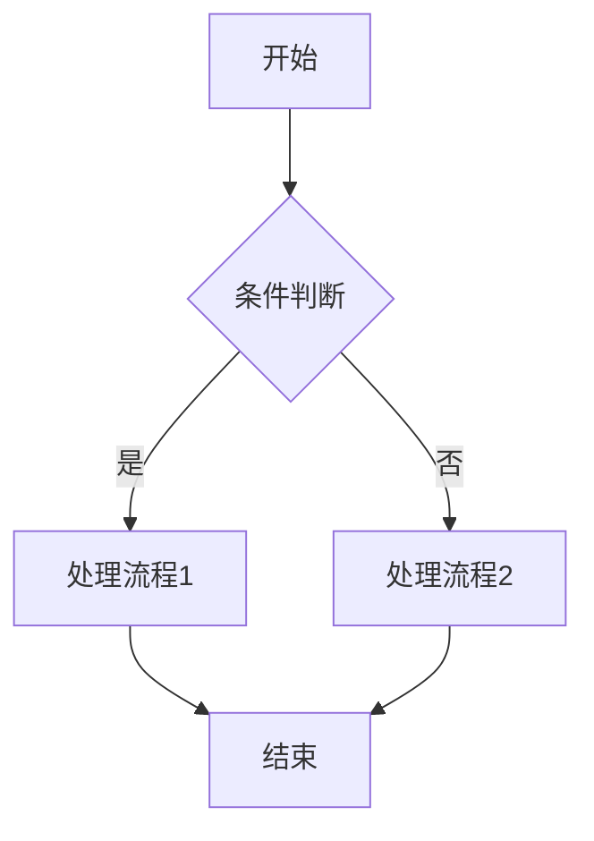
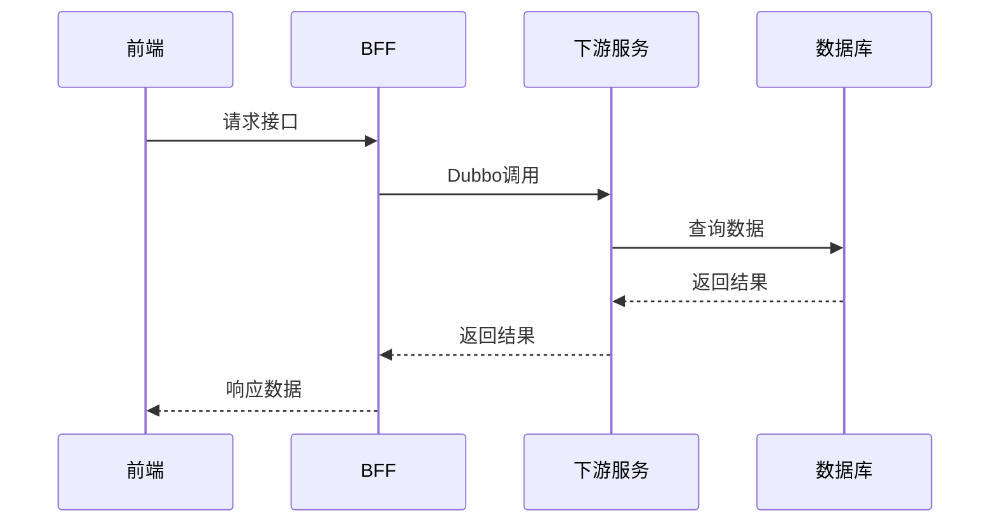
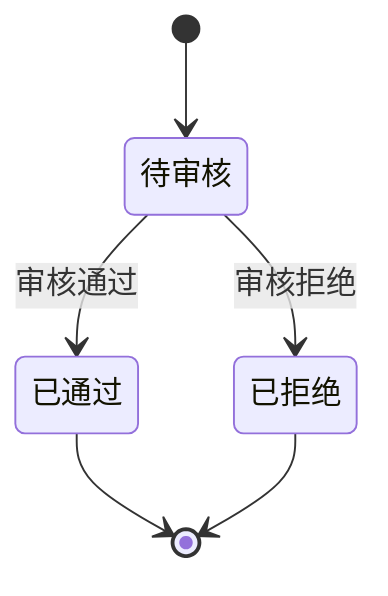

# 技术详细设计文档生成

根据用户提供的需求文档，生成完整的技术详细设计文档，包含流程图、时序图、架构设计等。

## 输入要求

用户需要提供以下信息之一：
1. 需求文档路径（如：`docs/requirements/xxx.md`）
2. 需求描述文本
3. PRD 截图或链接

## 输出内容

请按以下结构生成技术详细设计文档：

---

## 一、需求概述

### 1.1 需求背景
（简要描述业务背景和需求来源）

### 1.2 需求目标
（明确本次需求要达成的目标）

### 1.3 术语说明
| 术语 | 说明 |
|-----|------|
| xxx | xxx |

---

## 二、流程设计

### 2.1 业务流程图

使用 Mermaid 绘制业务流程图：



### 2.2 时序图

使用 Mermaid 绘制关键接口的时序图：



### 2.3 状态流转图（如有状态变更）



---

## 三、接口设计

### 3.1 接口清单

| 序号 | 接口名称 | 请求方式 | 接口路径 | 说明 |
|-----|---------|---------|---------|------|
| 1 | xxx | POST | /api/xxx | xxx |

### 3.2 接口详细设计

#### 3.2.1 接口名称

**请求参数**：
```json
{
  "field1": "string, 必填, 字段说明",
  "field2": "integer, 选填, 字段说明"
}
```

**响应参数**：
```json
{
  "code": 200,
  "message": "success",
  "data": {
    "field1": "返回字段说明"
  }
}
```

**业务逻辑**：
1. 参数校验
2. 业务处理步骤
3. 返回结果

---

## 四、数据库设计

### 4.1 表结构设计

#### 表名：xxx_table

| 字段名 | 类型 | 是否必填 | 默认值 | 说明 |
|-------|------|---------|-------|------|
| id | varchar(64) | 是 | - | 主键 |
| create_time | datetime | 是 | CURRENT_TIMESTAMP | 创建时间 |
| update_time | datetime | 是 | CURRENT_TIMESTAMP | 更新时间 |

### 4.2 索引设计

| 索引名 | 字段 | 类型 | 说明 |
|-------|------|------|------|
| idx_xxx | field1,field2 | 普通索引 | 查询优化 |

### 4.3 SQL 脚本

```sql
CREATE TABLE `xxx_table` (
  `id` varchar(64) NOT NULL COMMENT '主键',
  `create_time` datetime NOT NULL DEFAULT CURRENT_TIMESTAMP COMMENT '创建时间',
  `update_time` datetime NOT NULL DEFAULT CURRENT_TIMESTAMP ON UPDATE CURRENT_TIMESTAMP COMMENT '更新时间',
  PRIMARY KEY (`id`)
) ENGINE=InnoDB DEFAULT CHARSET=utf8mb4 COMMENT='表说明';
```

---

## 五、技术方案

### 5.1 涉及服务

| 服务名 | 类型 | 职责 |
|-------|------|------|
| city-parking-bff-xxx | BFF | 对外暴露接口 |
| city-parking-xxx | 下游服务 | 业务逻辑处理 |

### 5.2 核心类设计

```
city-parking-xxx-server/
├── dubbo/
│   └── XxxDubboApiImpl.java      # Dubbo接口实现
├── service/
│   ├── IXxxService.java          # Service接口
│   └── impl/
│       └── XxxServiceImpl.java   # Service实现
└── mapper/
    └── XxxMapper.java            # Mapper接口
```

### 5.3 关键代码逻辑

（描述核心业务逻辑的实现思路）

---

## 六、非功能性设计

### 6.1 性能考虑
- 预估 QPS：xxx
- 是否需要缓存：是/否
- 是否需要分页：是/否

### 6.2 安全考虑
- 是否需要鉴权：是/否
- 是否涉及敏感数据：是/否
- 数据脱敏方案：xxx

### 6.3 异常处理
- 幂等性保障：xxx
- 失败重试机制：xxx
- 补偿方案：xxx

---

## 七、测试要点

### 7.1 单元测试
- [ ] Service 层核心逻辑测试
- [ ] 边界条件测试

### 7.2 集成测试
- [ ] 接口联调测试
- [ ] 异常场景测试

### 7.3 测试用例

| 用例编号 | 测试场景 | 输入 | 预期结果 |
|---------|---------|------|---------|
| TC001 | 正常流程 | xxx | xxx |
| TC002 | 异常流程 | xxx | xxx |

---

## 八、上线计划

### 8.1 上线顺序
1. 数据库脚本执行
2. 下游服务部署
3. BFF 服务部署
4. 前端部署

### 8.2 回滚方案
（描述出现问题时的回滚步骤）

### 8.3 灰度策略
（如需要灰度发布，描述灰度方案）

---

## 执行说明

1. **阅读需求**：仔细阅读用户提供的需求文档
2. **分析流程**：梳理业务流程，识别关键节点
3. **设计接口**：根据业务需求设计 API 接口
4. **数据建模**：设计数据库表结构
5. **绘制图表**：使用 Mermaid 绘制流程图、时序图
6. **输出文档**：生成完整的技术详细设计文档

**注意事项**：
- 流程图使用 Mermaid 语法，便于在 Markdown 中渲染
- 接口设计要符合 RESTful 规范
- 数据库设计要遵循框架的字段规范（id、create_time、update_time 等）
- 涉及到的服务要明确是 BFF 层还是下游服务
