# AI Coding Delivery Workflow

Version: 1.0.0
Updated: 2026-07-10

This workflow connects existing city-parking assets into a minimum executable delivery loop. It preserves `tzh-review` as the formal quality decision source.

```mermaid
flowchart LR
  A["Raw requirement"] --> B["prd-authoring"]
  B --> C["PRD Gate"]
  C --> D["design-doc"]
  D --> E["Design Gate"]
  E --> F["pre-coding-check"]
  F --> G["Task breakdown"]
  G --> H["TDD / generate-tests"]
  H --> I["Coding Skill: new-crud / new-api / add-field / fix-cache / new-bff / new-page"]
  I --> J["Build Gate"]
  J --> K["Test Gate / self-test"]
  K --> L["diff-report"]
  L --> M["tzh-review"]
  M --> N["Release Gate"]
```

## Stage Contract

| Stage | Entry | Inputs | Outputs | Blocking conditions |
| --- | --- | --- | --- | --- |
| PRD | `prd-authoring` | Raw requirement, TAPD | `docs/requirements/<id>/prd.md` | Missing goals, scope, acceptance criteria |
| Design | `design-doc` | PRD | `docs/requirements/<id>/design.md` | Missing API, DB, permission, rollback, test strategy for relevant change |
| Pre-coding | `pre-coding-check` | PRD, design | task list | Missing module/table/interface/test evidence |
| TDD | `generate-tests` | acceptance criteria | failing tests or NOT_EXECUTED record | Test not executed for required core scenario |
| Coding | specialized Skill | tasks, design | code changes, evidence | Coding without design basis for large/core change |
| Build | script or project command | code | build result | failed or required build not executed |
| Test | `self-test` and project tests | code, test plan | test report | failed critical tests, NOT_EXECUTED core tests |
| Review | `tzh-review` | diff, evidence, TAPD | formal decision | P0, unresolved P1, core UNKNOWN |
| Release | release gate | review, deployment, rollback | release decision | missing rollback or verification plan |

## Human Decision Points

- Product owner confirms business scope and acceptance criteria.
- Architect confirms design for core business, DB, security, and cross-service changes.
- QA confirms exploratory testing and final test sign-off.
- Release owner confirms deployment window and rollback readiness.
