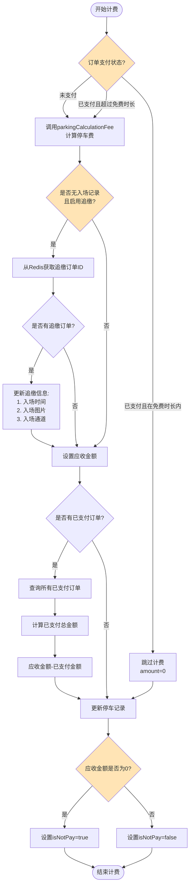
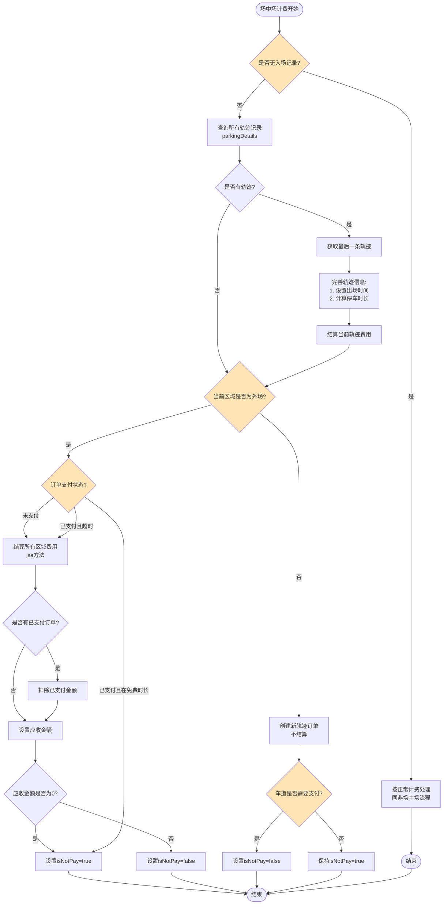

# appearanceProcessing 方法详解

## 方法概述

**所在类:** `com.tzh.parkinglot.service.parking.ParkingDeviceServiceImpl`

**方法签名:**
```java
private boolean appearanceProcessing(ParkingList parkingList,
                                     ParkingDevicePushMsgDTO parkingDevicePushMsgDTO,
                                     ParkingDevice parkingDevice,
                                     ParkingCarLane parkingCarLane,
                                     ParkingInfo parkingInfo,
                                     ParkingCarTypeInfoDO parkingCarTypeInfoDO)
```

**方法位置:** `ParkingDeviceServiceImpl.java:853-1127`

**功能说明:** 处理车辆出场的核心业务逻辑,包括出场信息更新、费用计算、场中场处理、储值车扣费、优惠计算、屏显展示、开闸放行等完整流程。这是停车场系统中车辆出场的主处理方法。

---

## 完整流程图

```mermaid
flowchart TD
    Start([开始 - appearanceProcessing]) --> InitVars[初始化变量:<br/>出场开始时间<br/>isNotPay=true<br/>amount=0]

    InitVars --> SetEndFeeTime[设置计费截止时间<br/>endFeeTime]
    SetEndFeeTime --> SaveUniqueId[保存设备唯一ID到Redis<br/>TTL=180分钟]

    SaveUniqueId --> CheckPoliceCar[判断是否为军警车]
    CheckPoliceCar --> LaneVerify[车道身份验证<br/>laneIdentityVerification]

    LaneVerify --> VerifyResult{验证是否通过?}
    VerifyResult -->|否| ReturnFalse1([返回false])

    VerifyResult -->|是| CheckManual{是否为手动输入?}
    CheckManual -->|是| ProcessManual[处理手动输入:<br/>修改车牌/类型/时间]
    CheckManual -->|否| UpdateOutInfo[更新出场信息]

    ProcessManual --> UpdateOutInfo
    UpdateOutInfo --> PauseDetection[暂停检测<br/>优化预缴费冲突]

    PauseDetection --> CheckInterior{是否为场中场?}

    CheckInterior -->|否| NormalExit[非场中场出场处理]
    CheckInterior -->|是| InteriorExit[场中场出场处理]

    NormalExit --> CalcNormalFee[计费处理子流程]
    CalcNormalFee --> CheckCharge{充电减免?}

    InteriorExit --> CheckNoEntry{是否为无入场记录?}
    CheckNoEntry -->|是| CalcNoEntryFee[按正常计费<br/>处理追缴]
    CheckNoEntry -->|否| ProcessTrajectory[处理轨迹订单]

    ProcessTrajectory --> CheckOuterExit{是否为外场出口?}
    CheckOuterExit -->|是| CalcOuterFee[结算所有区域费用]
    CheckOuterExit -->|否| CreateNewTrajectory[创建新轨迹<br/>不结算]

    CalcNoEntryFee --> CheckCharge
    CalcOuterFee --> CheckCharge
    CreateNewTrajectory --> CheckCharge

    CheckCharge -->|是| ApplyChargeDiscount[应用充电减免]
    CheckCharge -->|否| CheckPrePay

    ApplyChargeDiscount --> CheckPrePay{是否有预缴费?}
    CheckPrePay -->|是| SetFree[设置isNotPay=true]
    CheckPrePay -->|否| CheckNoRecordManual{无入场记录<br/>人工处理?}

    SetFree --> CheckNoRecordManual
    CheckNoRecordManual -->|是| ErrorDisplay[错误屏显<br/>需要管理员处理]
    ErrorDisplay --> ReturnTrue1([返回true])

    CheckNoRecordManual -->|否| CheckIsFree{是否免费?}

    CheckIsFree -->|是| DirectExit[直接出场:<br/>1. 调用outCar<br/>2. 更新车位数<br/>3. 发送消息]
    DirectExit --> SendDelayMsg[发送延时消息<br/>2分钟后检查是否离场]
    SendDelayMsg --> ReturnTrue2([返回true])

    CheckIsFree -->|否| CheckRecharge{是否为储值车?}
    CheckRecharge -->|是| RechargeDeduct[储值车扣费]
    RechargeDeduct --> DeductResult{扣费是否成功?}

    DeductResult -->|是| DirectExit2[直接出场<br/>补充订单信息]
    DirectExit2 --> SendDelayMsg

    DeductResult -->|否| CalcDiscount[出场前优惠计算<br/>outCarBeforeNotify]
    CheckRecharge -->|否| CalcDiscount

    CalcDiscount --> DiscountResult{优惠结果?}
    DiscountResult -->|1-免费| DirectExit
    DiscountResult -->|其他| SetReverseLock{是否单通道?}

    SetReverseLock -->|是| AddReverseLock[设置反向车道锁<br/>TTL=3分钟]
    SetReverseLock -->|否| ShowAmount

    AddReverseLock --> ShowAmount[屏显应收金额]
    ShowAmount --> PushOut[推送出场记录]
    PushOut --> SendSocket[发送Socket监控消息]
    SendSocket --> CreateOrderDelay[发送创建订单<br/>延时消息]
    CreateOrderDelay --> SendDelayMsg

    ReturnFalse1 --> End([结束])
    ReturnTrue1 --> End
    ReturnTrue2 --> End

    style CheckInterior fill:#FFE4B5
    style CheckIsFree fill:#FFE4B5
    style CheckRecharge fill:#FFE4B5
    style CheckOuterExit fill:#FFE4B5
    style DirectExit fill:#90EE90
    style DirectExit2 fill:#90EE90
    style ErrorDisplay fill:#FFB6C1
    style ShowAmount fill:#87CEEB
```



---

## 计费处理子流程

### 非场中场计费流程



### 场中场计费流程



---

## 详细业务逻辑说明

### 1. 初始化与基础设置 (854-868行)

```java
long outStartTime = System.currentTimeMillis();
boolean isSuccess = true;
boolean isNotPay = true;
BigDecimal amount = BigDecimal.ZERO;
long min = 0;

// 设置计费截止时间
if (parkingList.getEndFeeTime() == null || parkingList.getCarActType() != PlateTypeEnum.MONTHLY_CARD_MORE_CAR.getCode()) {
    parkingList.setEndFeeTime(new Date());
}

// 保存设备唯一ID
if (StringUtils.isNotBlank(parkingDevicePushMsgDTO.getUniqueId())) {
    redissonUtil.set("DEVICE_UNIQUE_ID:" + parkingList.getId(), parkingDevicePushMsgDTO.getUniqueId(),180 * 60);
}
```

**业务说明:**
- **出场开始时间:** 用于性能监控
- **关键变量:**
  - `isSuccess`: 处理是否成功
  - `isNotPay`: 是否免费(true-免费,false-需支付)
  - `amount`: 应收金额
  - `min`: 停车时长(分钟)
- **计费截止时间:**
  - 普通车辆: 设置为当前时间
  - 多位多车长租: 可能已有endFeeTime(转免费时设置)
- **设备唯一ID:** 保存到Redis,TTL 180分钟,用于设备指令回调

---

### 2. 车道身份验证 (869-875行)

```java
Boolean allowsPoliceCar = isAllowsPoliceCar(parkingDevicePushMsgDTO, parkingList.getCarNumber());
Boolean laneIdentityVerification = laneIdentityVerification(parkingInfo,
        parkingDevicePushMsgDTO, parkingCarLane,
        parkingDevice, parkingCarTypeInfoDO, allowsPoliceCar, parkingList.getId());
if (!laneIdentityVerification) {
    return false;
}
```

**业务说明:**
- 验证车辆在当前出口车道是否有通行权限
- 包括军警车、临停车、蓝牌车、黄牌车等限制检查
- 验证失败直接返回false,不继续处理

---

### 3. 手动输入处理 (877-880行)

```java
if (parkingDevicePushMsgDTO.getTriggerType() == 2) {
    processManualInput(parkingInfo, parkingList, parkingDevicePushMsgDTO);
}
```

**业务说明:**
- **触发类型 = 2:** 手动输入(非自动识别)
- 调用 `processManualInput` 方法处理

**processManualInput方法逻辑** (1145-1173行):
```java
parkingList.setOutType(ParkingListPassTypeEnum.MANUAL.getCode());
String account = GetUserInfo.getAccount();
parkingList.setUpdateUser(account);

// 根据deviceTodo判断修改类型
if ("1".equals(parkingDevicePushMsgDTO.getDeviceTodo())) {
    // 修改车牌
    parkingList.setRemark(parkingList.getRemark() + "修改车牌;");
}
if ("2".equals(parkingDevicePushMsgDTO.getDeviceTodo())) {
    // 修改车辆类型
    parkingList.setCarPlateColor(parkingDevicePushMsgDTO.getColorType().byteValue());
    parkingList.setRemark(parkingList.getRemark() + "修改车辆类型;");
}
if ("3".equals(parkingDevicePushMsgDTO.getDeviceTodo())) {
    // 修改入场时间
    parkingList.setInTime(TimeUtil.strToDate(parkingDevicePushMsgDTO.getTime(), TimeUtil.DATE_TIME));
    if (parkingInfo.getIsInterior() == 0) {
        parkingList.setExceptionType(ExceptionTypeEnum.NORMAL_ORDER.getCode());
    }
    parkingList.setRemark(parkingList.getRemark() + "修改入场时间;");
}
```

**deviceTodo说明:**
- `"1"`: 修改车牌号
- `"2"`: 修改车辆类型
- `"3"`: 修改入场时间(可将异常订单改为正常订单)

---

### 4. 更新出场基础信息 (881-894行)

```java
parkingList.setOutImg(parkingDevicePushMsgDTO.getImageOssPath());
parkingList.setOutMiniImg(parkingDevicePushMsgDTO.getImageMiniOssPath());
parkingList.setExportId(parkingDevice.getParkingLaneId());
parkingList.setParkingExportId(parkingDevice.getParkingLaneId());
parkingList.setCarActType(getCarActTypeByCarNumber(parkingInfo.getId(), parkingList.getCarNumber(), 1, parkingDevice.getRegionId()).getPlateType().byteValue());
parkingList.setCarPlateType(parkingDevicePushMsgDTO.getType().byteValue());
parkingList.setParkingExportName(parkingCarLane.getLaneName());

if (parkingList.getInTime() != null) {
    parkingList.setParkingTimeNum((int) TimeUtil.getMinute(parkingList.getInTime(),
            parkingList.getOutTime() == null ? parkingList.getEndFeeTime() : new Date()));
} else {
    parkingList.setParkingTimeNum(0);
}
parkingList.setOutTime(new Date());
```

**业务说明:**
- 设置出场图片(原图和缩略图)
- 设置出口车道信息
- 重新获取车辆类型(可能有变化)
- 计算停车时长(分钟)
- 设置出场时间

---

### 5. 预缴费冲突优化 (896-898行)

```java
boolean settlement = true;
ChargeDiscountDetailDTO chargeDiscount = getChargeDiscount(parkingInfo.getParkingSn(), parkingList.getCarNumber());
pauseDetection(parkingList.getId());
```

**业务说明:**
- `settlement`: 是否需要结算(场中场内部移动时为false)
- 获取充电优惠信息
- `pauseDetection`: 暂停检测,优化预缴费和出口识别的冲突

---

### 6. 非场中场出场处理 (900-947行)

```java
if (parkingInfo.getIsInterior() == 0) {
    log.info("不是场中场出场 {}", parkingDevicePushMsgDTO.getLicense());

    // 未支付 或 已支付但超过免费时长
    if (Byte.valueOf((byte) OrderStatusEnum.PAYMENT_IN.getCode()).equals(parkingList.getOrderStatus())
            || parkingInfo.getPayFreeTime() < TimeUtil.getMinute(parkingList.getPayTime(), new Date())) {

        try {
            // 计费
            amount = parkingFee.parkingCalculationFee(parkingInfo.getParkingSn(), parkingList);

            // 追缴处理
            if (parkingList.getExceptionType().equals(ExceptionTypeEnum.NO_ENTRY_RECORD.getCode())
                    && amount.compareTo(BigDecimal.ZERO) > 0
                    && parkingInfo.getPressPaymentStatus() == 1) {
                String beforId = redissonUtil.get("PRESS_PAYMENT" + parkingList.getCarNumber() + parkingList.getParkingLotId());
                if (beforId != null) {
                    pressPaymentUpdate(parkingList, beforId);
                }
            }

            parkingList.setShouldAmount(amount);

            // 扣除已支付金额
            if (amount.compareTo(BigDecimal.ZERO) > 0) {
                ParkingOrderQuery parkingOrderQuery = new ParkingOrderQuery();
                parkingOrderQuery.setParkingListId(parkingList.getId());
                parkingOrderQuery.setTransactionStatus(1);
                List<ParkingOrderDO> parkingOrderDOS = parkingOrderMapper.queryForList(parkingOrderQuery);
                if (!parkingOrderDOS.isEmpty()) {
                    BigDecimal payAmount = BigDecimal.ZERO;
                    for (ParkingOrderDO parkingOrderDO : parkingOrderDOS) {
                        payAmount = payAmount.add(parkingOrderDO.getTransactionAmount());
                    }
                    log.info("有预支付过" + payAmount);
                    amount = (amount.subtract(payAmount)).compareTo(BigDecimal.ZERO) < 0 ? BigDecimal.ZERO : amount.subtract(payAmount);
                }
            }

            isNotPay = amount.compareTo(BigDecimal.ZERO) == 0;
        } catch (Exception e) {
            log.error("出场算费异常", e);
            parkingList.setOrderStatus((byte) 9);
            outExectionWarner(parkingList.getParkingLotName() + "--" + parkingList.getCarNumber());
        }
    }

    parkingListMapper.updateByPrimaryKeySelective(parkingList);
}
```

**业务逻辑:**

#### 6.1 计费触发条件
- 订单状态为"未支付"
- 或订单已支付但超过免费时长

**免费时长说明:**
- `payFreeTime`: 支付后多少分钟内免费出场
- 场景: 用户支付后15分钟内可免费出场

#### 6.2 费用计算
- 调用 `parkingFee.parkingCalculationFee` 计算停车费
- 计费规则在计费模块中实现

#### 6.3 追缴处理
**触发条件:**
1. 订单类型为"无入场记录"
2. 应收金额 > 0
3. 车场启用追缴功能

**处理逻辑:**
- 从Redis获取追缴订单ID: `PRESS_PAYMENT{carNumber}{parkingId}`
- 调用 `pressPaymentUpdate` 更新当前订单的入场信息
- 将追缴订单的入场时间、图片、通道等信息复制到当前订单

**pressPaymentUpdate方法** (1256-1271行):
```java
ParkingList parkingList1 = parkingListMapper.selectById(listId);
if (StringUtils.isNotBlank(listId) && parkingList1 != null) {
    parkingList.setInTime(parkingList1.getInTime());
    parkingList.setInImg(parkingList1.getInImg());
    parkingList.setInMiniImg(parkingList1.getInImg());
    parkingList.setEntranceId(parkingList1.getEntranceId());
    parkingList.setParkingEntranceId(parkingList1.getParkingEntranceId());
    parkingList.setParkingEntranceName(parkingList1.getParkingEntranceName());
    parkingList.setExceptionType(ExceptionTypeEnum.NORMAL_ORDER.getCode());
    parkingList.setParkingTimeNum((int) TimeUtil.getMinute(parkingList1.getInTime(),
            parkingList.getOutTime() == null ? parkingList.getEndFeeTime() : new Date()));
    parkingList.setRemark("防逃费判定");
    redissonUtil.delete("PRESS_PAYMENT" + parkingList.getCarNumber() + parkingList.getParkingLotId());
}
```

**业务场景:**
- 车辆A在10:00入场,但未正常出场(如尾随出场)
- 车辆A在12:00再次出场,识别为"无入场记录"
- 系统判定为逃费,将10:00的入场信息关联到当前出场

#### 6.4 扣除已支付金额
- 查询该停车记录的所有已支付订单
- 累加已支付总金额
- 应收金额 = 计算金额 - 已支付金额
- 如果结果 < 0,设置为0

#### 6.5 异常处理
- 捕获计费异常
- 设置订单状态为9(异常)
- 发送异常告警

---

### 7. 场中场出场处理 (948-1028行)

场中场是停车场系统的复杂业务场景,需要根据不同情况分别处理。

#### 7.1 无入场记录处理 (952-971行)

```java
String marks = redissonUtil.get("NO_ENTRY_RECORD" + parkingList.getCarNumber() + parkingList.getId());
if (parkingList.getExceptionType().equals(ExceptionTypeEnum.NO_ENTRY_RECORD.getCode())
        || StringUtils.isNotBlank(marks)) {

    ParkingList parkingListFee = parkingList;
    amount = parkingFee.parkingCalculationFee(parkingInfo.getParkingSn(), parkingListFee);

    // 追缴处理
    if (amount.compareTo(BigDecimal.ZERO) > 0 && parkingInfo.getPressPaymentStatus() == 1) {
        String beforId = redissonUtil.get("PRESS_PAYMENT" + parkingList.getCarNumber() + parkingList.getParkingLotId());
        if (beforId != null) {
            pressPaymentUpdate(parkingList, beforId);
            redissonUtil.set("NO_ENTRY_RECORD" + parkingList.getCarNumber() + parkingList.getId(),
                    parkingList.getId(), 1200);
        }
    }

    parkingList.setShouldAmount(amount);
    isNotPay = amount.compareTo(BigDecimal.ZERO) == 0;
    parkingListMapper.updateByPrimaryKeySelective(parkingList);
}
```

**业务说明:**
- 场中场的无入场记录也按正常计费处理
- Redis标记: `NO_ENTRY_RECORD{carNumber}{listId}`,TTL 1200秒
- 支持追缴逻辑

---

#### 7.2 正常出场 - 轨迹结算 (973-1027行)

```java
// 获取当前通道口绑定的区域
ParkingRegion parkingRegion = parkingRegionMapper.getParkingRegionByRegionId(parkingCarLane.getRegionId());

// 查询所有轨迹
ParkingDetailQuery parkingDetailQuery = new ParkingDetailQuery();
parkingDetailQuery.setListId(parkingList.getId());
parkingDetailQuery.setParkingLotId(parkingList.getParkingLotId());
List<ParkingDetail> parkingDetails = parkingDetailMapper.selectAllParkingDetail(parkingDetailQuery);

// 结算当前轨迹
if (!parkingDetails.isEmpty()) {
    ParkingDetail parkingDetail = parkingDetails.get(parkingDetails.size() - 1);
    parkingDetail = completeRegionDetails(parkingDetail, parkingRegion, parkingInfo, parkingList, parkingDetails);
    billingDetails(parkingDetail, parkingList, parkingInfo, parkingList.getOutTime(), true);
}
```

**业务说明:**
- 查询车辆的所有轨迹记录(parkingDetail)
- 获取最后一条轨迹(当前区域)
- 调用 `completeRegionDetails` 完善轨迹信息
- 调用 `billingDetails` 结算当前轨迹费用

**场中场轨迹说明:**
- 车辆在场中场内移动时会产生多条轨迹记录
- 每条轨迹记录一个区域的停车信息
- 例: 车辆从外场 → VIP区 → 普通区 → 外场,产生3条轨迹

---

#### 7.3 外场出口处理 (990-1016行)

```java
if (parkingRegion.getRegionLocation().equals(RegionLocationEnum.AREA_A.getCode())) {
    // 场中场单独结算 - 外场出口

    if (Byte.valueOf((byte) OrderStatusEnum.PAYMENT_IN.getCode()).equals(parkingList.getOrderStatus())
            || (Byte.valueOf((byte) OrderStatusEnum.PAYMENT_COMPLETED.getCode()).equals(parkingList.getOrderStatus())
            && parkingInfo.getPayFreeTime() < TimeUtil.getMinute(parkingList.getPayTime(), new Date()))) {

        // 结算所有区域费用
        amount = jsa(parkingList, parkingDetails, parkingInfo, amount);

        // 扣除已支付金额
        if (amount.compareTo(BigDecimal.ZERO) > 0) {
            ParkingOrderQuery parkingOrderQuery = new ParkingOrderQuery();
            parkingOrderQuery.setParkingListId(parkingList.getId());
            parkingOrderQuery.setTransactionStatus(1);
            List<ParkingOrderDO> parkingOrderDOS = parkingOrderMapper.queryForList(parkingOrderQuery);
            if (!parkingOrderDOS.isEmpty()) {
                BigDecimal payAmount = BigDecimal.ZERO;
                for (ParkingOrderDO parkingOrderDO : parkingOrderDOS) {
                    payAmount = payAmount.add(parkingOrderDO.getTransactionAmount());
                }
                amount = (amount.subtract(payAmount)).compareTo(BigDecimal.ZERO) < 0 ? BigDecimal.ZERO : amount.subtract(payAmount);
            }
        }
        parkingList.setShouldAmount(amount);
    }
    isNotPay = amount.compareTo(BigDecimal.ZERO) == 0;
}
```

**业务说明:**
- **外场出口** (`AREA_A`): 车辆最终离开停车场
- 需要结算所有区域的费用
- 调用 `jsa` 方法(join settlement amount)合并计算

**jsa方法作用:**
- 检查所有轨迹是否已结算
- 补全未结算的轨迹
- 汇总所有区域费用

---

#### 7.4 内场出口处理 (1017-1026行)

```java
} else {
    // 不是外场 - 生成新的轨迹订单
    log.info("出场新增轨迹" + parkingRegion.getId());
    settlement = false;
    deviceAsyncService.createDetail(parkingInfo, parkingList, parkingDetails);

    if (parkingCarLane.getWhetherToPay() == 1) {
        isNotPay = amount.compareTo(BigDecimal.ZERO) == 0;
    }
}
```

**业务说明:**
- **内场出口:** 车辆从一个区域移动到另一个区域
- 不进行最终结算 (`settlement = false`)
- 创建新的轨迹记录
- 如果车道配置了"需要支付",则检查是否有欠费

**场景举例:**
- 车辆从VIP区出来,进入普通区
- 结算VIP区费用,创建普通区轨迹
- 不触发最终出场流程

---

### 8. 充电减免处理 (1029-1035行)

```java
if ("2282871186".equals(parkingInfo.getParkingSn())) {
    if (Byte.valueOf((byte) OrderStatusEnum.PAYMENT_IN.getCode()).equals(parkingList.getOrderStatus())) {
        amount = chargeDiscountInfo(chargeDiscount, parkingList, amount);
        isNotPay = amount.compareTo(BigDecimal.ZERO) == 0;
    }
}
```

**业务说明:**
- 特定车场(SN: 2282871186)支持充电减免
- 根据充电优惠信息调整应收金额
- 充电越久,优惠越多

---

### 9. 预缴费处理 (1037-1042行)

```java
String isPayListId = redissonUtil.get("READY_PAY_LIST_INFO" + parkingList.getId());
if (StringUtils.isNotBlank(isPayListId) && isPayListId.equals(parkingList.getId())) {
    isNotPay = true;
}
```

**业务说明:**
- Redis Key: `READY_PAY_LIST_INFO{listId}`
- 如果存在该标记,说明已预缴费
- 直接免费放行

---

### 10. 无入场记录人工处理 (1043-1065行)

```java
if (parkingList.getExceptionType() == ExceptionTypeEnum.NO_ENTRY_RECORD.getCode()
        && parkingInfo.getIsNoRecordFixedCost() == 2
        && !parkingList.getRemark().contains("时间")) {

    ParkingInfoConfig parkingInfoConfig = parkingInfoConfigMapper.getParkingInfoConfig(parkingInfo.getId());
    if (parkingInfoConfig != null && StringUtils.isNotBlank(parkingInfoConfig.getControlCarType())) {
        List<String> labelInfos = Arrays.asList(parkingInfoConfig.getControlCarType().split(","));
        byte carActType = parkingList.getCarActType() == 10 ? 1 : parkingList.getCarActType();

        if (labelInfos.contains(String.valueOf(carActType))) {
            parkingRecordPushService.outRecordPushResult(parkingList, false, "无入场记录出场");
            deviceCmdOperateService.errorScreenDisplay(parkingInfo, parkingDevice, "无入场记录出场,需要管理员处理");
            parkingListServiceImpl.sendMonitorListMsg(parkingList, 1);
            return true;
        }
    } else {
        parkingRecordPushService.outRecordPushResult(parkingList, false, "无入场记录出场");
        deviceCmdOperateService.errorScreenDisplay(parkingInfo, parkingDevice, "无入场记录出场,需要管理员处理");
        parkingListServiceImpl.sendMonitorListMsg(parkingList, 1);
        return true;
    }
}
```

**业务说明:**
- **触发条件:**
  1. 无入场记录订单
  2. 车场配置"人工处理" (`isNoRecordFixedCost = 2`)
  3. 备注中不包含"时间"(说明未手动修改入场时间)

- **处理逻辑:**
  - 检查车辆类型是否在控制名单中
  - 如果在名单中或未配置名单,拒绝自动放行
  - 屏显错误信息
  - 推送监控消息
  - 等待管理员手动处理

**controlCarType配置:**
- 逗号分隔的车辆类型,如 "0,1"(临停车、月卡车)
- 这些类型的车辆如果无入场记录,必须人工处理

---

### 11. 免费出场处理 (1066-1070行)

```java
if (isNotPay) {
    long outWarnerTime = System.currentTimeMillis();
    outDurationWarner(outStartTime, outWarnerTime, "免费-->" + parkingList.getParkingLotName() + "--" + parkingList.getCarNumber());
    log.info("免费-->直接出场");
    parkingListServiceImpl.outCar(parkingInfo, parkingDevice, parkingList, parkingCarLane, true, settlement);
}
```

**业务说明:**
- `isNotPay = true`: 免费出场
- 记录出场耗时
- 调用 `outCar` 方法处理出场

**outCar方法职责:**
- 更新停车记录为已出场
- 下发开闸指令
- 更新车位数
- 推送出场成功消息
- 触发出场回调

---

### 12. 收费出场处理 (1071-1110行)

#### 12.1 储值车扣费 (1074-1085行)

```java
int carActTypes = parkingList.getCarActType().intValue();
if (carActTypes == PlateTypeEnum.RECHARGE_TYPE.getCode()) {
    boolean typeInfo = rechargeTypeInfo(parkingInfo, parkingList, amount);
    log.info("储值车扣除结果" + typeInfo + "车牌" + parkingList.getCarNumber());
    if (typeInfo) {
        log.info("免费->直接出场");
        isNotPay = true;
        parkingListServiceImpl.outCar(parkingInfo, parkingDevice, parkingList, parkingCarLane, true, settlement);
        parkingListServiceImpl.supplementary(parkingList, "");
    }
}
```

**业务说明:**
- 如果是储值车,尝试扣除储值金额
- 调用 `rechargeTypeInfo` 方法

**rechargeTypeInfo方法逻辑** (1180-1252行):
```java
// 1. 查询储值车信息
ParkingRechargeCarDO parkingRechargeCarDO = parkingRechargeCarMapper.selectByPrimaryKey(typeId);

// 2. 检查状态和余额
if (parkingRechargeCarDO != null && parkingRechargeCarDO.getStatus() == 0) {
    if (parkingRechargeCarDO.getBalanceAmount().compareTo(amount) >= 0) {
        // 余额充足

        // 3. 更新停车记录
        parkingList.setPayTime(new Date());
        parkingList.setActualAmount(BigDecimal.ZERO);
        parkingListMapper.updateByPrimaryKeySelective(parkingList);

        // 4. 扣除储值金额
        parkingRechargeCarDO.setBalanceAmount(parkingRechargeCarDO.getBalanceAmount().subtract(amount));
        parkingRechargeCarDO.setPayAmount(amount);
        parkingRechargeCarMapper.updateByPrimaryKeySelective(parkingRechargeCarDO);

        // 5. 创建扣费记录
        ParkingRechargeRecordDO parkingRechargeRecordDO = new ParkingRechargeRecordDO();
        parkingRechargeRecordDO.setRechargeId(parkingRechargeCarDO.getId());
        parkingRechargeRecordDO.setPayAmount(amount);
        parkingRechargeRecordDO.setPayStatus(2);
        parkingRechargeRecordDO.setBalanceAmount(parkingRechargeCarDO.getBalanceAmount());
        parkingRechargeRecordMapper.insert(parkingRechargeRecordDO);

        // 6. 创建支付订单
        ParkingOrderDO parkingOrderDO = new ParkingOrderDO();
        parkingOrderDO.setTransactionAmount(amount);
        parkingOrderDO.setStoredValueDeduction(amount);
        parkingOrderDO.setPayChannel("储值车抵扣");
        parkingOrderDO.setPayScene(8);
        parkingOrderDO.setTransactionStatus((byte) 1);
        parkingOrderMapper.insert(parkingOrderDO);

        return true;
    }
}
return false;
```

**业务流程:**
1. 查询储值车信息
2. 检查状态(0-正常)和余额
3. 扣除储值金额
4. 创建扣费记录
5. 创建支付订单
6. 免费放行

---

#### 12.2 出场前优惠计算 (1086-1092行)

```java
String inTime = parkingList.getExceptionType() != 2 ? TimeUtil.datToStr(parkingList.getInTime(), TimeUtil.DATE_TIME) : "";
int status = outCarBeforeNotify(parkingInfo.getParkingSn(),
        parkingList.getId(),
        parkingList.getCarNumber(),
        inTime,
        parkingCarLane.getLaneSn(),
        min,
        parkingCarLane.getLaneName(),
        amount,
        (int)parkingList.getCarPlateColor());
```

**业务说明:**
- 调用第三方接口进行优惠计算
- 参数包括:车场SN、停车记录ID、车牌号、入场时间、车道SN、停车时长、应收金额等
- 返回状态:
  - `1`: 免费出场
  - 其他: 需要支付或部分优惠

**典型场景:**
- 商场消费满额减免
- 会员优惠
- 活动优惠等

---

#### 12.3 待出场处理 (1093-1109行)

```java
if (status != 1) {
    // 加反向车道锁
    if (parkingCarLane.getSingleChannelType() == 1 && StringUtils.isNotBlank(parkingCarLane.getReverseLane())) {
        redissonUtil.set(RedisConstant.REVERSE_LANE_ID + parkingCarLane.getReverseLane(),
                parkingList.getCarNumber(), 3L * 60);
    }

    // 屏显
    parkingList.setShouldAmount(amount);
    parkingRecordPushService.outRecordPushResult(parkingList, false, "待出场");
    deviceCmdOperateService.screenDisplay(parkingDevice, parkingInfo, parkingList);

    // Socket推送
    parkingListServiceImpl.sendMonitorListMsg(parkingList, 1);

    // 发送创建订单延时队列
    if (!isNotPay) {
        this.createOrder(parkingList);
    }
}
```

**业务说明:**

**反向车道锁:**
- 单通道双向行驶时,出口有车缴费,入口需等待
- Redis Key: `REVERSE_LANE_ID{laneId}`
- TTL: 3分钟

**屏显展示:**
- 显示应收金额
- 显示车牌号、停车时长等信息
- 提示扫码支付

**创建订单:**
- 异步创建欠费订单
- 延时队列处理
- 用于后续催缴

---

### 13. 延时消息发送 (1111-1120行)

```java
try {
    JSONObject contents = new JSONObject();
    contents.put("parkingListId", parkingList.getId());
    rocketMqUtil.asyncSend(CloudTopic.IDENTIFY_CAR_NO_NOT_LEAVE,
            CloudTopic.IDENTIFY_CAR_NO_NOT_LEAVE,
            contents.toJSONString(), 6);
} catch (Exception e) {
    log.error("发送车牌识别动作延时消息到rocketMQ失败", e);
    isSuccess = false;
}
```

**业务说明:**
- 发送延时消息到RocketMQ
- 延时级别: 6 (约2分钟)
- 消费者在2分钟后检查车辆是否已离场
- 如果未离场,发送报警通知

**业务场景:**
- 车辆识别后未实际离场(闸机故障等)
- 及时发现异常情况

---

### 14. 异常处理 (1121-1125行)

```java
} catch (Exception e) {
    log.error("出场处理异常:", e);
    return false;
}
return isSuccess;
```

**业务说明:**
- 捕获所有未处理的异常
- 记录错误日志
- 返回false,表示处理失败

---

## 关键配置项

| 配置项 | 字段/Key | 说明 | 默认值 |
|--------|---------|------|--------|
| 是否场中场 | `parkingInfo.isInterior` | 0-否, 1-是 | - |
| 预支付免费时长 | `parkingInfo.payFreeTime` | 支付后多少分钟内免费出场 | - |
| 追缴开关 | `parkingInfo.pressPaymentStatus` | 0-关闭, 1-开启 | - |
| 无入场记录处理 | `parkingInfo.isNoRecordFixedCost` | 1-固定费用, 2-人工处理 | - |
| 控制车辆类型 | `parkingInfoConfig.controlCarType` | 需人工处理的车辆类型,逗号分隔 | - |
| 车道是否需要支付 | `parkingCarLane.whetherToPay` | 场中场场景,0-不需要, 1-需要 | - |
| 单通道类型 | `parkingCarLane.singleChannelType` | 0-双通道, 1-单通道双向 | - |
| 反向车道ID | `parkingCarLane.reverseLane` | 单通道场景的反向车道ID | - |
| 区域位置 | `parkingRegion.regionLocation` | 0-外场, 其他-内场 | - |
| 触发类型 | `parkingDevicePushMsgDTO.triggerType` | 1-自动, 2-手动 | - |
| 设备操作类型 | `parkingDevicePushMsgDTO.deviceTodo` | "1"-改车牌, "2"-改类型, "3"-改时间 | - |

---

## 数据流转

### Redis缓存使用

| Key模式 | 用途 | TTL | 值 |
|---------|------|-----|-----|
| `DEVICE_UNIQUE_ID:{listId}` | 设备唯一ID | 180分钟 | uniqueId |
| `NO_ENTRY_RECORD{carNumber}{listId}` | 无入场记录标记 | 1200秒 | listId |
| `PRESS_PAYMENT{carNumber}{parkingId}` | 追缴订单ID | - | 原订单ID |
| `READY_PAY_LIST_INFO{listId}` | 预缴费标记 | - | listId |
| `REVERSE_LANE_ID{laneId}` | 反向车道锁 | 3分钟 | 车牌号 |

### 数据库操作

**查询:**
- `parkingRegionMapper.getParkingRegionByRegionId()` - 查询区域信息
- `parkingDetailMapper.selectAllParkingDetail()` - 查询轨迹记录
- `parkingOrderMapper.queryForList()` - 查询订单列表
- `parkingInfoConfigMapper.getParkingInfoConfig()` - 查询车场配置
- `parkingRechargeCarMapper.selectByPrimaryKey()` - 查询储值车信息

**更新:**
- `parkingListMapper.updateByPrimaryKeySelective()` - 更新停车记录
- `parkingRechargeCarMapper.updateByPrimaryKeySelective()` - 更新储值车余额

**插入:**
- `parkingRechargeRecordMapper.insert()` - 插入储值扣费记录
- `parkingOrderMapper.insert()` - 插入支付订单

---

## 外部接口调用

### 1. 业务处理
- `laneIdentityVerification()` - 车道身份验证
- `isAllowsPoliceCar()` - 军警车判断
- `processManualInput()` - 手动输入处理
- `pauseDetection()` - 暂停检测
- `getChargeDiscount()` - 获取充电优惠
- `parkingFee.parkingCalculationFee()` - 停车费计算
- `completeRegionDetails()` - 完善轨迹信息
- `billingDetails()` - 结算轨迹费用
- `jsa()` - 场中场全区域结算
- `deviceAsyncService.createDetail()` - 创建新轨迹
- `chargeDiscountInfo()` - 充电减免计算
- `rechargeTypeInfo()` - 储值车扣费
- `outCarBeforeNotify()` - 出场前优惠计算
- `parkingListServiceImpl.outCar()` - 出场处理
- `parkingListServiceImpl.supplementary()` - 补充订单信息

### 2. 设备指令
- `deviceCmdOperateService.errorScreenDisplay()` - 错误屏显
- `deviceCmdOperateService.screenDisplay()` - 正常屏显

### 3. 消息推送
- `parkingRecordPushService.outRecordPushResult()` - 出场记录推送
- `parkingListServiceImpl.sendMonitorListMsg()` - Socket监控消息
- `rocketMqUtil.asyncSend()` - RocketMQ延时消息

### 4. 订单创建
- `debtOrderInfoService.saveDebtOrderInfo()` - 创建欠费订单(异步)

### 5. 告警
- `outDurationWarner()` - 出场耗时告警
- `outExectionWarner()` - 出场异常告警

---

## 性能优化点

### 1. 异步处理
- 创建订单使用线程池异步处理
- 延时消息使用RocketMQ
- 不阻塞主流程

### 2. 提前返回
- 身份验证失败立即返回
- 无入场记录人工处理直接返回

### 3. 缓存使用
- 设备唯一ID缓存
- 预缴费标记缓存
- 减少数据库查询

### 4. 场中场优化
- 内部移动不进行最终结算
- 减少计费次数

---

## 常见业务场景

### 场景1: 临停车正常出场(未支付)
1. 出口识别车牌
2. 查询到在场记录
3. 计算停车费: 20元
4. 检查已支付订单: 无
5. 屏显展示: "应付20元,请扫码支付"
6. 等待支付

### 场景2: 月卡车免费出场
1. 出口识别车牌
2. 查询到在场记录,车辆类型: 月卡车
3. 计算停车费: 0元
4. isNotPay = true
5. 调用outCar直接出场
6. 更新车位数
7. 发送出场消息

### 场景3: 预支付后出场
1. 用户在线支付停车费: 20元
2. 出口识别车牌(支付后5分钟内)
3. 查询到在场记录,订单状态: 已支付
4. 检查免费时长: 在15分钟内
5. 跳过计费
6. 直接出场

### 场景4: 储值车出场
1. 出口识别车牌
2. 查询到在场记录,车辆类型: 储值车
3. 计算停车费: 15元
4. 查询储值余额: 100元
5. 扣除储值: 100 - 15 = 85元
6. 创建扣费记录
7. 直接出场

### 场景5: 无入场记录出场(已支付免费放行失败)
1. 出口识别车牌
2. 无在场记录
3. 查询5分钟内已支付订单: 无
4. 创建异常订单(无入场记录)
5. 计算费用: 固定费用或按时段
6. 屏显展示应付金额
7. 等待支付或人工处理

### 场景6: 场中场外场出场
1. 车辆从VIP区进入普通区,再从普通区出场
2. 识别车牌(外场出口)
3. 查询轨迹: VIP区(已结算) + 普通区(未结算)
4. 结算普通区费用
5. 汇总所有区域费用
6. 扣除已支付金额
7. 屏显展示应付金额

### 场景7: 场中场内场出场
1. 车辆从外场进入VIP区
2. 识别车牌(VIP区入口)
3. 结算外场费用
4. 创建VIP区轨迹
5. 不触发最终出场
6. 如车道需要支付,则屏显VIP区费用

### 场景8: 追缴处理
1. 车辆A在10:00入场,记录ID: order1
2. 车辆A尾随出场,未正常识别
3. 系统检测到异常,设置Redis: `PRESS_PAYMENT{A}{parkingId} = order1`
4. 车辆A在12:00再次出场
5. 识别为无入场记录
6. 查询到追缴标记
7. 将order1的入场信息关联到当前出场
8. 按10:00-12:00计费

---

## 注意事项

### 1. 事务处理
- 方法未添加@Transactional注解
- 数据库操作需注意一致性
- 异常时需要人工介入

### 2. 并发控制
- 反向车道锁防止单通道冲突
- 预缴费标记防止重复计费

### 3. 数据一致性
- 储值车扣费需保证余额一致性
- 场中场轨迹需保证完整性
- 订单创建与停车记录需关联正确

### 4. 性能监控
- outDurationWarner监控出场耗时
- 超时告警及时发现问题

### 5. 异常处理
- 计费异常时设置订单状态为9
- 发送告警通知
- 避免影响用户出场

### 6. 场中场复杂性
- 需区分外场和内场
- 轨迹记录需准确
- 费用结算需分阶段处理

---

## 相关方法索引

| 方法名 | 行号 | 说明 |
|--------|------|------|
| appearanceProcessing | 853-1127 | 主方法 |
| processManualInput | 1145-1173 | 手动输入处理 |
| rechargeTypeInfo | 1180-1252 | 储值车扣费 |
| pressPaymentUpdate | 1256-1271 | 追缴订单更新 |
| createOrder | 1131-1138 | 创建欠费订单(异步) |

---

## 相关文档

- [devicePushInfo方法详解](./devicePushInfo方法详解.md) - 设备上报处理
- [carInto方法详解](./carInto方法详解.md) - 车辆入场处理

---

**文档版本:** v1.0
**最后更新:** 2025-12-20
**维护人员:** Claude Code
