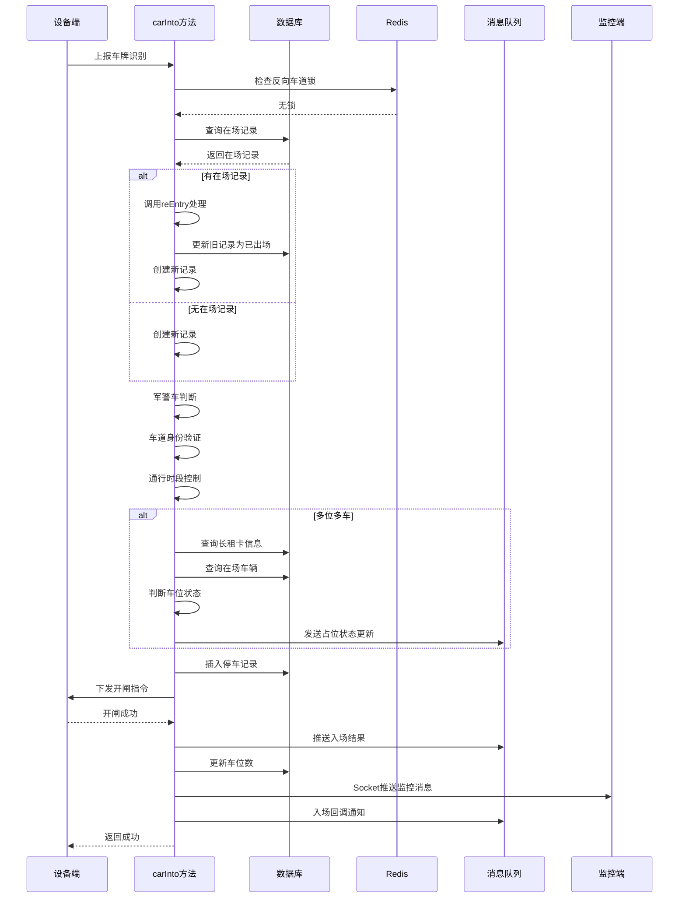

# carInto 方法详解

## 方法概述

**所在类:** `com.tzh.parkinglot.service.parking.ParkingDeviceServiceImpl`

**方法签名:**
```java
public void carInto(String license, Date inTime, ParkingDevicePushMsgDTO parkingDevicePushMsgDTO,
                    ParkingCarLane parkingCarLane, ParkingList parkingList, ParkingInfo parkingInfo,
                    ParkingDevice parkingDevice, ParkingCarTypeInfoDO parkingCarTypeInfoDO, long startTime)
```

**方法位置:** `ParkingDeviceServiceImpl.java:1678-1917`

**功能说明:** 处理车辆入场的核心业务逻辑,包括重复入场检测、多位多车处理、身份验证、停车记录创建、场中场处理、设备指令下发等完整流程。这是停车场系统中车辆入场的主入口方法。

---

## 完整流程图

```mermaid
flowchart TD
    Start([开始 - carInto]) --> CheckReverseLane{检查反向车道<br/>是否有车缴费中?}

    CheckReverseLane -->|是| ShowError1[错误屏显:<br/>出口有车缴费中,请等待]
    ShowError1 --> Return1([返回])

    CheckReverseLane -->|否| QueryRegion[查询车道所属区域]
    QueryRegion --> CheckParkingList{是否有在场记录?}

    CheckParkingList -->|有| CheckRepeatConfig{车场是否禁止<br/>重复入场?}

    CheckRepeatConfig -->|是| CheckPlateType{车辆类型是否在<br/>禁止重复入场名单?}
    CheckPlateType -->|是| ShowError2[错误屏显:<br/>车辆已在场]
    ShowError2 --> Return2([返回])

    CheckPlateType -->|否| CheckInterior{是否为场中场?}
    CheckRepeatConfig -->|否| CheckInterior

    CheckInterior -->|否| CallReEntry1[调用reEntry<br/>处理重复入场]
    CheckInterior -->|是| CheckOuterArea{是否为外场区域?}

    CheckOuterArea -->|是| CallReEntry2[调用reEntry<br/>处理重复入场]
    CheckOuterArea -->|否| SetNoSave[设置isSave=false<br/>不保存新记录]

    CallReEntry1 --> CheckPoliceCar[判断是否为军警车]
    CallReEntry2 --> CheckPoliceCar
    SetNoSave --> CheckPoliceCar
    CheckParkingList -->|无| CheckPoliceCar

    CheckPoliceCar --> LaneVerify[车道身份验证<br/>laneIdentityVerification]
    LaneVerify --> VerifyResult1{验证是否通过?}

    VerifyResult1 -->|否| Return3([返回])
    VerifyResult1 -->|是| IdentityVerify[身份验证<br/>identityVerification]

    IdentityVerify --> VerifyResult2{验证是否通过?}
    VerifyResult2 -->|否| Return4([返回])
    VerifyResult2 -->|是| VehicleControl[车辆通行时段控制<br/>vehicleControl]

    VehicleControl --> ControlResult{是否在通行时段?}
    ControlResult -->|否| ShowError3[错误屏显:<br/>未到达通行时间]
    ShowError3 --> Return5([返回])

    ControlResult -->|是| CreateNewRecord[创建新的停车记录对象]
    CreateNewRecord --> CheckMoreCar{是否为多位多车?}

    CheckMoreCar -->|是| QueryRental[查询长租卡信息]
    QueryRental --> CheckRentalExists{长租卡是否存在?}

    CheckRentalExists -->|否| ReturnError[记录错误日志并返回]
    CheckRentalExists -->|是| QueryPlates[查询该卡下所有车牌]

    QueryPlates --> CheckPlateCount{车牌数>车位数?}
    CheckPlateCount -->|否| SetFree[设置为免费<br/>更新占位状态=1]

    CheckPlateCount -->|是| CheckJudgeMethod{是否使用新判断方式?}
    CheckJudgeMethod -->|是| NewJudge[新判断方式:<br/>统计占位状态]
    CheckJudgeMethod -->|否| OldJudge[旧判断方式:<br/>查询在场记录]

    NewJudge --> CheckSpace1{已占位数>=车位数?}
    CheckSpace1 -->|是| SetTemp1[设置moreCarTemporary=1<br/>临停计费,占位=0]
    CheckSpace1 -->|否| SetFree1[设置moreCarTemporary=0<br/>免费,占位=1]

    OldJudge --> CheckSpace2{在场免费车数>=车位数?}
    CheckSpace2 -->|是| SetTemp2[设置moreCarTemporary=1<br/>临停计费,占位=0]
    CheckSpace2 -->|否| SetFree2[设置moreCarTemporary=0<br/>免费,占位=1]

    SetFree --> FillRecord[填充停车记录字段]
    SetTemp1 --> FillRecord
    SetFree1 --> FillRecord
    SetTemp2 --> FillRecord
    SetFree2 --> FillRecord
    CheckMoreCar -->|否| FillRecord

    FillRecord --> CheckPopUp{临停是否岗亭端确认?}
    CheckPopUp -->|是| SetDelFlag[设置delFlg=true<br/>逻辑删除]
    CheckPopUp -->|否| CheckManual{是否为手动输入?}

    SetDelFlag --> CheckManual
    CheckManual -->|是| SetManual[设置手动标记和操作人]
    CheckManual -->|否| CheckNestedEntry{是否为场中场?}

    SetManual --> CheckNestedEntry
    CheckNestedEntry -->|是| CallNested[调用nestedEntry<br/>创建场中场轨迹]
    CheckNestedEntry -->|否| CheckSave{isSave是否为true?}

    CallNested --> CheckSave
    CheckSave -->|是| InsertDB[插入停车记录到数据库]
    CheckSave -->|否| CalcDuration[计算入场耗时]

    InsertDB --> CalcDuration
    CalcDuration --> SendDevice[下发设备指令<br/>屏显+开闸]

    SendDevice --> DeviceResult{设备指令是否成功?}
    DeviceResult -->|否| Return6([返回])
    DeviceResult -->|是| PushResult[推送入场记录结果]

    PushResult --> UpdateSpace[更新车位数]
    UpdateSpace --> SendSocket[发送Socket监控消息]
    SendSocket --> CheckCallback{是否需要回调?}

    CheckCallback -->|是| IntoNotify[调用intoNotify<br/>入场回调]
    CheckCallback -->|否| ReturnSuccess([成功返回])

    IntoNotify --> ReturnSuccess

    ReturnError --> Return7([返回])

    style CheckReverseLane fill:#FFE4B5
    style CheckParkingList fill:#FFE4B5
    style CheckMoreCar fill:#FFE4B5
    style CheckNestedEntry fill:#FFE4B5
    style CheckSave fill:#FFE4B5
    style SetTemp1 fill:#FFB6C1
    style SetTemp2 fill:#FFB6C1
    style SetFree1 fill:#90EE90
    style SetFree2 fill:#90EE90
    style SetFree fill:#90EE90
```



---

## 详细业务逻辑说明

### 1. 反向车道锁检查 (1683-1687行)

```java
String reverseLane = redissonUtil.get(RedisConstant.REVERSE_LANE_ID + parkingCarLane.getId());
if (StringUtils.isNotBlank(reverseLane)){
    deviceCmdOperateService.errorScreenDisplay(parkingInfo, parkingDevice, license + "出口有车缴费中，请等待");
    return;
}
```

**业务说明:**
- **目的:** 防止单通道双向行驶时的冲突
- **场景:** 出口有车辆正在缴费时,入口不允许放行
- **逻辑:**
  - 检查Redis中是否存在反向车道锁
  - 如果存在,说明出口有车辆正在处理,拒绝入场
  - 显示错误信息到屏幕
- **Redis Key:** `REVERSE_LANE_ID{laneId}`
- **关联代码:** 在出场处理时,如果是单通道会设置此锁(devicePushInfo方法1215行)

**典型场景:**
- 同一个通道既可入又可出
- 出口车辆正在支付时,入口车辆需要等待
- 避免两辆车在狭窄通道内相遇

---

### 2. 区域查询和在场记录判断 (1689-1712行)

```java
boolean isSave = true;
ParkingRegion parkingRegion = parkingRegionMapper.getParkingRegionByRegionId(parkingCarLane.getRegionId());
boolean isRegion = parkingInfo.getIsInterior() == 1 && !parkingRegion.getRegionLocation().equals(RegionLocationEnum.AREA_A.getCode());

if (parkingList != null) {
    log.info("再次入场{}id{}",parkingList.getCarNumber(),parkingList.getId());
    // ... 处理重复入场逻辑
}
```

**业务说明:**
- **查询区域信息:** 获取车道所属的停车区域配置
- **判断是否为内场:** `isRegion` 标识是否为场中场的内部区域
- **处理在场记录:** 如果车辆已有在场记录,说明是重复入场

**关键变量:**
- `isSave`: 是否需要保存新的停车记录(场中场内部移动时不保存)
- `isRegion`: 是否为场中场内部区域
- `parkingList`: 当前车辆的在场记录(可能为null)

---

### 3. 重复入场检测与处理 (1693-1711行)

#### 3.1 禁止重复入场配置检查

```java
if (parkingInfo.getIsNotPlateRepeat() == 1 && !isRegion && parkingDevicePushMsgDTO.getTriggerType() != 2
    && parkingList.getExceptionType().equals(ExceptionTypeEnum.NORMAL_ORDER.getCode())){
    List<String> repeatEntryPlateType = getRepeatEntryPlateType(parkingInfo.getId());
    if (repeatEntryPlateType.contains(String.valueOf(parkingCarTypeInfoDO.getPlateType()))) {
        parkingRecordPushService.entranceRecordPushResult(...,"车辆已在场");
        mqMessageService.sendNotInMQMsg(..., "车辆已在场，如需重复入场，请联系工作人员");
        deviceCmdOperateService.errorScreenDisplay(parkingInfo, parkingDevice, license + "车辆已在场,如需重复入场请联系工作人员");
        return;
    }
}
```

**业务说明:**
- **触发条件:**
  1. 车场配置了禁止重复入场 (`isNotPlateRepeat = 1`)
  2. 不是场中场内部区域 (`!isRegion`)
  3. 不是手动输入 (`triggerType != 2`)
  4. 原订单是正常订单(非异常订单)
- **检查逻辑:**
  - 查询车场配置的禁止重复入场车辆类型列表
  - 如果当前车辆类型在禁止列表中,拒绝入场
- **拒绝动作:**
  - 推送入场失败结果
  - 发送MQ消息
  - 屏显错误信息
  - 返回不继续处理

**配置查询:** `getRepeatEntryPlateType` 方法(1919-1926行)
```java
ParkingInfoConfig parkingInfoConfig = parkingInfoConfigMapper.getParkingInfoConfig(parkingId);
if (parkingInfoConfig != null && StringUtils.isNotBlank(parkingInfoConfig.getRepeatEntryPlateTypes())) {
    repeatEntryPlateType = Arrays.asList(parkingInfoConfig.getRepeatEntryPlateTypes().split(","));
}
```
- 配置字段: `repeatEntryPlateTypes` - 逗号分隔的车辆类型,如 "0,1"(临停车、月卡车)

---

#### 3.2 重复入场自动出场处理

```java
if (parkingInfo.getIsInterior() != 1) {
    reEntry(parkingList,parkingInfo,parkingCarLane);
} else {
    if(parkingRegion.getRegionLocation().equals(RegionLocationEnum.AREA_A.getCode())){
        reEntry(parkingList,parkingInfo,parkingCarLane);
    }else{
        isSave = false;
    }
}
```

**业务说明:**
- **非场中场模式:** 直接调用 `reEntry` 处理旧记录出场
- **场中场模式:**
  - **外场区域** (`AREA_A`): 调用 `reEntry` 出场并重新入场
  - **内场区域**: 设置 `isSave=false`,不创建新记录(仅算作区域间移动)

**reEntry方法逻辑** (2017-2040行):
```java
private void reEntry(ParkingList parkingList, ParkingInfo parkingInfo, ParkingCarLane parkingCarLane) {
    log.info("{} 未出场车辆重新入场", parkingList.getCarNumber());

    // 设置异常类型为重复入场
    if (parkingList.getExceptionType().equals(ExceptionTypeEnum.NORMAL_ORDER.getCode())){
        parkingList.setExceptionType(ExceptionTypeEnum.REPEAT_ADMISSION.getCode());

        // 根据情况设置备注
        if (parkingList.getOutTime() != null){
            parkingList.setRemark("未缴费出场");
        } else {
            if (parkingList.getOrderStatus() == OrderStatusEnum.PAYMENT_COMPLETED.getCode()){
                parkingList.setRemark("预缴费未出场");
            } else {
                parkingList.setRemark("无出场记录出场");
                parkingList.setOutTime(new DateTime());
            }
        }
    }

    // 更新为已出场
    parkingList.setIsOut((byte) 1);
    parkingListMapper.updateByPrimaryKeySelective(parkingList);

    // 更新车位数
    spaceNumberUpdateService.update(parkingInfo.getId(), parkingList.getRegionId(), (byte) 1, parkingList, false, 0);

    // 出场后回调
    outCarAfterNotify(parkingInfo.getParkingSn(), parkingCarLane.getLaneSn(), parkingList);
}
```

**处理逻辑:**
1. 标记原订单为"重复入场"异常类型
2. 根据原订单状态设置不同的备注
3. 更新原订单为已出场
4. 更新车位数(+1)
5. 触发出场回调

---

### 4. 军警车判断 (1714行)

```java
Boolean allowsPoliceCar = isAllowsPoliceCar(parkingDevicePushMsgDTO, license);
```

**isAllowsPoliceCar方法** (2008-2014行):
```java
private Boolean isAllowsPoliceCar(ParkingDevicePushMsgDTO parkingDevicePushMsgDTO, String license){
    boolean isAllowsPoliceCar = true;
    if ((license.contains("警") || license.contains("应急") || license.startsWith("WJ"))
        || (parkingDevicePushMsgDTO.getType() == 8 || parkingDevicePushMsgDTO.getType() == 9)
        || parkingDevicePushMsgDTO.getColorType() == 3){
        isAllowsPoliceCar = false;
    }
    return isAllowsPoliceCar;
}
```

**业务说明:**
- **判断依据:**
  1. 车牌包含"警"或"应急"字样
  2. 车牌以"WJ"开头(武警)
  3. 车牌类型为8或9(军车、警车类型码)
  4. 车牌颜色为3(白色,军警车常用)
- **返回值:**
  - `false`: 是军警车
  - `true`: 不是军警车
- **用途:** 后续在车道身份验证中使用,决定是否允许通行

---

### 5. 车道身份验证 (1715-1720行)

```java
Boolean laneIdentityVerification = laneIdentityVerification(parkingInfo,
        parkingDevicePushMsgDTO, parkingCarLane,
        parkingDevice, parkingCarTypeInfoDO, allowsPoliceCar, "");
if (!laneIdentityVerification) {
    return;
}
```

**业务说明:**
- 验证车辆在当前车道是否有通行权限
- 包括军警车、临停车、蓝牌车、黄牌车等限制检查
- 如果验证失败,直接返回,不继续处理

**laneIdentityVerification方法关键逻辑** (2219行开始):

#### 5.1 军警车检查
```java
if (!isAllowsPoliceCar){
    if(parkingCarLane.getAllowsPoliceCar() == 0){
        // 车道禁止军警车通行
        mqMessageService.sendNotInMQMsg(devicePushInfo, parkingCarLane, carTypeInfoDO, "军警车禁止通行");
        deviceCmdOperateService.errorScreenDisplay(parkingInfo, parkingDevice, devicePushInfo.getLicense() + ",无通行权限");
        return false;
    }
}
```

#### 5.2 手动输入跳过检查
```java
if (devicePushInfo.getTriggerType() == 2){
    return true;  // 手动输入不受限制
}
```

#### 5.3 车辆类型通行检查
```java
switch (carActTypeByCarNumber) {
    case 0:  // 临停车
        if (parkingCarLane.getIsTempCar() == 0) {
            // 车道禁止临停车
            return false;
        }
        // 检查蓝牌车限制
        if (parkingCarLane.getIsBluePlate() == 0 && licenseColor == 1) {
            return false;
        }
        // 检查黄牌车限制
        if (parkingCarLane.getIsYellowPlate() == 0 && licenseColor == 2) {
            return false;
        }
        break;

    case 1:  // 月卡车
    case 2:  // VIP车
    // ... 其他车辆类型的检查
}
```

**配置项:**
- `allowsPoliceCar`: 是否允许军警车(0-禁止, 1-允许)
- `isTempCar`: 是否允许临停车(0-禁止, 1-允许)
- `isBluePlate`: 是否允许蓝牌车(0-禁止, 1-允许)
- `isYellowPlate`: 是否允许黄牌车(0-禁止, 1-允许)

---

### 6. 身份验证 (1722-1726行)

```java
Boolean aBoolean = identityVerification(parkingInfo,
        parkingDevicePushMsgDTO, parkingCarLane, parkingDevice, license, allowsPoliceCar);
if (!aBoolean) {
    return;
}
```

**业务说明:**
- 进一步的身份验证逻辑
- 可能包括黑名单、白名单、特殊权限等检查
- 验证失败则返回,不继续处理

**identityVerification方法位置:** 2759行(未在当前读取范围内)

---

### 7. 车辆通行时段控制 (1727-1732行)

```java
if(!vehicleControl(parkingInfo, parkingDevicePushMsgDTO, parkingCarLane, parkingCarTypeInfoDO)){
    mqMessageService.sendNotInMQMsg(parkingDevicePushMsgDTO, parkingCarLane, parkingCarTypeInfoDO, "未到达通行时间无法通行");
    parkingRecordPushService.entranceRecordPushResult(parkingDevicePushMsgDTO.getUniqueId(), parkingList,
        parkingDevicePushMsgDTO.getLicense(), parkingCarTypeInfoDO.getPlateType(), false, "未到达通行时间无法通行");
    deviceCmdOperateService.errorScreenDisplay(parkingInfo, parkingDevice,
        parkingDevicePushMsgDTO.getLicense() + ",未到达通行时间无法通行");
    return;
}
```

**业务说明:**
- **目的:** 控制不同车辆类型在不同时段的通行权限
- **场景举例:**
  - 临停车只能在工作日8:00-18:00通行
  - 月卡车全天候通行
  - 访客车需要预约时段
- **验证失败处理:**
  - 发送MQ消息
  - 推送入场失败结果
  - 屏显错误信息
  - 返回不继续处理

**vehicleControl方法位置:** 2924行

---

### 8. 创建停车记录对象 (1733行)

```java
parkingList = new ParkingList();
```

**业务说明:**
- 通过所有验证后,创建新的停车记录对象
- 后续会填充各个字段

---

### 9. 多位多车处理 (1735-1841行)

这是 `carInto` 方法中最复杂的业务逻辑部分。

#### 9.1 多位多车判断

```java
boolean moreCarTemporary = false;
if (parkingCarTypeInfoDO.getPlateType() != null
        && parkingCarTypeInfoDO.getPlateType() == MONTHLY_CARD_MORE_CAR.getCode()) {
    log.info("多位多车入场--->>{}", license);
    // 查询长租卡
    String rentalInfoId = parkingCarTypeInfoDO.getTypeId();
    ParkingRentalInfo parkingRentalInfo = parkingRentalInfoMapper.selectByPrimaryKey(rentalInfoId);
    if (parkingRentalInfo == null) {
        log.error("长租卡不存在,入场失败:{}", rentalInfoId);
        return;
    }

    // 车位数
    Integer spaceCount = parkingRentalInfo.getSpaceCount();
    parkingList.setSpaceCount(spaceCount);
```

**业务说明:**
- **触发条件:** 车辆类型为"多位多车长租"
- **关键概念:**
  - 用户购买"N车位M车"月卡
  - 允许M个车牌绑定,但同时只能有N辆车免费停车
  - 第N+1辆车开始按临停计费
- **关键变量:**
  - `moreCarTemporary`: 是否作为临停车计费
  - `spaceCount`: 车位数(N)
  - `rentalInfoId`: 长租卡ID

---

#### 9.2 查询同卡下的其他车牌

```java
List<ParkingRentalPlate> parkingRentalPlates = parkingRentalPlateMapper.selectByRentalInfoIdAndPlate(parkingRentalInfo.getId(), null);
List<String> carNumbers = parkingRentalPlates.stream()
        .filter(r -> !r.getPlate().equals(license))
        .map(ParkingRentalPlate::getPlate).collect(Collectors.toList());
Set<String> allCarNumbers = parkingRentalPlates.stream().map(ParkingRentalPlate::getPlate).collect(Collectors.toSet());
```

**业务说明:**
- 查询该长租卡下绑定的所有车牌
- `carNumbers`: 除当前车牌外的其他车牌列表
- `allCarNumbers`: 所有车牌集合(包括当前车牌)

---

#### 9.3 判断是否需要临停计费

```java
if (carNumbers.size() > 0 && allCarNumbers.size() > parkingRentalInfo.getSpaceCount()) {
    // 其它车牌数量大于0 且 车牌数大于车位数
```

**业务说明:**
- **触发条件:**
  1. 有其他车牌绑定
  2. 总车牌数 > 车位数(存在竞争关系)
- **如果不满足:** 直接设置为免费,更新占位状态

---

#### 9.4 新判断方式配置

```java
boolean newJudgmentMethods = true;
int newJudgmentMethodsCondition = 20;
ParkingSysConfigPO parkingSysConfigPO = parkingSysConfigMapper
        .selectByConfigKey(ParkingSysConfigPO.SysConfigKeyEnum.NEW_JUDGMENT_METHODS_CONDITION.getKey());
if (parkingSysConfigPO != null) {
    String configValue = parkingSysConfigPO.getConfigValue();
    try {
        newJudgmentMethodsCondition = Integer.parseInt(configValue);
    } catch (NumberFormatException e) {
        log.error("获取车牌数配置失败，请检查配置:{}", newJudgmentMethodsCondition);
    }
}
```

**业务说明:**
- **新旧判断方式切换逻辑:**
  - 系统配置阈值(默认20个车牌)
  - 车牌数 >= 阈值 且 所有车牌都有占位状态: 使用新方式
  - 否则: 使用旧方式
- **为什么有新旧两种方式:**
  - **旧方式:** 查询数据库在场记录,准确但慢
  - **新方式:** 使用Redis缓存的占位状态,快但需要状态同步
  - 车牌数少时用旧方式保证准确性
  - 车牌数多时用新方式提升性能

```java
if (allCarNumbers.size() >= newJudgmentMethodsCondition) {
    for (ParkingRentalPlate parkingRentalPlate : parkingRentalPlates) {
        if (Integer.valueOf(-1).equals(parkingRentalPlate.getInParkingSpace())) {
            // 有位置占位状态为-1的车牌(未同步),需要查询车辆在场状态
            newJudgmentMethods = false;
            break;
        }
    }
} else {
    newJudgmentMethods = false;
}
```

**占位状态说明:**
- `inParkingSpace = -1`: 未知状态(需要查询数据库)
- `inParkingSpace = 0`: 未占位(车辆不在场)
- `inParkingSpace = 1`: 已占位(车辆在场)

---

#### 9.5 新判断方式实现 (1789-1832行)

```java
if (newJudgmentMethods){
    log.info("多位多车状态判断-新的判断方式:{}", license);

    // 统计已占位的车牌数
    int inNum = 0;
    for (ParkingRentalPlate parkingRentalPlate : parkingRentalPlates) {
        if (parkingRentalPlate.getPlate().equals(license)) {
            continue;  // 跳过当前车牌
        }
        if (Integer.valueOf(1).equals(parkingRentalPlate.getInParkingSpace())) {
            inNum += 1;
        }
    }
    parkingList.setInCarNum(inNum);

    // 构建在场车牌列表字符串(最多显示10个)
    StringBuilder inCarPlates = new StringBuilder();
    int i = 0;
    for (ParkingRentalPlate parkingRentalPlate : parkingRentalPlates) {
        if (parkingRentalPlate.getPlate().equals(license)
            || !Integer.valueOf(1).equals(parkingRentalPlate.getInParkingSpace())) {
            continue;
        }
        if (i > 10){
            inCarPlates.append("....");
            break;
        }
        inCarPlates.append(parkingRentalPlate.getPlate());
        inCarPlates.append(",");
        i++;
    }
    if (inCarPlates.length() > 0){
        parkingList.setInCarPlates(inCarPlates.substring(0, inCarPlates.length() - 1));
    }

    // 判断车位是否已满
    if (inNum >= spaceCount){
        // 车位已占满 -> 临停计费
        log.info("多位多车状态判断-新的判断方式,车位已满:{}", license);
        moreCarTemporary = true;
        sendRentalPlateInSpaceStatusUpdate(license, rentalInfoId, null, 0);  // 不占位
    } else {
        // 车位未占满 -> 免费
        log.info("多位多车状态判断-新的判断方式,车位未满(有空位):{}", license);
        moreCarTemporary = false;
        sendRentalPlateInSpaceStatusUpdate(license, rentalInfoId, null, 1);  // 占位
    }
}
```

**业务逻辑:**
1. **统计已占位数:** 遍历所有车牌,统计 `inParkingSpace=1` 的数量
2. **构建在场车牌显示:** 用于屏显展示,最多显示10个车牌
3. **判断车位状态:**
   - 已占位数 >= 车位数: 临停计费,当前车牌不占位
   - 已占位数 < 车位数: 免费,当前车牌占位
4. **发送占位状态更新消息:** 同步更新Redis缓存

**优点:**
- 不查询数据库,性能高
- 适合车牌数多的场景

**缺点:**
- 依赖占位状态的准确性
- 如果状态不同步可能出错

---

#### 9.6 旧判断方式实现 (1834行,调用oldInSpace方法)

```java
moreCarTemporary = oldInSpace(carNumbers, parkingRentalInfo, parkingRegion, parkingInfo, license, parkingList, rentalInfoId, moreCarTemporary);
```

**oldInSpace方法** (1928-1992行):

```java
public boolean oldInSpace(List<String> carNumbers, ParkingRentalInfo parkingRentalInfo,
                         ParkingRegion parkingRegion, ParkingInfo parkingInfo,
                         String license, ParkingList parkingList,
                         String rentalInfoId, Boolean moreCarTemporary) {
    final Byte TEMPORARY_CAR_FLAG = 1;

    log.info("多位多车状态判断-旧的判断方式:{}", license);

    // 1. 查询数据库获取在场车辆列表
    List<ParkingList> parkingLists = parkingListMapper.moreCarInCars(parkingInfo.getId(), carNumbers)
            .stream()
            .filter(p -> !p.getCarNumber().equals(license))
            .collect(Collectors.toList());

    // 2. 处理区域限制逻辑
    if (StringUtils.isNotBlank(parkingRentalInfo.getAreaId())) {
        String[] parts = parkingRentalInfo.getAreaId().split(",");
        List<String> regionIds = Arrays.asList(parts);

        // 多区域场景过滤
        if (parkingRegion.getRegionType() == 1) {
            parkingLists = parkingLists.stream()
                    .filter(p -> regionIds.contains(p.getRegionId()))
                    .collect(Collectors.toList());
        }

        // 查询并过滤占位数据
        List<String> listIds = parkingLists.stream().map(ParkingList::getId).collect(Collectors.toList());
        List<ParkingDetail> parkingDetails = !listIds.isEmpty() ?
                parkingDetailMapper.selectByListIdAndRegionId(parkingInfo.getId(), regionIds, listIds) :
                Collections.emptyList();

        if (!parkingDetails.isEmpty()) {
            Set<String> validListIds = parkingDetails.stream()
                    .map(ParkingDetail::getListId)
                    .collect(Collectors.toSet());
            parkingLists = parkingLists.stream()
                    .filter(p -> validListIds.contains(p.getId()))
                    .collect(Collectors.toList());
        }
    }

    // 3. 统计免费车数量
    Set<String> collect = parkingLists.stream()
            .filter(p -> !TEMPORARY_CAR_FLAG.equals(p.getMoreCarTemporary())
                    || (TEMPORARY_CAR_FLAG.equals(p.getMoreCarTemporary()) && p.getEndFeeTime() != null))
            .map(ParkingList::getCarNumber)
            .collect(Collectors.toSet());

    parkingList.setInCarNum(collect.size());
    parkingList.setInCarPlates(buildInCarPlates(collect));

    // 4. 判断车位状态
    if (collect.size() >= parkingRentalInfo.getSpaceCount()) {
        sendStatusUpdate(license, rentalInfoId, 0);  // 不占位
        log.info("{}->多位多车 临停转长租，需要缴费", license);
        moreCarTemporary = true;
    } else {
        sendStatusUpdate(license, rentalInfoId, 1);  // 占位
    }

    return moreCarTemporary;
}
```

**业务逻辑:**

**步骤1: 查询在场车辆**
- 从数据库查询其他车牌的在场记录
- 排除当前车牌

**步骤2: 区域限制过滤**
- 如果长租卡限制了区域(`areaId`不为空)
- 且当前区域是多区域模式(`regionType=1`)
- 只统计指定区域内的在场车辆
- 并进一步查询停车明细(`parkingDetail`)确认车辆确实在该区域

**步骤3: 统计免费车数量**
- 免费车判断条件:
  1. `moreCarTemporary != 1` (不是临停状态)
  2. 或者 `moreCarTemporary == 1 && endFeeTime != null` (临停但已截止计费,已转免费)
- 构建在场车牌显示字符串

**步骤4: 判断车位状态**
- 免费车数 >= 车位数: 临停计费
- 免费车数 < 车位数: 免费

**优点:**
- 查询数据库,准确可靠
- 支持区域限制

**缺点:**
- 查询数据库,性能较差
- 车牌数多时耗时长

---

#### 9.7 辅助方法

**buildInCarPlates** (1995-2000行):
```java
private String buildInCarPlates(Set<String> carNumbers) {
    return carNumbers.stream()
            .limit(10)
            .collect(Collectors.joining(","))
            .concat(carNumbers.size() > 10 ? ",..." : "");
}
```
- 构建在场车牌显示字符串
- 最多显示10个车牌
- 超过10个显示"..."

**sendStatusUpdate** (2003-2005行):
```java
private void sendStatusUpdate(String license, String rentalInfoId, int status) {
    sendRentalPlateInSpaceStatusUpdate(license, rentalInfoId, null, status);
}
```
- 发送车牌占位状态更新消息
- status: 0-不占位, 1-占位

---

#### 9.8 多位多车不需要判断的情况 (1836-1840行)

```java
} else {
    // 多位多车长租车,车牌数<=车位数,直接免费
    sendRentalPlateInSpaceStatusUpdate(license, rentalInfoId, null, 1);
}
```

**业务说明:**
- 如果没有其他车牌,或者总车牌数 <= 车位数
- 直接设置为免费,不需要复杂判断
- 更新占位状态为1(占位)

---

### 10. 填充停车记录字段 (1844-1880行)

```java
parkingList.setId(UUIDUtil.getSimpleUUID());
parkingList.setParkingLotName(parkingInfo.getParkingName());
parkingList.setParkingLotId(parkingInfo.getId());
parkingList.setRegionId(parkingDevice.getRegionId());
parkingList.setCarNumber(license);
String sysOrder = IdUtil.getSnowflake().nextIdStr();
parkingList.setSysOrder(sysOrder);
parkingList.setInTime(inTime);
parkingList.setInImg(parkingDevicePushMsgDTO.getImageOssPath());
parkingList.setInMiniImg(parkingDevicePushMsgDTO.getImageMiniOssPath());
parkingList.setEntranceId(parkingCarLane.getId());
parkingList.setParkingEntranceId(parkingCarLane.getId());
parkingList.setParkingEntranceName(parkingCarLane.getLaneName());
parkingList.setParkingOrder(UUIDUtil.getOrderNumber(parkingInfo.getId()));
parkingList.setCarPlateColor(parkingDevicePushMsgDTO.getColorType().byteValue());
parkingList.setCarPlateType(parkingDevicePushMsgDTO.getType().byteValue());

// 停车类型 - 获取免费时长
BillingRules billingRules = billingRulesMapper.selectByPrimaryKey(parkingRegion.getBillingRulesId());
parkingList.setFreeTime(billingRules.getFreeTime());

parkingList.setCarActType(parkingCarTypeInfoDO.getPlateType().byteValue());
parkingList.setIsOut((byte) 0);
parkingList.setCreateTime(new Date());
parkingList.setUpdateTime(new Date());
parkingList.setMoreCarTemporary((byte) (moreCarTemporary ? 1 : 0));
```

**业务说明:**
- 设置基本信息: ID、车场、区域、车牌号
- 设置入场信息: 时间、图片、车道
- 设置订单号: 系统订单号(雪花ID)、停车订单号
- 设置车辆信息: 车牌颜色、车牌类型、车辆类型
- 设置计费信息: 免费时长(从计费规则获取)
- 设置状态: 未出场、多位多车临停标记

**关键字段:**
- `sysOrder`: 系统订单号,使用雪花算法生成,全局唯一
- `parkingOrder`: 停车订单号,根据车场ID生成
- `freeTime`: 免费时长(分钟),从计费规则中获取
- `moreCarTemporary`: 多位多车临停标记(0-免费, 1-临停计费)

---

### 11. 弹窗确认处理 (1869-1872行)

```java
String isRental = (String) redisUtil.get("NOT_AREA_MONTHLY_CARD_TYPE" + parkingInfo.getId() + parkingList.getCarNumber());
if (parkingCarTypeInfoDO.getPlateType().byteValue() == 0
    && parkingCarLane.getIsPopUp() == 1
    && parkingCarLane.getIsPopUpSave() != 1
    && StringUtils.isBlank(isRental)){
    parkingList.setDelFlg(true);
}
```

**业务说明:**
- **适用场景:** 临停车入场时需要人工确认
- **触发条件:**
  1. 车辆类型为临停车(`plateType = 0`)
  2. 车道配置了弹窗(`isPopUp = 1`)
  3. 车道未配置自动保存(`isPopUpSave != 1`)
  4. Redis中没有确认标记
- **处理方式:** 设置 `delFlg = true`,逻辑删除
- **后续流程:**
  - 监控端会弹出确认框
  - 管理员确认后,更新 `delFlg = false`
  - 拒绝则保持逻辑删除状态

**Redis Key:** `NOT_AREA_MONTHLY_CARD_TYPE{parkingId}{carNumber}`

---

### 12. 手动输入标记 (1874-1878行)

```java
if (parkingDevicePushMsgDTO.getTriggerType() == 2) {
    String account = GetUserInfo.getAccount();
    parkingList.setUpdateUser(account);
    parkingList.setInType(ParkingListPassTypeEnum.MANUAL.getCode());
}
```

**业务说明:**
- **触发类型 = 2:** 手动输入(非自动识别)
- **处理:**
  - 记录操作人账号
  - 设置入场类型为"手动"
- **场景:** 管理员手动放行车辆

---

### 13. 场中场处理 (1882-1884行)

```java
if (parkingInfo.getIsInterior() == 1) {
    nestedEntry(parkingInfo, parkingList, parkingRegion, parkingCarLane);
}
```

**业务说明:**
- 如果是场中场模式,调用 `nestedEntry` 方法
- 创建场中场轨迹记录

**nestedEntry方法位置:** 2583行

**场中场概念:**
- 大停车场内部划分多个区域
- 车辆在区域间移动需要记录轨迹
- 用于差异化计费(如VIP区域、普通区域)

---

### 14. 保存停车记录 (1886-1891行)

```java
if (isSave) {
    log.info("{}--{}->保存入场信息", license, parkingList.getMoreCarTemporary());
    int insert = parkingListMapper.insertSelective(parkingList);
    log.debug("{} 车辆入场信息新增{}:{}", license, insert > 0 ? "成功" : "失败", parkingList.getId());
}
```

**业务说明:**
- **isSave = true:** 需要保存新记录
  - 正常入场
  - 场中场外场入场
- **isSave = false:** 不保存新记录
  - 场中场内部区域间移动
- 插入数据库并记录日志

---

### 15. 入场耗时告警 (1893-1895行)

```java
long endTime = System.currentTimeMillis();
enterDurationWarner(startTime, endTime, parkingList.getParkingLotName() + "--" + license);
```

**业务说明:**
- 计算方法执行耗时
- 如果超过阈值,发送告警
- 用于性能监控

**enterDurationWarner方法** (2049-2061行):
```java
@Async
public void enterDurationWarner(long startTime, long endTime, String dataStr) {
    long durationTime = endTime - startTime;
    if (durationTime > enterWarnerTime) {
        WarnerContentVO warnerContentVO = new WarnerContentVO();
        warnerContentVO.setModule("车辆进场");
        warnerContentVO.setDescription("进场开闸程序执行耗时大于" + enterWarnerTime + "毫秒");
        warnerContentVO.setDataStr(dataStr);
        warnerContentVO.setInterfaceName(this.getClass().getName());
        warnerContentVO.setMethodName("carInto()");
        warnerContentVO.setDurationTime(durationTime);
        sendWarner(warnerContentVO);
    }
}
```

**配置项:**
- `enterWarnerTime`: 入场耗时告警阈值(毫秒)
- 异步发送告警,不阻塞主流程

---

### 16. 下发设备指令 (1897-1902行)

```java
try {
    sendEnterDeviceMsg(parkingDevice, parkingInfo, parkingList, parkingCarLane);
} catch (Exception e) {
    log.error("屏显开闸失败：{}", ExceptionUtils.returnExceptionMsg(e));
    return;
}
```

**业务说明:**
- 调用 `sendEnterDeviceMsg` 方法下发指令
- 包括:
  - 屏显展示欢迎信息、车牌号、车辆类型等
  - 发送开闸指令
- 如果失败,记录日志并返回

**sendEnterDeviceMsg方法:** 未在当前读取范围内,应该包含:
- 根据设备品牌调用不同的接口
- 海康、芊熠等不同厂商的指令格式不同

---

### 17. 推送入场记录结果 (1903行)

```java
parkingRecordPushService.entranceRecordPushResult(parkingDevicePushMsgDTO.getUniqueId(), parkingList,
    parkingDevicePushMsgDTO.getLicense(), parkingList.getCarActType().intValue(), true, "入场成功");
```

**业务说明:**
- 推送入场结果到外部系统
- 参数:
  - uniqueId: 设备唯一标识
  - parkingList: 停车记录
  - license: 车牌号
  - carActType: 车辆类型
  - success: true(成功)
  - message: "入场成功"

---

### 18. 更新车位数 (1905行)

```java
spaceNumberUpdateService.update(parkingInfo.getId(), parkingList.getRegionId(), (byte) 0, parkingList, true, 0);
```

**业务说明:**
- 车辆入场,车位数 -1
- 参数:
  - parkingId: 车场ID
  - regionId: 区域ID
  - direction: 0-入场
  - parkingList: 停车记录
  - isIn: true-入场
  - type: 0-普通

---

### 19. 发送Socket监控消息 (1907行)

```java
parkingListServiceImpl.sendMonitorListMsg(parkingList, 0);
```

**业务说明:**
- 通过WebSocket推送入场消息到监控端
- 参数 0 表示入场事件
- 监控端实时显示车辆动态

---

### 20. 入场回调通知 (1908-1912行)

```java
if (parkingInfo.getIsInterior() == 0
    || (parkingInfo.getIsInterior() == 1 && parkingRegion.getRegionLocation().equals(RegionLocationEnum.AREA_A.getCode()))) {
    intoNotify(parkingInfo.getParkingSn(), parkingList.getId(), license,
            TimeUtil.datToStr(inTime, TimeUtil.DATE_TIME), parkingCarLane.getLaneSn(),
            parkingDevicePushMsgDTO.getImageOssPath(), parkingDevicePushMsgDTO.getImageMiniOssPath(),
            (int)parkingList.getCarPlateColor(), parkingList.getCarActType().intValue());
}
```

**业务说明:**
- **触发条件:**
  - 非场中场模式
  - 或者场中场的外场入场
- **不触发条件:** 场中场内部区域间移动
- **回调内容:** 向第三方系统推送入场信息
  - 车场SN
  - 停车记录ID
  - 车牌号
  - 入场时间
  - 车道SN
  - 图片路径
  - 车牌颜色
  - 车辆类型

---

### 21. 异常处理与事务回滚 (1913-1917行)

```java
} catch (Exception e) {
    log.error("车辆入场信息处理异常：{},开始回滚事务", ExceptionUtils.returnExceptionMsg(e));
    TransactionAspectSupport.currentTransactionStatus().setRollbackOnly();
}
```

**业务说明:**
- 捕获所有未处理的异常
- 记录错误日志
- **手动回滚事务:** 使用 `TransactionAspectSupport` 标记回滚
- 不抛出异常,避免影响设备端

**注意:** 方法本身没有 `@Transactional` 注解,但在调用时通过AOP代理开启了事务(devicePushInfo方法571行)

---

## 关键配置项

| 配置项 | 字段/Key | 说明 | 默认值 |
|--------|---------|------|--------|
| 反向车道锁 | `REVERSE_LANE_ID{laneId}` | 单通道防冲突 | TTL 3分钟 |
| 禁止重复入场 | `parkingInfo.isNotPlateRepeat` | 0-允许, 1-禁止 | - |
| 重复入场车辆类型 | `parkingInfoConfig.repeatEntryPlateTypes` | 逗号分隔的类型,如"0,1" | - |
| 是否场中场 | `parkingInfo.isInterior` | 0-否, 1-是 | - |
| 区域位置 | `parkingRegion.regionLocation` | 0-外场, 1-内场 | - |
| 允许军警车 | `parkingCarLane.allowsPoliceCar` | 0-禁止, 1-允许 | - |
| 允许临停车 | `parkingCarLane.isTempCar` | 0-禁止, 1-允许 | - |
| 允许蓝牌车 | `parkingCarLane.isBluePlate` | 0-禁止, 1-允许 | - |
| 允许黄牌车 | `parkingCarLane.isYellowPlate` | 0-禁止, 1-允许 | - |
| 触发类型 | `parkingDevicePushMsgDTO.triggerType` | 1-自动, 2-手动 | - |
| 车位数 | `parkingRentalInfo.spaceCount` | 多位多车的车位数 | - |
| 新判断方式阈值 | `NEW_JUDGMENT_METHODS_CONDITION` | 车牌数阈值 | 20 |
| 占位状态 | `parkingRentalPlate.inParkingSpace` | -1-未知, 0-未占位, 1-已占位 | - |
| 是否弹窗 | `parkingCarLane.isPopUp` | 0-否, 1-是 | - |
| 是否自动保存 | `parkingCarLane.isPopUpSave` | 0-否, 1-是 | - |
| 免费时长 | `billingRules.freeTime` | 免费停车时长(分钟) | - |
| 入场耗时告警阈值 | `enterWarnerTime` | 毫秒 | - |

---

## 数据流转

### Redis缓存使用

| Key模式 | 用途 | 值类型 | 说明 |
|---------|------|--------|------|
| `REVERSE_LANE_ID{laneId}` | 反向车道锁 | String(车牌号) | 单通道防冲突 |
| `NOT_AREA_MONTHLY_CARD_TYPE{parkingId}{carNumber}` | 弹窗确认标记 | String | 临停车确认标记 |
| 其他占位状态相关 | 多位多车占位 | - | 由消息队列更新 |

### 数据库操作

**查询:**
- `parkingRegionMapper.getParkingRegionByRegionId()` - 查询区域信息
- `parkingInfoConfigMapper.getParkingInfoConfig()` - 查询车场配置
- `parkingRentalInfoMapper.selectByPrimaryKey()` - 查询长租卡信息
- `parkingRentalPlateMapper.selectByRentalInfoIdAndPlate()` - 查询长租卡车牌
- `parkingListMapper.moreCarInCars()` - 查询多车在场记录
- `parkingDetailMapper.selectByListIdAndRegionId()` - 查询停车明细
- `billingRulesMapper.selectByPrimaryKey()` - 查询计费规则
- `parkingSysConfigMapper.selectByConfigKey()` - 查询系统配置

**插入:**
- `parkingListMapper.insertSelective()` - 插入停车记录

**更新:**
- `parkingListMapper.updateByPrimaryKeySelective()` - 更新停车记录(重复入场时)

---

## 外部接口调用

### 1. 消息推送
- `mqMessageService.sendNotInMQMsg()` - 发送拒绝入场MQ消息
- `parkingRecordPushService.entranceRecordPushResult()` - 推送入场记录结果
- `sendRentalPlateInSpaceStatusUpdate()` - 发送车牌占位状态更新

### 2. 设备指令
- `deviceCmdOperateService.errorScreenDisplay()` - 错误屏显
- `sendEnterDeviceMsg()` - 下发入场指令(屏显+开闸)

### 3. 业务处理
- `reEntry()` - 重复入场处理
- `laneIdentityVerification()` - 车道身份验证
- `identityVerification()` - 身份验证
- `vehicleControl()` - 通行时段控制
- `nestedEntry()` - 场中场轨迹创建
- `spaceNumberUpdateService.update()` - 更新车位数
- `parkingListServiceImpl.sendMonitorListMsg()` - Socket监控消息
- `intoNotify()` - 入场回调通知
- `outCarAfterNotify()` - 出场回调(重复入场时)

### 4. 告警
- `enterDurationWarner()` - 入场耗时告警(异步)

---

## 性能优化点

### 1. 多位多车新旧判断方式
- **旧方式:** 查询数据库,准确但慢
- **新方式:** 使用占位状态缓存,快但需要状态同步
- **自动切换:** 根据车牌数和状态完整性选择

### 2. 异步处理
- 入场耗时告警使用 `@Async` 异步处理
- 不阻塞主流程

### 3. 提前返回
- 多个验证点失败后立即返回
- 避免不必要的后续处理

### 4. 场中场优化
- 内部区域间移动不保存新记录(`isSave=false`)
- 减少数据库写入

---

## 常见业务场景

### 场景1: 临停车正常入场
1. 识别车牌
2. 无在场记录
3. 通过军警车检查
4. 通过车道身份验证(临停车允许)
5. 通过身份验证
6. 通过时段控制
7. 创建停车记录(临停类型)
8. 下发开闸指令
9. 更新车位数

### 场景2: 月卡车重复入场
1. 识别车牌
2. 查询到在场记录
3. 车场未禁止重复入场
4. 调用reEntry处理旧记录:
   - 标记为"重复入场"异常
   - 更新为已出场
   - 车位数+1
5. 创建新的入场记录
6. 下发开闸指令
7. 车位数-1

### 场景3: 多位多车(3车位5车)第1辆车入场
1. 识别车牌
2. 判断为多位多车类型
3. 查询长租卡信息(3车位)
4. 查询其他车牌(4个)
5. 查询在场记录(0辆)
6. 判断: 0 < 3,车位未满
7. 设置为免费(`moreCarTemporary=0`)
8. 更新占位状态=1
9. 创建停车记录
10. 下发开闸指令

### 场景4: 多位多车第4辆车入场(车位已满)
1. 识别车牌
2. 判断为多位多车类型
3. 查询其他车牌(4个)
4. 查询在场记录(3辆免费)
5. 判断: 3 >= 3,车位已满
6. 设置为临停(`moreCarTemporary=1`)
7. 更新占位状态=0(不占位)
8. 创建停车记录
9. 下发开闸指令
10. 屏显提示: "车位已满,按临停计费"

### 场景5: 场中场外场入场
1. 识别车牌(外场入口)
2. 判断为场中场模式
3. 创建停车记录
4. 调用nestedEntry创建轨迹:
   - 创建parkingDetail记录
   - 记录进入外场区域的时间
5. 下发开闸指令
6. 触发入场回调

### 场景6: 场中场内场入场(从外场进内场)
1. 识别车牌(内场入口)
2. 查询到在场记录(外场在场)
3. 判断为场中场内部移动
4. 设置isSave=false(不保存新记录)
5. 调用nestedEntry创建新轨迹:
   - 结算外场区域费用
   - 创建内场区域轨迹
6. 下发开闸指令
7. 不触发入场回调

### 场景7: 临停车入场需要确认
1. 识别车牌
2. 车道配置了弹窗(`isPopUp=1`)
3. 创建停车记录
4. 设置delFlg=true(逻辑删除)
5. 下发开闸指令
6. 监控端弹出确认框:
   - 管理员确认: 更新delFlg=false
   - 管理员拒绝: 保持逻辑删除

### 场景8: 单通道出口有车缴费时入口车辆
1. 入口识别车牌
2. 检查反向车道锁(Redis Key存在)
3. 屏显错误: "出口有车缴费中,请等待"
4. 返回不继续处理
5. 不开闸

---

## 注意事项

### 1. 事务处理
- 方法通过AOP代理开启事务
- 异常时手动回滚事务
- 不抛出异常,避免影响设备端

### 2. 性能考虑
- 多位多车处理是性能瓶颈
- 车牌数多时优先使用新判断方式
- 入场耗时告警帮助发现性能问题

### 3. 并发控制
- 反向车道锁防止单通道冲突
- 多位多车占位状态需要及时同步

### 4. 数据一致性
- 重复入场需要同时处理旧记录和新记录
- 车位数更新需要准确(+1/-1)
- 占位状态更新需要可靠

### 5. 场中场复杂性
- 需要区分外场和内场
- 内部移动不保存新记录
- 轨迹记录需要准确

### 6. 设备兼容性
- 不同品牌设备指令格式不同
- 需要统一的设备指令下发接口

---

## 相关方法索引

| 方法名 | 行号 | 说明 |
|--------|------|------|
| carInto | 1678-1917 | 主方法 |
| reEntry | 2017-2040 | 重复入场处理 |
| isAllowsPoliceCar | 2008-2014 | 军警车判断 |
| getRepeatEntryPlateType | 1919-1926 | 获取禁止重复入场车辆类型 |
| oldInSpace | 1928-1992 | 多位多车旧判断方式 |
| buildInCarPlates | 1995-2000 | 构建在场车牌显示 |
| sendStatusUpdate | 2003-2005 | 发送占位状态更新 |
| enterDurationWarner | 2049-2061 | 入场耗时告警 |
| laneIdentityVerification | 2219- | 车道身份验证 |
| identityVerification | 2759- | 身份验证 |
| vehicleControl | 2924- | 通行时段控制 |
| nestedEntry | 2583- | 场中场轨迹创建 |

---

## 流程时序图



---

**文档版本:** v1.0
**最后更新:** 2025-12-18
**维护人员:** Claude Code