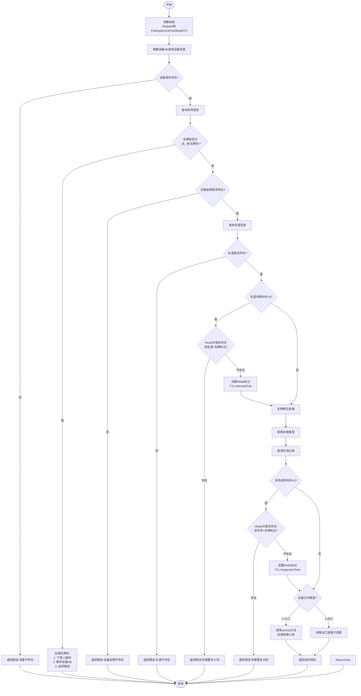
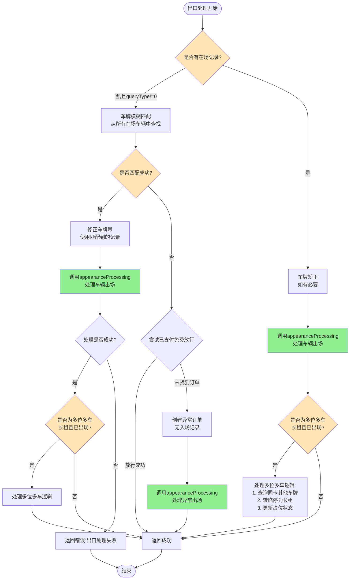
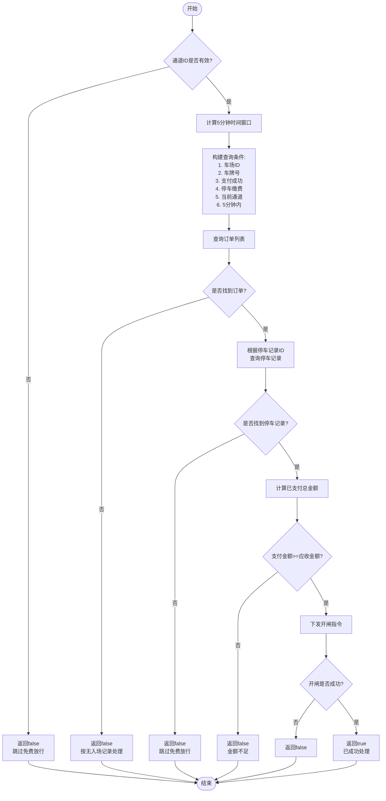
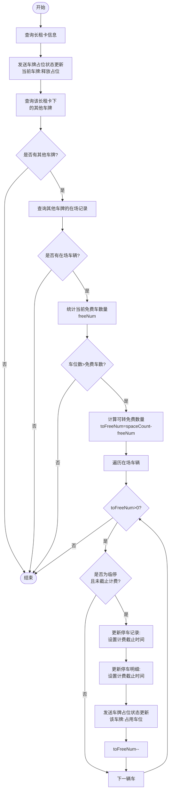
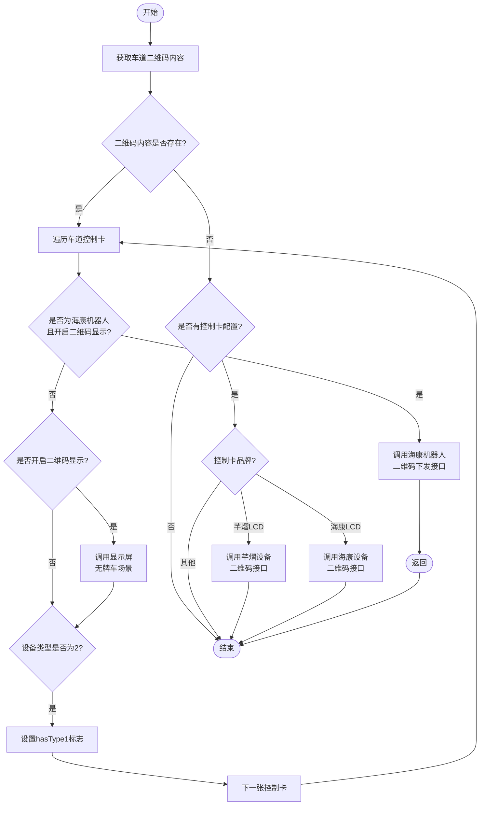

# devicePushInfo 方法详解

## 方法概述

**所在类:** `com.tzh.parkinglot.service.parking.ParkingDeviceServiceImpl`

**方法签名:** `public Response<ParkingDevicePushMsgDTO> devicePushInfo(Request<ParkingDevicePushMsgDTO> request)`

**方法位置:** `ParkingDeviceServiceImpl.java:499-656`

**功能说明:** 处理车场设备上报的车牌识别信息,是车辆进出场管理的核心入口方法。根据设备方向类型(入口/出口)进行不同的业务处理。

---

## 完整流程图



---

## 出口处理子流程

出口处理是 devicePushInfo 方法中的重要分支,主要处理车辆出场识别、费用计算和放行逻辑。

### 出口处理流程图



**关键说明:**
- 出口处理的核心是 `appearanceProcessing` 方法,详见 [appearanceProcessing方法详解](./appearanceProcessing方法详解.md)
- 车牌模糊匹配只在配置了 `queryType != 0` 时生效
- 已支付免费放行是2025-12-17新增功能,解决"已支付但无入场记录"的问题
- 多位多车处理确保车位占用状态的正确性

---

## 详细业务逻辑说明

### 1. 参数校验与初始化 (500-504行)

```java
long startTime = System.currentTimeMillis();
ExceptionUtils.throwParaNullException(request, "Request<ParkingDevicePushMsgDTO>");
ParkingDevicePushMsgDTO parkingDevicePushMsgDTO = request.getRequestData();
ExceptionUtils.throwParaNullException(parkingDevicePushMsgDTO, "ParkingDevicePushMsgDTO");
log.info("车场识别信息上报：{}", JSONObject.toJSONString(parkingDevicePushMsgDTO));
```

**业务说明:**
- 记录方法开始时间,用于后续性能监控
- 校验请求对象和数据对象非空
- 记录识别信息日志

---

### 2. 设备信息验证 (506-511行)

```java
ParkingDevice parkingDevice = parkingDeviceMapper.findBySn(parkingDevicePushMsgDTO.getDeviceSn());
if (parkingDevice == null) {
    log.error("设备不存在：" + parkingDevicePushMsgDTO.getDeviceSn());
    return ResponseFactory.getFailResponse(ServiceExceptionConstant.REQ_PARA_ERR, "设备不存在", request);
}
```

**业务说明:**
- 根据设备序列号(SN)查询设备信息
- 如果设备不存在,返回错误响应
- **关键字段:** `deviceSn` - 设备唯一标识

---

### 3. 车场信息查询 (513行)

```java
ParkingInfo parkingInfo = parkingInfoMapper.selectById(parkingDevice.getParkingLotId());
```

**业务说明:**
- 根据设备所属车场ID查询车场配置信息
- 车场信息包含:计费规则、是否场中场、支付配置等

---

### 4. 无牌车处理 (514-519行)

```java
if ("_无_".equals(parkingDevicePushMsgDTO.getLicense()) || "无牌车".equals(parkingDevicePushMsgDTO.getLicense())) {
    unlicensedCarQrCode(parkingDevice);
    redissonUtil.set("DEVICE-SN"+parkingDevicePushMsgDTO.getDeviceSn(),parkingDevicePushMsgDTO.getTime(),120);
    return ResponseFactory.getFailResponse(ServiceExceptionConstant.REQ_PARA_ERR, "无车牌号", request);
}
```

**业务说明:**
- 识别到无牌车时的特殊处理
- 调用 `unlicensedCarQrCode` 方法下发二维码到显示屏
- 缓存设备识别时间(TTL 120秒)
- 返回错误,不继续处理

**关联方法:** `unlicensedCarQrCode` (658-703行) - 根据设备品牌下发二维码

---

### 5. 设备品牌验证 (521-525行)

```java
DeviceBrand cameraBrand = parkingDevice.getDeviceBrand();
if (cameraBrand == null) {
    log.error("设备品牌不存在");
    return ResponseFactory.getFailResponse(ServiceExceptionConstant.REQ_PARA_ERR, "设备品牌不存在", request);
}
```

**业务说明:**
- 验证设备品牌配置是否存在
- 品牌信息用于后续设备指令下发(海康、芊熠等不同厂商)

---

### 6. 车道信息验证 (526-530行)

```java
ParkingCarLane parkingCarLane = parkingCarLaneMapper.selectParkingCarLaneById(parkingDevice.getParkingLaneId());
if (parkingCarLane == null) {
    log.error("车道不存在:{}", parkingDevice.getParkingLaneId());
    return ResponseFactory.getFailResponse(ServiceExceptionConstant.REQ_PARA_ERR, "车道不存在", request);
}
```

**业务说明:**
- 查询设备所属车道信息
- 车道信息包含:方向类型、间隔时间、是否需要支付等配置

---

### 7. 车道间隔时间重复识别检测 (533-542行)

```java
if (parkingCarLane.getIntervalTime() != null && parkingCarLane.getIntervalTime() > 0 ) {
    Integer intervalTime = parkingCarLane.getIntervalTime() > 20 ? 20 : parkingCarLane.getIntervalTime();
    Object isExist = redisUtil.get("LANE_CARNO" + parkingCarLane.getId() + "_" + parkingDevicePushMsgDTO.getLicense());
    if (isExist == null) {
        redisUtil.set("LANE_CARNO" + parkingCarLane.getId() + "_" + parkingDevicePushMsgDTO.getLicense(), true, intervalTime);
    } else {
        parkingRecordPushService.entranceRecordPushResult(parkingDevicePushMsgDTO.getUniqueId(),null,parkingDevicePushMsgDTO.getLicense(),null,false,"车辆重复识别");
        return ResponseFactory.getFailResponse(ServiceExceptionConstant.REQ_PARA_ERR, "车辆重复入场", request);
    }
}
```

**业务说明:**
- **目的:** 防止同一车辆在短时间内重复识别(主从摄像头场景)
- **逻辑:**
  - 如果车道配置了间隔时间(最大20秒)
  - 检查Redis中是否已存在该车道+车牌的标记
  - 如果存在,说明是重复识别,返回错误并推送失败结果
  - 如果不存在,设置Redis标记,TTL为间隔时间
- **Redis Key:** `LANE_CARNO{laneId}_{license}`

---

### 8. 车牌修正实现 (545-546行)

```java
String license = parkingDevicePushMsgDTO.getLicense();
plateCorrectionRealization(parkingDevicePushMsgDTO,parkingCarLane.getId());
```

**业务说明:**
- 从Redis中获取人工修正的车牌号
- 如果存在修正记录,替换识别的车牌号
- **关联方法:** `plateCorrectionRealization` (807-815行)

**plateCorrectionRealization方法逻辑:**
```java
String key = "plateCorrection:" + carLaneId;
String carNo = redissonUtil.get(key);
redissonUtil.delete(key);
if (StringUtil.isEmpty(carNo)) {
    return;
}
parkingDevicePushMsgDTO.setLicense(carNo);
```
- Redis Key: `plateCorrection:{laneId}`
- 获取后立即删除,保证一次性使用

---

### 9. 获取车辆类型 (548行)

```java
ParkingCarTypeInfoDO carActTypeByCarNumber = getCarActTypeByCarNumber(parkingInfo.getId(), license, parkingDevice.getDirectionType().intValue(), parkingDevice.getRegionId());
```

**业务说明:**
- 根据车牌号判断车辆类型:临停车、月卡车、储值车等
- 参数:车场ID、车牌号、方向类型、区域ID
- 返回车辆实际类型信息

---

### 10. 查询在场记录 (552-557行)

```java
ParkingList parkingList = null;
if (parkingInfo.getIsInterior() == 1) {
    parkingList = parkingListMapper.selectByCarInfo(license, null, parkingDevice.getParkingLotId());
} else {
    parkingList = parkingListMapper.selectByCarInfo(license, parkingDevice.getRegionId(), parkingDevice.getParkingLotId());
}
```

**业务说明:**
- 查询该车牌是否有在场记录(未出场的停车记录)
- **场中场模式** (`isInterior==1`): 不区分区域,查询整个车场
- **非场中场模式**: 按区域查询在场记录
- **判断依据:**
  - 有在场记录 → 车辆出场
  - 无在场记录 → 车辆入场 或 异常出场

---

### 11. 车场巡检时间重复识别检测 (558-566行)

```java
if (parkingInfo.getInspectionTime() != null && parkingInfo.getInspectionTime() != 0){
    Object isExist = redisUtil.get("PARKING_CARNO" + parkingInfo.getId() + "_" + parkingDevicePushMsgDTO.getLicense());
    if (isExist == null) {
        redisUtil.set("PARKING_CARNO" + parkingInfo.getId() + "_" + parkingDevicePushMsgDTO.getLicense(), true, parkingInfo.getInspectionTime());
    } else {
        return ResponseFactory.getFailResponse(ServiceExceptionConstant.REQ_PARA_ERR, "车辆重复识别", request);
    }
}
```

**业务说明:**
- **目的:** 在车场级别防止重复识别
- **逻辑:**
  - 如果车场配置了巡检时间
  - 检查Redis中是否已存在该车场+车牌的标记
  - 如果存在,返回错误
  - 如果不存在,设置Redis标记,TTL为巡检时间
- **Redis Key:** `PARKING_CARNO{parkingId}_{license}`
- **与车道间隔的区别:** 这是车场级别的防重,车道间隔是车道级别的防重

---

### 12. 入口处理 (569-582行)

```java
if (parkingDevice.getDirectionType() == 0) {
    log.info("{} 入口车辆入场", license);
    ((ParkingDeviceServiceImpl) AopContext.currentProxy()).carInto(license,
            new Date(),
            parkingDevicePushMsgDTO,
            parkingCarLane,
            parkingList,
            parkingInfo,
            parkingDevice,
            carActTypeByCarNumber,
            startTime
    );
    log.info("{} 入口车辆完成入场", license);
}
```

**业务说明:**
- **方向类型 = 0:** 入口设备
- 调用 `carInto` 方法处理车辆入场
- 使用AOP代理调用,确保事务和切面生效
- **传入参数:**
  - license: 车牌号
  - new Date(): 识别时间
  - parkingDevicePushMsgDTO: 设备上报数据
  - parkingCarLane: 车道信息
  - parkingList: 在场记录(可能为null)
  - parkingInfo: 车场信息
  - parkingDevice: 设备信息
  - carActTypeByCarNumber: 车辆类型
  - startTime: 开始时间

**注意:** `carInto` 方法未在当前文件中,需要查看该方法的具体实现

---

### 13. 出口处理 - 主流程 (584-651行)

#### 13.1 车牌模糊匹配 (587-612行)

```java
if(parkingList == null && parkingInfo.getQueryType() != 0){
    ParkingListPageQuery  parkingListPageQuery= new ParkingListPageQuery();
    parkingListPageQuery.setParkingLotId(parkingInfo.getId());
    parkingListPageQuery.setIsOut(0);
    List<ParkingList> parkingLists = parkingListMapper.selectByParkingPage(parkingListPageQuery);
    List<String> carNumbers = parkingLists.stream().map(ParkingList::getCarNumber).collect(Collectors.toList());
    String matching = PlateUtils.plateFuzzyMatching(license, carNumbers, parkingInfo.getQueryType());
    if (!StringUtils.isEmpty(matching)){
        for (ParkingList list : parkingLists) {
            if (matching.equals(list.getCarNumber())){
                ParkingList parkingListQuery = new ParkingList();
                parkingListQuery.setParkingLotId(parkingInfo.getId());
                parkingListQuery.setCarNumber(license);
                parkingListQuery.setIsOut((byte) 1);
                ParkingList parkingListInfo = parkingListMapper.selectByParkingList(parkingListQuery);
                if (parkingListInfo != null && list.getInTime().compareTo(parkingListInfo.getInTime()) > 0){
                    parkingList = list;
                }else if (parkingListInfo == null){
                    parkingList = list;
                    break;
                }
            }
        }
    }
}
```

**业务说明:**
- **触发条件:** 无在场记录 且 车场配置了查询类型(`queryType != 0`)
- **目的:** 处理车牌识别不准确的情况(如0和O、1和I混淆)
- **逻辑:**
  1. 查询当前车场所有在场车辆
  2. 使用 `PlateUtils.plateFuzzyMatching` 进行模糊匹配
  3. 如果匹配成功:
     - 查询该车牌是否有已出场记录
     - 如果有已出场记录,比较入场时间,选择更晚入场的
     - 如果无已出场记录,直接使用匹配到的记录
  4. 将匹配到的记录赋值给 `parkingList`

**典型场景:** 车牌 "京A12345" 被识别成 "京A1Z345",通过模糊匹配找回正确记录

---

#### 13.2 有在场记录的出场处理 (614-623行)

```java
if (parkingList != null) {
    log.info("{} 有在场记录", license);
    if(!parkingList.getCarNumber().equals(license)){
        parkingList.setCarNumber(license);
    }
    boolean isAppearanceProcessing = appearanceProcessing(parkingList, parkingDevicePushMsgDTO, parkingDevice, parkingCarLane, parkingInfo,carActTypeByCarNumber);
    if (!isAppearanceProcessing) {
        return ResponseFactory.getFailResponse(ServiceExceptionConstant.REQ_PARA_ERR, "出口处理失败", request);
    }
}
```

**业务说明:**
- **前置条件:** 找到了在场记录(直接查询或模糊匹配)
- **逻辑:**
  1. 如果车牌号不一致(模糊匹配的情况),更新为识别的车牌号
  2. 调用 `appearanceProcessing` 方法处理出场
  3. 如果处理失败,返回错误

**关联方法:** `appearanceProcessing` (973-1246行) - 核心出场处理逻辑

---

#### 13.3 无在场记录的出场处理 (625-641行)

```java
} else {
    log.info("{} 无在场记录", license);

    boolean handled = handlePaidFreeRelease(parkingInfo, parkingDevice, parkingCarLane, license);
    if (handled) {
        return ResponseFactory.getResponse(null, request);
    }

    ParkingList abnormalOrder = unusualOut(parkingInfo, parkingDevice, license, parkingDevicePushMsgDTO);
    boolean isAppearanceProcessing = appearanceProcessing(abnormalOrder, parkingDevicePushMsgDTO, parkingDevice, parkingCarLane, parkingInfo,carActTypeByCarNumber);
    if (!isAppearanceProcessing) {
        return ResponseFactory.getFailResponse(ServiceExceptionConstant.REQ_PARA_ERR, "出口处理失败", request);
    }
    return ResponseFactory.getResponse(null, request);
}
```

**业务说明:**
- **前置条件:** 无在场记录(可能是异常情况或已支付订单)
- **处理流程:**
  1. **先尝试已支付免费放行** (`handlePaidFreeRelease`)
     - 查询5分钟内该车辆在当前通道的已支付订单
     - 如果找到且金额足够,直接开闸放行
     - 返回成功,不继续处理
  2. **如果未放行,创建异常订单** (`unusualOut`)
     - 标记为"无入场记录出场"
     - 创建一条新的停车记录
  3. **调用出场处理** (`appearanceProcessing`)
     - 按正常流程处理出场(计费、显示等)

**关联方法:**
- `handlePaidFreeRelease` (827-915行) - 已支付免费放行处理
- `unusualOut` (922-961行) - 创建异常订单

---

#### 13.4 多位多车长租处理 (643-650行)

```java
if (parkingList.getCarActType() != null && parkingList.getCarActType().intValue() == MONTHLY_CARD_MORE_CAR.getCode()) {
    log.info("多位多车入场出场都是长租---->>>>查询这个车牌号的长租卡，再查询该长租卡下的其它车牌号有没有入场时为临停的未出场车牌，如果有则将最先入场的那个转为长租，并设置计费截止时间");
    String rentalInfoId = carActTypeByCarNumber.getTypeId();
    moreCar(rentalInfoId,parkingList,license,parkingInfo);
}
```

**业务说明:**
- **触发条件:** 出场车辆是多位多车长租
- **业务场景:**
  - 用户购买了"3车位多车"月卡
  - 允许多个车牌,但同时只能有3辆车享受免费
  - 第4辆车入场时按临停计费
  - 当其中1辆车出场时,释放车位,临停车可转为免费
- **处理逻辑:** 调用 `moreCar` 方法

**关联方法:** `moreCar` (705-805行) - 多位多车占位处理

---

### 14. 已支付免费放行处理 (827-915行)

**方法:** `handlePaidFreeRelease`

**业务场景:**
- 车辆已在线支付,但系统未记录到入场
- 或者入场记录因故障丢失
- 用户在出口被拦,但已完成支付

**处理流程:**



**关键代码:**
```java
// 查询条件
OrderStatisticsQuery query = new OrderStatisticsQuery();
query.setParkingLotIds(Collections.singleton(parkingInfo.getId()));
query.setCarNo(license);
query.setTransactionStatus((byte) 1);  // 支付成功
query.setServiceType(0);  // 停车缴费
query.setParkingExportId(parkingDevice.getParkingLaneId());  // 当前出口通道
query.setStartTime(5分钟前);
query.setEndTime(当前时间);

// 验证支付金额
if (totalPaidAmount.compareTo(shouldAmount) >= 0) {
    sendEnterDeviceMsg(parkingDevice, parkingInfo, parkingList, parkingCarLane);
    return true;
}
```

**优化点:** (2025-12-17 新增功能 - issue#1003669)
- 解决"已支付但无入场记录"导致的出口拦截问题
- 提升用户体验,避免重复支付

---

### 15. 创建异常订单 (922-961行)

**方法:** `unusualOut`

**业务说明:**
- 当出口识别到无入场记录的车辆时,创建一条异常停车记录
- 标记为"无入场记录出场"异常类型

**处理逻辑:**

```java
ParkingList abnormalOrder = new ParkingList();
abnormalOrder.setId(UUIDUtil.getSimpleUUID());
abnormalOrder.setParkingLotId(parkingInfo.getId());
abnormalOrder.setRegionId(parkingDevice.getRegionId());

// 获取随机入口车道
ParkingCarLane inParkingCarLane = parkingCarLaneMapper.selectParkingCarLaneByParam(查询条件);
abnormalOrder.setEntranceId(inParkingCarLane.getId());

// 标记异常类型
abnormalOrder.setExceptionType(ExceptionTypeEnum.NO_ENTRY_RECORD.getCode());
abnormalOrder.setRemark("无入场记录出场");

// 设置车辆信息
abnormalOrder.setCarNumber(license);
abnormalOrder.setCarPlateType(parkingDevicePushMsgDTO.getType().byteValue());
abnormalOrder.setCarPlateColor(parkingDevicePushMsgDTO.getColorType().byteValue());

// 设置订单信息
abnormalOrder.setSysOrder(System.currentTimeMillis() + 随机4位数);
abnormalOrder.setParkingOrder(UUIDUtil.getOrderNumber(parkingInfo.getId()));
abnormalOrder.setOrderStatus((byte) 0);  // 未支付
abnormalOrder.setIsOut((byte) 0);  // 未出场

// 插入数据库
parkingListMapper.insertSelective(abnormalOrder);
return abnormalOrder;
```

**字段说明:**
- `exceptionType = 2`: 无入场记录
- `entranceId`: 随机选择一个入口车道(因为不知道真实入口)
- `sysOrder`: 系统订单号 = 时间戳 + 4位随机数
- `parkingOrder`: 停车订单号(根据车场ID生成)

---

### 16. 多位多车占位处理 (705-805行)

**方法:** `moreCar`

**业务场景:**
- 用户购买"3车位5车"月卡
- 允许5个车牌绑定,但同时只能有3辆车免费停车
- 第4、5辆车入场时按临停计费
- 当免费车出场时,临停车可转为免费

**处理流程:**



**关键代码:**

```java
// 1. 统计当前免费车数量
int freeNum = 0;
for (ParkingListResponseDTO dto : responseData) {
    if (dto.getMoreCarTemporary() == null
        || dto.getMoreCarTemporary() != 1
        || (dto.getMoreCarTemporary() == 1 && dto.getEndFeeTime() != null)) {
        freeNum++;
    }
}

// 2. 计算可转免费数量
if (parkingRentalInfo.getSpaceCount() > freeNum) {
    int toFreeNum = parkingRentalInfo.getSpaceCount() - freeNum;

    // 3. 转临停为免费
    for (ParkingListResponseDTO dto : responseData) {
        if (toFreeNum <= 0) break;

        if (dto.getMoreCarTemporary() == 1 && dto.getEndFeeTime() == null) {
            // 更新停车记录
            ParkingList update = new ParkingList();
            update.setId(dto.getId());
            update.setEndFeeTime(new Date());  // 设置计费截止时间
            parkingListMapper.updateByPrimaryKeySelective(update);

            // 更新停车明细
            ParkingDetail detail = parkingDetails.get(parkingDetails.size() - 1);
            detail.setEndFeeTime(new Date());
            parkingDetailMapper.updateByPrimaryKeySelective(detail);

            // 发送占位状态更新
            sendRentalPlateInSpaceStatusUpdate(车牌号, 长租卡ID, null, 1);

            toFreeNum--;
        }
    }
}
```

**字段说明:**
- `moreCarTemporary = 1`: 多位多车临停状态(正在计费)
- `endFeeTime`: 计费截止时间
  - 为null: 一直计费到出场
  - 不为null: 计费到该时间点,之后免费
- `spaceCount`: 车位数
- `freeNum`: 当前免费车数量
- `toFreeNum`: 可转免费的数量

**示例:**
- 用户购买"3车位5车"月卡
- 车牌A、B、C、D、E都绑定了该卡
- 当前在场:A(免费)、B(免费)、C(免费)、D(临停计费)
- 此时A车出场,释放1个车位
- 系统将D车转为免费,设置 `endFeeTime = 当前时间`
- D车从入场到endFeeTime这段时间需要付费,之后免费

---

### 17. 车牌修正实现 (807-815行)

**方法:** `plateCorrectionRealization`

**业务说明:**
- 支持人工修正识别错误的车牌号
- 修正信息临时存储在Redis中

**处理逻辑:**
```java
String key = "plateCorrection:" + carLaneId;
String carNo = redissonUtil.get(key);
redissonUtil.delete(key);  // 立即删除,保证一次性使用
if (StringUtil.isEmpty(carNo)) {
    return;  // 没有修正信息,直接返回
}
parkingDevicePushMsgDTO.setLicense(carNo);  // 替换为修正后的车牌号
```

**使用场景:**
1. 管理员在后台发现识别错误
2. 设置修正信息到Redis: `plateCorrection:{laneId} = "京A12345"`
3. 下次该车道识别到车辆时,自动替换为修正车牌号
4. 修正信息使用后立即删除

**Redis Key:** `plateCorrection:{laneId}`

---

### 18. 无牌车二维码下发 (658-703行)

**方法:** `unlicensedCarQrCode`

**业务说明:**
- 当识别到无牌车时,在显示屏上展示二维码
- 用户扫码可进行临时停车

**处理流程:**



**支持的设备品牌:**
1. **海康机器人** (`HIK_BOOT`)
   - 调用: `hkRobotDeviceService.qrCode()`
2. **通用显示屏** (qrShow=1)
   - 调用: `displayCmdOperateService.startUlpScene()`
   - 显示文字: "无牌车请扫码"
3. **芊熠LCD** (`QIANYI_LCD`)
   - 调用: `iDeviceAsyncService.qrCode()`
4. **海康LCD** (`HAIKANG_LCD`)
   - 调用: `ihkDeviceService.qrCode()`

**二维码来源:**
- `parkingDeviceDisplayInfoServicei.showLaneQRCode()`: 车道二维码(长期有效)
- `parkingDeviceDisplayInfoServicei.showLaneTemporaryQRCode()`: 临时二维码

---

## 异常处理

### 1. 全局异常捕获 (652-655行)

```java
} catch (Exception e) {
    log.error("设备上报车牌识别结果信息处理异常：", e);
}
return ResponseFactory.getResponse(null, request);
```

**说明:**
- 捕获所有未处理的异常
- 记录错误日志
- 返回成功响应(避免设备端重试)

### 2. 无牌车二维码异常 (700-702行)

```java
} catch (Exception e) {
    log.error("无牌车二维码发送失败SN：{}.原因{}",parkingDevice.getCameraMac(),e);
}
```

**说明:**
- 二维码下发失败不影响主流程
- 仅记录日志,不抛出异常

---

## 关键配置项

| 配置项 | 字段 | 说明 |
|--------|------|------|
| 设备方向类型 | `parkingDevice.directionType` | 0-入口, 1-出口 |
| 车道间隔时间 | `parkingCarLane.intervalTime` | 重复识别防护时间(秒),最大20秒 |
| 车场巡检时间 | `parkingInfo.inspectionTime` | 车场级重复识别防护时间(秒) |
| 是否场中场 | `parkingInfo.isInterior` | 0-否, 1-是 |
| 查询类型 | `parkingInfo.queryType` | 0-精确匹配, 其他-支持模糊匹配 |
| 预支付免费时长 | `parkingInfo.payFreeTime` | 支付后多少分钟内免费出场 |
| 车道是否需要支付 | `parkingCarLane.whetherToPay` | 场中场场景,0-不需要, 1-需要 |
| 控制卡品牌 | `deviceControlCard.cardFlag` | 海康LCD、芊熠LCD等 |
| 是否显示二维码 | `parkingDevice.showCode` | 0-否, 1-是 |

---

## 数据流转

### Redis缓存使用

| Key模式 | 用途 | TTL | 值 |
|---------|------|-----|-----|
| `DEVICE-SN{deviceSn}` | 无牌车识别时间 | 120秒 | 识别时间 |
| `LANE_CARNO{laneId}_{license}` | 车道级重复识别防护 | intervalTime | true |
| `PARKING_CARNO{parkingId}_{license}` | 车场级重复识别防护 | inspectionTime | true |
| `plateCorrection:{laneId}` | 车牌修正信息 | - | 修正后的车牌号 |
| `DEVICE_UNIQUE_ID:{parkingListId}` | 设备唯一ID | 180分钟 | uniqueId |
| `READY_PAY_LIST_INFO{parkingListId}` | 预缴费标记 | - | parkingListId |
| `PRESS_PAYMENT{carNumber}{parkingId}` | 追缴订单ID | - | 订单ID |
| `NO_ENTRY_RECORD{carNumber}{parkingListId}` | 无入场记录标记 | 1200秒 | parkingListId |
| `REVERSE_LANE_ID{laneId}` | 反向车道锁 | 3分钟 | 车牌号 |

### 数据库操作

**查询:**
- `parkingDeviceMapper.findBySn()` - 查询设备信息
- `parkingInfoMapper.selectById()` - 查询车场信息
- `parkingCarLaneMapper.selectParkingCarLaneById()` - 查询车道信息
- `parkingListMapper.selectByCarInfo()` - 查询在场记录
- `parkingOrderMapper.queryList()` - 查询订单列表

**插入:**
- `parkingListMapper.insertSelective()` - 创建异常订单

**更新:**
- `parkingListMapper.updateByPrimaryKeySelective()` - 更新停车记录
- `parkingDetailMapper.updateByPrimaryKeySelective()` - 更新停车明细

---

## 外部接口调用

### 1. Dubbo服务调用
- `parkingDeviceDisplayInfoServicei.showLaneQRCode()` - 获取车道二维码
- `parkingDeviceDisplayInfoServicei.showLaneTemporaryQRCode()` - 获取临时二维码
- `parkingListServiceImpl.moreCarTemporaryCars()` - 查询多车临停状态
- `parkingListServiceImpl.outCar()` - 车辆出场处理
- `parkingListServiceImpl.sendMonitorListMsg()` - Socket推送监控消息

### 2. 设备指令下发
- `hkRobotDeviceService.qrCode()` - 海康机器人二维码
- `displayCmdOperateService.startUlpScene()` - 通用显示屏
- `iDeviceAsyncService.qrCode()` - 芊熠设备
- `ihkDeviceService.qrCode()` - 海康设备
- `deviceCmdOperateService.screenDisplay()` - 屏显信息
- `deviceCmdOperateService.errorScreenDisplay()` - 错误屏显
- `sendEnterDeviceMsg()` - 开闸指令

### 3. 消息推送
- `parkingRecordPushService.entranceRecordPushResult()` - 入场记录推送
- `parkingRecordPushService.outRecordPushResult()` - 出场记录推送
- `sendRentalPlateInSpaceStatusUpdate()` - 长租车牌占位状态推送

### 4. 计费相关
- `parkingFee.parkingCalculationFee()` - 停车费计算
- `getChargeDiscount()` - 充电优惠查询
- `outCarBeforeNotify()` - 出场前通知(优惠计算)

---

## 性能优化点

### 1. 并行查询优化
- 在场记录查询根据是否场中场选择不同策略
- 模糊匹配仅在必要时触发(`queryType != 0`)

### 2. 缓存使用
- Redis防止重复识别,减少数据库压力
- 车牌修正信息缓存,支持快速修正

### 3. 异步处理
- 创建订单使用线程池异步处理 (`MyThreadUtil.cachedThreadPool`)
- RocketMQ延时消息发送,不阻塞主流程

### 4. 提前返回
- 无牌车、设备不存在等异常情况提前返回
- 已支付免费放行成功后直接返回,不创建异常订单

---

## 常见业务场景

### 场景1: 正常入场
1. 入口摄像头识别车牌
2. 查询无在场记录
3. 调用 `carInto` 创建入场记录
4. 返回成功

### 场景2: 正常出场(未支付)
1. 出口摄像头识别车牌
2. 查询到在场记录
3. 调用 `appearanceProcessing` 处理出场
4. 计算停车费用
5. 屏显展示应付金额
6. 等待支付

### 场景3: 预支付后出场
1. 用户在线支付停车费
2. 出口识别车牌
3. 查询到在场记录且已支付
4. 免费时长内直接开闸
5. 更新出场时间

### 场景4: 无入场记录出场
1. 出口识别车牌
2. 查询无在场记录
3. 尝试查询5分钟内已支付订单
4. 如果找到且金额足够,直接开闸
5. 如果未找到,创建异常订单
6. 按正常流程计费处理

### 场景5: 车牌识别错误(模糊匹配)
1. 出口识别车牌为"京A1Z345"
2. 查询无在场记录
3. 触发模糊匹配,从所有在场车辆中查找
4. 匹配到"京A12345"
5. 使用匹配到的记录处理出场

### 场景6: 多位多车长租出场
1. 用户购买"3车位5车"月卡
2. 当前在场:A(免费)、B(免费)、C(免费)、D(临停)
3. A车出场,识别车牌
4. 释放1个车位
5. 系统自动将D车转为免费
6. 设置D车计费截止时间

### 场景7: 无牌车入场
1. 入口识别到"_无_"或"无牌车"
2. 下发二维码到显示屏
3. 用户扫码进行临时停车
4. 返回错误,不创建记录

---

## 相关文档

- [车辆出入场管理业务速记](.claude/business/04-车辆出入场管理.md)
- [停车计费系统业务速记](.claude/business/01-停车计费系统.md)
- [设备对接业务速记](.claude/business/02-设备对接.md)

---

## 注意事项

### 1. 事务处理
- 方法本身未添加 `@Transactional` 注解
- 调用 `carInto` 时使用AOP代理,确保事务生效

### 2. 异常处理
- 顶层捕获所有异常,返回成功响应
- 避免设备端因异常响应而重复上报

### 3. 并发控制
- 使用Redis分布式锁防止重复识别
- 反向车道锁防止单通道冲突

### 4. 数据一致性
- 多位多车场景需更新多个表(parkingList、parkingDetail)
- 注意消息推送和数据库更新的一致性

### 5. 性能监控
- 方法开始记录 `startTime`
- 关键环节记录耗时日志
- `outDurationWarner` 监控出场处理耗时

---

## 代码位置索引

| 功能模块 | 行号 | 说明 |
|---------|------|------|
| 方法入口 | 499 | devicePushInfo方法开始 |
| 参数校验 | 500-504 | 校验请求参数 |
| 设备验证 | 506-511 | 查询并验证设备信息 |
| 车场查询 | 513 | 查询车场配置 |
| 无牌车处理 | 514-519 | 无牌车特殊处理 |
| 品牌验证 | 521-525 | 验证设备品牌 |
| 车道验证 | 526-530 | 查询并验证车道信息 |
| 车道防重 | 533-542 | 车道级重复识别检测 |
| 车牌修正 | 545-546 | 车牌修正实现 |
| 车辆类型 | 548 | 获取车辆类型 |
| 在场查询 | 552-557 | 查询在场记录 |
| 车场防重 | 558-566 | 车场级重复识别检测 |
| 入口处理 | 569-582 | 调用carInto处理入场 |
| 模糊匹配 | 587-612 | 车牌模糊匹配逻辑 |
| 正常出场 | 614-623 | 有在场记录的出场 |
| 异常出场 | 625-641 | 无在场记录的出场 |
| 多车处理 | 643-650 | 多位多车长租处理 |
| 无牌二维码 | 658-703 | 无牌车二维码下发 |
| 多车占位 | 705-805 | 多位多车占位逻辑 |
| 车牌修正方法 | 807-815 | 车牌修正实现方法 |
| 已支付放行 | 827-915 | 已支付免费放行处理 |
| 创建异常单 | 922-961 | 创建无入场记录订单 |

---

**文档版本:** v1.0
**最后更新:** 2025-12-18
**维护人员:** Claude Code