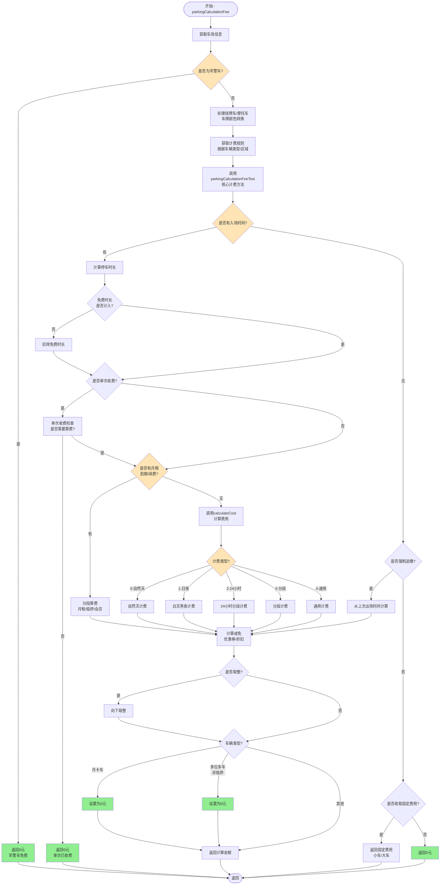
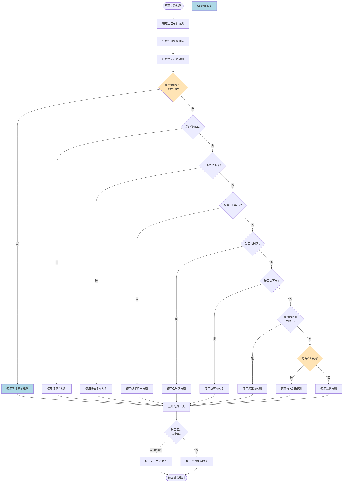
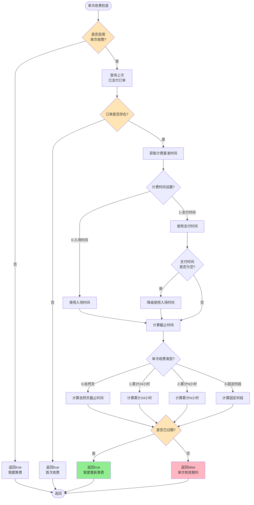
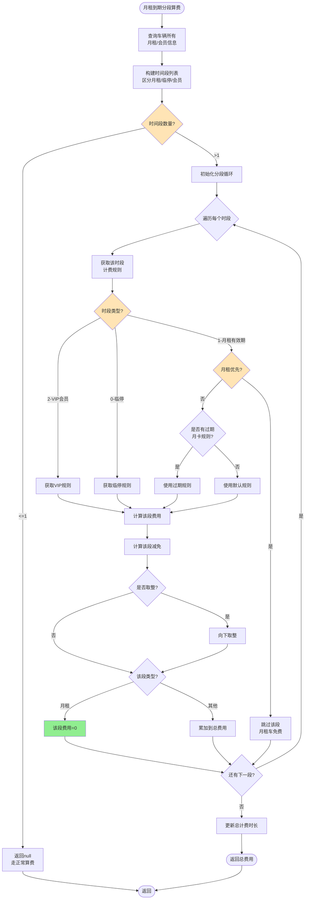
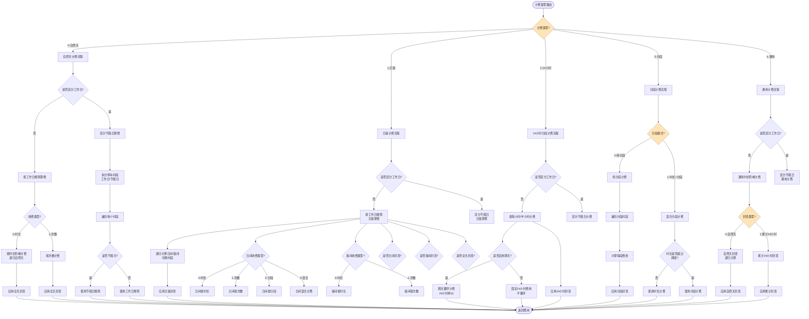

# parkingCalculationFee 方法详解

## 方法概述

**所在类:** `com.tzh.parkinglot.service.common.parkingfee.ParkingFee`

**方法签名:**
```java
public BigDecimal parkingCalculationFee(String parkingSn, ParkingList parkingList) throws ParseException
```

**方法位置:** `ParkingFee.java:74-145`

**功能说明:** 停车场计费核心方法,负责计算车辆停车应缴费用。根据车辆类型、车场规则、区域配置等多种因素,通过复杂的计费逻辑计算出最终应缴金额。支持多种计费模式:自然天计费、白天黑夜计费、24小时分段计费、纯分段计费、通用计费等。

---

## 完整流程图



---

## 子流程详解

### 子流程1: 计费规则获取流程



### 子流程2: 单次收费判断流程



### 子流程3: 月租到期分段算费流程



### 子流程4: 计费类型路由及实现



---

## 详细业务逻辑说明

### 1. 方法入口与基础信息获取 (74-86行)

```java
public BigDecimal parkingCalculationFee(String parkingSn, ParkingList parkingList) throws ParseException {
    ParkingInfo parkingInfo = parkingInfoMapper.selectById(parkingList.getParkingLotId());
    // 如果是会员车 则获取对应绑定的计费规则
    // 定义计费规则ID
    String billingRulesId = "";
    // 绿牌车
    Boolean allowsPoliceCar = isAllowsPoliceCar(parkingInfo,parkingList);
    if (!allowsPoliceCar){
        return BigDecimal.ZERO;
    }
    if (parkingList.getCarPlateColor() == 6 || parkingList.getCarNumber().contains("摩")){
        parkingList.setCarPlateColor((byte) 2);
    }
```

**业务说明:**
- **获取车场信息:** 通过停车场ID查询车场配置
- **军警车免费判断:**
  - 车牌包含"警"、"应急"或以"WJ"开头
  - 车牌类型为8或9(军车、警车)
  - 车牌颜色为3(白色)
  - 满足任一条件返回0元
- **车牌颜色处理:**
  - 绿牌车(颜色6)转为黄牌车(颜色2)
  - 摩托车按黄牌车(大车)计费

**关键配置:**
- `parkingInfo.isPoliceCar`: 是否对军警车免费(1-免费, 0-收费)

---

### 2. 计费规则获取 (87-133行)

```java
ParkingCarLane parkingCarLane = parkingCarLaneMapper.selectParkingCarLaneById(parkingList.getParkingExportId());
try {
    if (parkingList.getCarActType() == PlateTypeEnum.STOP_TYPE.getCode()) {
        parkingDeviceService.getCarActTypeByCarNumber(parkingInfo.getId(), parkingList.getCarNumber(), 1, parkingCarLane.getRegionId());
    }
} catch (Exception e) {
    log.error("获取身份失败");
}
String isRental = (String) redisUtil.get("NOT_AREA_FREE_MONTHLY_CARD_TYPE" + parkingInfo.getId() + parkingList.getCarNumber());
if (parkingCarLane != null) {
    ParkingRegion parkingRegion = parkingRegionMapper.getParkingRegionByRegionId(parkingCarLane.getRegionId());
    // 判断计费规则
    if (parkingRegion != null) {
        billingRulesId = parkingRegion.getBillingRulesId();
        //是否区分 新能源车
        if (parkingRegion.getIsNewEnergy() == 1 && (parkingList.getCarNumber().length() == 8 && !parkingList.getCarNumber().contains("临"))) {
            billingRulesId = parkingRegion.getNewEnergyCar();
        }else if (parkingRegion.getIsRechargeCar() == 1 && parkingList.getCarActType() == PlateTypeEnum.RECHARGE_TYPE.getCode()){
            // 如果是储值车
            billingRulesId = parkingRegion.getRechargeCar();
        }else if (parkingRegion.getIsMultiPosition() == 1 && parkingList.getCarActType() == PlateTypeEnum.MONTHLY_CARD_MORE_CAR.getCode()){
            // 如果是多位多车
            billingRulesId = parkingRegion.getMultiPosition();
        }else if (parkingRegion.getIsRentalExpire() == 1 && parkingList.getCarActType() == PlateTypeEnum.MONTHLY_CARD_DUE_CAR.getCode()){
            // 如果是月租到期
            billingRulesId = parkingRegion.getRentalExpire();
        }else if (parkingRegion.getIsNmvBilling() == 1 && (parkingList.getCarNumber().length() == 7 && parkingList.getCarNumber().contains("临"))){
            billingRulesId = parkingRegion.getNmvBilling();
        } else if (parkingRegion.getIsVisitorSeparateBilling() == 1 && parkingList.getCarActType() == PlateTypeEnum.VISITOR_TYPE.getCode()){
            billingRulesId = parkingRegion.getVisitorSeparateBilling();
        } else if (parkingRegion.getIsCrossRegionRentalRule() == 1 && StringUtils.isNotBlank(isRental) && parkingList.getCarActType() == PlateTypeEnum.STOP_TYPE.getCode()){
            billingRulesId = parkingRegion.getCrossRegionRentalRule();
        }
    }
}
```

**业务说明:**
- **查询出口车道:** 获取车辆出场的车道信息
- **查询区域配置:** 获取车道所属区域的计费配置
- **计费规则优先级:** (从高到低)
  1. **新能源车:** 8位车牌且非临时牌
  2. **储值车:** 车辆类型为储值类型
  3. **多位多车:** 车辆类型为多位多车
  4. **过期月卡:** 车辆类型为月卡到期
  5. **临时牌照:** 7位车牌且包含"临"字
  6. **访客车:** 车辆类型为访客
  7. **跨区域月租车:** 临停车但有月租标记
  8. **默认规则:** 区域基础计费规则

**Redis缓存:**
- `NOT_AREA_FREE_MONTHLY_CARD_TYPE{parkingId}{carNumber}`: 跨区域月租车标记

---

### 3. VIP会员规则获取 (122-133行)

```java
if (parkingList.getCarActType() == 2){
    ParkingVipCarInfoDO parkingVipCarInfoDO = new ParkingVipCarInfoDO();
    parkingVipCarInfoDO.setParkingId(parkingList.getParkingLotId());
    parkingVipCarInfoDO.setPlateNo(parkingList.getCarNumber());
    // 获取会员信息
    ParkingVipCarInfoDO parkingVipCarInfo = parkingVipCarInfoMapper.selectInfoByPrimary(parkingVipCarInfoDO);
    // 获取会员类型
    ParkingVipDiscountDO parkingVipDiscountDO = parkingVipDiscountMapper.selectByPrimaryKey(parkingVipCarInfo.getVipDiscountId());
    if(StringUtils.isNotBlank(parkingVipDiscountDO.getRulesId())) {
        billingRulesId = parkingVipDiscountDO.getRulesId();
    }
}
```

**业务说明:**
- **VIP会员车:** 车辆类型为2
- **查询会员信息:** 根据车场ID和车牌号查询会员信息
- **获取会员折扣配置:** 查询会员类型对应的计费规则
- **规则优先级:** VIP会员规则优先级最高,覆盖区域规则

---

### 4. 免费时长处理 (135-143行)

```java
//查询出口区域规则
BillingRules billingRules = super.queryBilling(parkingList.getParkingExportId(), parkingList.getParkingLotId(), billingRulesId);
Integer freeTime = billingRules.getFreeTime();
if (billingRules.getIsCarSize() == 1 ){
    if (parkingList.getCarPlateColor() == 2 && (billingRules.getLargeFreeTime() != null || billingRules.getLargeFreeTime()  != 0) ){
        freeTime = billingRules.getLargeFreeTime();
    }
}
parkingList.setFreeTime(freeTime);
BigDecimal account = parkingCalculationFeeTest(parkingInfo, billingRules, parkingList,freeTime);
return account;
```

**业务说明:**
- **查询计费规则:** 根据出口车道、车场ID、规则ID查询完整计费规则
- **大小车免费时长:**
  - 默认使用 `freeTime`
  - 如果区分大小车(`isCarSize=1`)且为黄牌车(颜色2),使用 `largeFreeTime`
- **调用核心算费方法:** `parkingCalculationFeeTest`

---

### 5. 核心算费方法入口 (153-175行)

```java
public BigDecimal parkingCalculationFeeTest(ParkingInfo parkingInfo,BillingRules billingRules, ParkingList parkingList,Integer freeTime) throws ParseException {
    BigDecimal actualAmount = BigDecimal.ZERO;
    // 判断场库配置
    if (parkingInfo == null || billingRules == null) {
        return BigDecimal.ZERO;
    }
    log.info("计费规则ID：{}", billingRules.getId());
    int code = parkingList.getExceptionType() == null ? 0 : parkingList.getExceptionType() ;
    if (parkingList.getInTime() != null && code != ExceptionTypeEnum.NO_ENTRY_RECORD.getCode()) {
        Date inTime = parkingList.getInTime();
        Date isInTime = inTime;
        //计算停车时长 分钟
        long min = TimeUtil.getMinute(inTime, parkingList.getEndFeeTime());
        log.info("{} 车辆，停车时长：{}，免费时长：{}", parkingList.getCarNumber(), min, freeTime);
        // 如果免费时长不计入停车费用
        if (parkingInfo.getIsFreeCharging() == 0) {
            //剩余免费时间
            long remainingTime = getRemainingFreeTime(billingRules, parkingList, inTime, freeTime);
            min = (min - remainingTime) <= 0 ? 0 : min - remainingTime;
            if (min <= 0) {
                return BigDecimal.ZERO;
            }
            inTime = new Date(inTime.getTime() + remainingTime * 60 * 1000);
            parkingList.setInTime(inTime);
        }
```

**业务说明:**
- **参数验证:** 车场信息和计费规则不能为空
- **异常类型检查:** 如果是无入场记录异常,走无入场记录逻辑
- **停车时长计算:** 计算入场时间到算费截止时间的分钟数
- **免费时长处理:**
  - `isFreeCharging = 0`: 免费时长不计入(扣除免费时长)
  - `isFreeCharging = 1`: 免费时长计入(不扣除,后续判断)
- **剩余免费时长计算:** 调用 `getRemainingFreeTime` 方法

---

### 6. 剩余免费时长计算 (272-334行)

```java
private long getRemainingFreeTime(BillingRules billingRules, ParkingList parkingList, Date inTime, Integer freeTime) {
    long newFreeTime = freeTime;
    Integer freeTimeRule = billingRules.getFreeTimeRule();
    // 免费时长是否按时长计算
    if(Objects.equals(freeTimeRule, 1)) {
        String freeTimeRuleData = billingRules.getFreeTimeRuleData();
        if (StringUtils.isNoneBlank(freeTimeRuleData)) {
            JSONObject freeDataJson = JSONObject.parseObject(freeTimeRuleData);
            try {
                log.info("{} 车辆，免费时间按时长消费逻辑,freeData={}", parkingList.getCarNumber(), freeDataJson);
                //1.自然日内按时长核销免费时间  2.自定义小时数
                Integer strategyType = freeDataJson.getInteger("strategyType");
                Integer timePeriod = freeDataJson.getInteger("timePeriod");
                Date rangeStartTime;
                Date rangeEndTime = parkingList.getEndFeeTime();
                if (Objects.nonNull(strategyType) && strategyType == 2 && Objects.nonNull(timePeriod) && timePeriod > 0) {
                    // 按小时数计算
                    rangeStartTime = plusHours(rangeEndTime, -timePeriod);
                } else {
                    // 按自然天计算
                    rangeStartTime = TimeUtil.getDateByTime(rangeEndTime, "00:00:00");
                }
                ParkingListPageQuery parkingListPageQuery = new ParkingListPageQuery();
                parkingListPageQuery.setParkingLotId(parkingList.getParkingLotId());
                parkingListPageQuery.setExceptionType(0);
                parkingListPageQuery.setIsOut(1);
                parkingListPageQuery.setCarNumber(parkingList.getCarNumber());
                parkingListPageQuery.setEntryStartTime(rangeStartTime);
                parkingListPageQuery.setEntryEndTime(rangeEndTime);
                List<ParkingList> freeParkingList = parkingListMapper.listParkingFreeRecord(parkingListPageQuery);
                log.info("{} 车辆，查询已核销免费时长记录数{}", parkingList.getCarNumber(), freeParkingList.size());
                if (CollectionUtils.isNotEmpty(freeParkingList)) {
                    long totalMinutes = 0;
                    for (ParkingList handleParkingList : freeParkingList) {
                        Date rangeInTime = handleParkingList.getInTime();
                        Date rangeEndFeeTime = handleParkingList.getEndFeeTime();
                        if (Objects.nonNull(rangeInTime)) {
                            if (Objects.isNull(rangeEndFeeTime)) {
                                Date outTime = handleParkingList.getOutTime();
                                if(Objects.isNull(outTime)) {
                                    rangeEndFeeTime = new Date();
                                }
                                rangeEndFeeTime = outTime;
                            }
                            // 计算当前车辆计费时长
                            long diff = Math.max(0,TimeUtil.getMinute(rangeInTime, rangeEndFeeTime));
                            totalMinutes += diff;
                            // 不符合则快速跳出循环
                            if(totalMinutes > freeTime){
                                break;
                            }
                        }
                    }
                    newFreeTime = Math.max(0, freeTime - totalMinutes);
                }
            } catch (Exception e) {
                log.error("免费时长多次进出异常, errmsg={}", e.getMessage());
            }
        }
    }
    log.info("{} 车辆, 免费时长按时计费, 免费时长规则={}, 剩余免费时长={}", parkingList.getCarNumber(), freeTimeRule, newFreeTime);
    return newFreeTime;
}
```

**业务说明:**
- **免费时长规则:**
  - `freeTimeRule = 0`: 按次计算(每次进出都有免费时长)
  - `freeTimeRule = 1`: 按时长计算(统计一段时间内已使用的免费时长)
- **策略类型:**
  - `strategyType = 1`: 自然日内(当天0点到算费时间)
  - `strategyType = 2`: 自定义小时数(算费时间往前N小时)
- **核销逻辑:**
  1. 查询时间范围内的所有出场记录
  2. 统计已使用的免费时长
  3. 剩余免费时长 = 总免费时长 - 已使用时长
- **应用场景:** 避免同一车辆多次进出重复享受免费时长

---

### 7. 单次收费判断 (179-188行)

```java
// 进行单次收费判断  1 获取第上次支付时间
if(billingRules.getPayPerType() == 1 && StringUtils.isNotBlank(billingRules.getPayPerData())){
    EndTimeBean endTimeBean = perPayTime(parkingList, billingRules);
    if (!endTimeBean.getIsPayPer()){
        return BigDecimal.ZERO;
    }else {
        if (endTimeBean.getEndTime() != null && parkingList.getInTime().compareTo(endTimeBean.getEndTime()) < 0) {
            parkingList.setInTime(endTimeBean.getEndTime() == null ? parkingList.getInTime() : endTimeBean.getEndTime());
        }
    }
}
```

**业务说明:**
- **单次收费:** 一定时间内只收一次费
- **场景举例:**
  - 车辆上午9点入场,缴费出场
  - 下午2点再次入场,如果在24小时内,不再收费
- **判断逻辑:**
  - 查询上次已支付订单
  - 计算单次收费有效截止时间
  - 如果当前时间在有效期内,返回0元
  - 如果已过期,从截止时间开始算费

**perPayTime方法详解** (493-575行):

```java
private EndTimeBean perPayTime(ParkingList parkingList, BillingRules billingRules) {
    EndTimeBean endTimeBean = new EndTimeBean();
    boolean isPayPer = true;

    String payPerDataJson = billingRules.getPayPerData();
    JSONObject perData = JSONObject.parseObject(payPerDataJson);
    // 0自然天 1累计24小时 2.累计小时配置 3固定时间段配置
    int payPerTimeType = perData.getIntValue("pay_per_time_type");

    ParkingOrderDO parkingOrderDO = parkingOrderMapper.selectPayTimePerOrder(
            parkingList.getParkingLotId(), carNumber);

    if (parkingOrderDO != null && parkingOrderDO.getParkingListId() != null) {
        ParkingList parkingListInfo = parkingListMapper.selectById(parkingOrderDO.getParkingListId());

        // 计费设置 0.上一次停车入场时间计算 1.上一次订单支付时间[即出场时间计算]
        int payPerTimeSet = perData.getIntValue("pay_per_time_set");
        Date lastTime;
        if(payPerTimeSet != 0) {
            lastTime = parkingOrderDO.getPayTime();
            if(lastTime == null) {
                log.warn("{} 车牌,配置使用支付时间但支付时间为空,降级使用入场时间", carNumber);
                lastTime = parkingListInfo.getInTime();
            }
        }else {
            lastTime = parkingListInfo.getInTime();
        }

        Date endDateTime;
        if (payPerTimeType == 1) {
            endDateTime = getPeriodEndDateTime(lastTime);
        } else if(payPerTimeType == 2){
            endDateTime = getPeriodEndDateTimeByHour(lastTime, perData.getIntValue("pay_per_time_duration"));
        } else if(payPerTimeType == 3){
            endDateTime = getPerTimeDurationData(perData, lastTime, parkingList.getInTime());
        } else {
            Date firstStartTime = TimeUtil.getDateByTime(lastTime, "00:00:00");
            endDateTime = getPeriodEndDateTime(firstStartTime);
        }

        if (Objects.isNull(endDateTime) || endDateTime.compareTo(new Date()) < 0) {
            isPayPer = true;
            endTimeBean.setEndTime(endDateTime);
        } else {
            isPayPer = false;
        }
    }

    endTimeBean.setIsPayPer(isPayPer);
    return endTimeBean;
}
```

**单次收费类型:**
- **类型0-自然天:** 上次支付所在自然天的次日0点截止
- **类型1-累计24小时:** 从上次支付时间+24小时
- **类型2-累计N小时:** 从上次支付时间+N小时
- **类型3-固定时段:** 固定时间段内(如18:00-次日06:00)

**计费基准时间:**
- **配置0-入场时间:** 使用上次停车的入场时间
- **配置1-支付时间:** 使用上次订单的支付时间

---

### 8. 月租到期分段算费 (190-194行)

```java
// 这里开始计算月租到期和续费的问题
List<RentalTimeBean> maturityTimeList = getMaturityTimeList(parkingInfo, parkingList);
if (maturityTimeList.size() > 1) {
    BigDecimal maturityTimeFee = getMaturityTimeFee(maturityTimeList, billingRules, parkingList, parkingInfo);
    return maturityTimeFee;
}
```

**业务说明:**
- **适用场景:** 车辆停车期间,月租卡/会员卡到期或续费
- **分段逻辑:**
  - 入场时是月租车
  - 停车中月租到期,变为临停车
  - 或者停车中续费月租,从临停变为月租
- **时段分段:** 将停车时长拆分为多个时段,每个时段使用对应的计费规则

**getMaturityTimeList方法** (3194行开始):
- 查询车辆所有月租/会员信息
- 分析停车时段,构建时间段列表
- 每个时间段包含: 开始时间、结束时间、类型(月租/临停/会员)、计费状态

**getMaturityTimeFee方法** (346-440行):
```java
private BigDecimal getMaturityTimeFee(List<RentalTimeBean> maturityTimeList ,BillingRules billingRules,ParkingList parkingList,ParkingInfo parkingInfo){
    BigDecimal totalAmount = BigDecimal.ZERO;
    BigDecimal actualAmount = BigDecimal.ZERO;
    long totalTime = 0;

    // 遍历每个时段
    for (RentalTimeBean rentalTimeBean : maturityTimeList) {
        // 跳过无效时段
        if (rentalTimeBean.getStartTime().compareTo(rentalTimeBean.getEndTime()) >= 0){
            continue;
        }

        // 月租车时段,判断是否优先
        if (rentalTimeBean.getType() == 1 ){
            if (parkingInfo.getCardPriorityType() ==  1) {
                return BigDecimal.ZERO; // 月租优先,整单免费
            }
        }

        // 获取该时段的计费规则
        String billId = "";
        if (rentalTimeBean.getMonthlyCardType() != null && rentalTimeBean.getMonthlyCardType() == 2){
            // 月租到期时段,使用过期规则
            ParkingRegion parkingRegion = parkingRegionMapper.getParkingRegionByRegionId(parkingList.getRegionId());
            if (parkingRegion != null && parkingRegion.getIsRentalExpire() == 1){
                if (StringUtils.isNotBlank(parkingRegion.getRentalExpire())) {
                    billId = parkingRegion.getRentalExpire();
                }
            }
        }

        // VIP会员时段,获取会员规则
        if (rentalTimeBean.getType() == 2 && StringUtils.isNotBlank(rentalTimeBean.getTypeId()) ) {
            ParkingVipCarInfoDO parkingVipCarInfo = parkingVipCarInfoMapper.selectByPrimaryKey(rentalTimeBean.getTypeId());
            if (parkingVipCarInfo != null) {
                ParkingVipDiscountDO parkingVipDiscountDO = parkingVipDiscountMapper.selectByPrimaryKey(parkingVipCarInfo.getVipDiscountId());
                if (StringUtils.isNotBlank(parkingVipDiscountDO.getRulesId())) {
                    billId = parkingVipDiscountDO.getRulesId();
                }
            }
        }

        billingRules = super.queryBilling(parkingList.getParkingExportId(), parkingList.getParkingLotId(), billId);

        // 创建该时段的停车记录副本
        ParkingList parkingListCalculation = new ParkingList();
        BeanUtils.copyProperties(parkingList,parkingListCalculation);
        parkingListCalculation.setInTime(rentalTimeBean.getStartTime());
        parkingListCalculation.setEndFeeTime(rentalTimeBean.getEndTime());
        parkingListCalculation.setCarActType(rentalTimeBean.getType().byteValue());

        // 计算该时段费用
        long min = TimeUtil.getMinute(parkingListCalculation.getInTime(), parkingListCalculation.getEndFeeTime());
        BigDecimal payAmount = calculateCost(parkingInfo, billingRules, parkingListCalculation, min,1);
        actualAmount =  calculateReliefTest(parkingInfo, parkingListCalculation, payAmount, min, billingRules,rentalTimeBean);

        // 取整
        if (parkingInfo.getIsSmallChange() == 1) {
            actualAmount = actualAmount.setScale(0, RoundingMode.DOWN);
        }

        // 月租车时段费用为0
        if (rentalTimeBean.getType()  == 1 || actualAmount.compareTo(BigDecimal.ZERO) < 0) {
            actualAmount = BigDecimal.ZERO;
        }

        if(actualAmount.compareTo(BigDecimal.ZERO) > 0 ){
            totalTime = totalTime + min;
        }
        totalAmount = totalAmount.add(actualAmount);
    }

    updateTime(parkingList.getId(),totalTime);
    return totalAmount;
}
```

**分段类型:**
- **类型0:** 临停车时段
- **类型1:** 月租车有效期时段
- **类型2:** VIP会员时段

**月租优先配置:**
- `cardPriorityType = 1`: 月租优先,只要有月租有效期,整单免费
- `cardPriorityType = 0`: 按时段算费

---

### 9. 调用计费逻辑 (196-199行)

```java
log.info("停车信息：{}", JSONObject.toJSONString(parkingList));
// 计算费用
BigDecimal payAmount = calculateCost(parkingInfo,billingRules, parkingList, min,1);
log.info("{} 车辆，停车费用：{}", parkingList.getCarNumber(), payAmount.toString());
actualAmount = calculateRelief(parkingInfo, parkingList, payAmount, min, billingRules);
log.info("{} 车辆，停车费用：{}", parkingList.getCarNumber(), (payAmount.subtract(actualAmount)).toString());
```

**业务说明:**
- **calculateCost:** 根据计费类型计算原始费用
- **calculateRelief:** 计算减免后的实际费用
- **日志记录:** 记录原始费用和减免金额

---

### 10. 取整与最终金额处理 (202-266行)

```java
// 是否取整
if (parkingInfo.getIsSmallChange() == 1) {
    actualAmount = actualAmount.setScale(0, RoundingMode.DOWN);
}
// 初始话入场时间防止被修改
parkingList.setInTime(isInTime);

// ... 无入场记录逻辑 ...

if (parkingList.getCarActType() != null && parkingList.getCarActType() == 1 ) {
    // 长租车
    actualAmount = BigDecimal.ZERO;
}
if (parkingList.getCarActType() != null && parkingList.getCarActType() == 10
        &&  (parkingList.getMoreCarTemporary() == null || parkingList.getMoreCarTemporary() != 1)){
    // 长租卡为多位多车且不用交费
    actualAmount = BigDecimal.ZERO;
}
if (actualAmount.compareTo(BigDecimal.ZERO) < 0){
    actualAmount = BigDecimal.ZERO;
}
log.info("{}待支付金额：{}", parkingList.getCarNumber(), actualAmount);

return actualAmount;
```

**业务说明:**
- **取整处理:** `isSmallChange = 1` 时,向下取整到元
- **恢复入场时间:** 防止计算过程中修改了入场时间
- **特殊车辆类型:**
  - **月卡车** (类型1): 费用强制为0
  - **多位多车** (类型10): 如果不是临停标记,费用为0
- **负数处理:** 费用不能为负,最小为0

---

### 11. 无入场记录处理 (208-249行)

```java
} else {
    // 无入场记录是否收取固定费用
    log.info("无入场记录是否收取固定费用{}", parkingList.getCarNumber());
    // 获取上一笔订单是否有支付记录 有则按照固定费用进行算费无则进行正常算费
    Date date = beforeParking(parkingList, billingRules);
    Date isDate = date;
    if (parkingInfo.getPressPaymentStatus() == 1 && date!= null){
        //计算停车时长 分钟
        long min = TimeUtil.getMinute(date, parkingList.getEndFeeTime());
        log.info("{} 车辆，停车时长：{}，免费时长：{}", parkingList.getCarNumber(), min, freeTime);
        // 如果免费时长不计入停车费用
        if (parkingInfo.getIsFreeCharging() == 0) {
            long remainingTime = getRemainingFreeTime(billingRules, parkingList, date, freeTime);
            min = (min - remainingTime) <= 0 ? 0 : min - remainingTime;
            if (min <= 0) {
                return BigDecimal.ZERO;
            }
            date = new Date(date.getTime() + remainingTime* 60 * 1000);
        }
        parkingList.setInTime(date);
        parkingList.setEndFeeTime(new Date());
        // 计算费用
        BigDecimal payAmount = calculateCost(parkingInfo,billingRules, parkingList, min,1);
        log.info("{} 车辆，停车费用：{}", parkingList.getCarNumber(), payAmount.toString());
        actualAmount = calculateRelief(parkingInfo, parkingList, payAmount, min, billingRules);
        log.info("{} 车辆，停车费用：{}", parkingList.getCarNumber(), (payAmount.subtract(actualAmount)).toString());
        // 是否取整
        if (parkingInfo.getIsSmallChange() == 1) {
            actualAmount = actualAmount.setScale(0, RoundingMode.DOWN);
        }
    }else {
        log.info("无入场记录是否收取固定费用{}", parkingList.getCarNumber());
        if (parkingInfo.getIsNoRecordFixedCost() == 1 && (parkingList.getCarActType() == 0 || parkingList.getCarActType() == 7 || parkingList.getCarActType() == 5 || parkingList.getCarActType() == 11)) {
            if (parkingList.getCarPlateColor() != null && parkingList.getCarPlateColor() == 2) {
                actualAmount = parkingInfo.getCartMoney();
            } else {
                actualAmount = parkingInfo.getMoney();
            }
        }
    }
    // 初始话入场时间防止被修改
    parkingList.setInTime(isDate);
}
```

**业务说明:**
- **适用场景:** 车辆有出场记录但无入场记录(异常订单)
- **强制追缴配置:** `pressPaymentStatus = 1`
  - 查询上次出场时间
  - 从上次出场时间开始算费
  - 正常计算免费时长和减免
- **固定费用配置:** `isNoRecordFixedCost = 1`
  - 仅对临停车(0)、储值车(7)、过期月卡(5)、访客车(11)有效
  - 黄牌车收取 `cartMoney`
  - 其他车收取 `money`

**beforeParking方法** (456-489行):
```java
private Date beforeParking(ParkingList parkingList,BillingRules billingRules){
    Date date = null;
    if(parkingList.getCarActType() != 0 && parkingList.getCarActType() != 3 && parkingList.getCarActType() != 11){
        return date;
    }

    ParkingInfoConfig parkingInfoConfig = parkingInfoConfigMapper.getParkingInfoConfig(billingRules.getParkingLotId());
    // 默认24小时
    long gapTime = 24;
    int parkingTimeLimit = 15;
    if (parkingInfoConfig != null && StringUtils.isNotBlank(parkingInfoConfig.getEntryGapTime())){
        gapTime = Long.valueOf(parkingInfoConfig.getEntryGapTime());
        parkingTimeLimit = Integer.valueOf(parkingInfoConfig.getLastParkingTimeLimit());
    }

    Date date1 = TimeUtil.beforeTime(parkingList.getEndFeeTime(), gapTime * 60);
    ParkingList parkingList1 = parkingListMapper.selectByParkingList(parkingListPageQuery);
    if (parkingList1  != null && parkingList1.getOutTime() != null){
        log.info("追缴订单上一笔订单" + JSONObject.toJSONString(parkingList1));
        // 未支付
        boolean isGapTime = parkingList1.getOutTime().compareTo(date1) >=  0 && parkingList1.getOutTime().compareTo(new Date()) <= 0 ;
        if (parkingList1.getOrderStatus() != 1 && parkingList1.getParkingTimeNum()  <= parkingTimeLimit && isGapTime){
            date = parkingList1.getInTime();
            redissonUtil.set("PRESS_PAYMENT"+parkingList.getCarNumber()+parkingList.getParkingLotId(),parkingList1.getId(),1000);
        }
    }
    return date;
}
```

**追缴条件:**
1. 仅对临停车(0)、访客车(11)有效
2. 查询gap时间内(默认24小时)的上次出场记录
3. 上次订单未支付
4. 停车时长 <= 限制时长(默认15分钟)
5. 出场时间在gap时间范围内

---

### 12. 计费类型路由 (613-635行)

```java
public BigDecimal calculateCost(ParkingInfo parkingInfo,BillingRules billingRules, ParkingList parkingList, long min,Integer freeType) throws ParseException {
    BigDecimal payAmount = BigDecimal.ZERO;
    // 处理免费时段
    BigDecimal freeAmount = freeTimeType(parkingInfo, billingRules, parkingList, min, freeType);
    if (freeAmount != null) {
        return freeAmount;
    }
    // 计费类型 0 -- 自然天计费；1 -- 白天夜晚计费；2 -- 24小时计费 3 分段计费 4 通用计费规则
    if (billingRules.getBillingType() == 0) {
        payAmount = naturalDay(billingRules, min, parkingList);
    }else if (billingRules.getBillingType() == 1) {
        payAmount = blackAndWhiteq(billingRules, min, parkingList);
    }else if (billingRules.getBillingType() == 2) {
        payAmount = wholeDayTime(billingRules, min, parkingList);
    }else if (billingRules.getBillingType() == 3) {
        payAmount = timePeriod(billingRules, min, parkingList);
    }else if (billingRules.getBillingType() == 4) {
        payAmount = general(billingRules, min, parkingList);
    }else{
        throw new IllegalArgumentException("计费类型错误, 车场编号=" + parkingInfo.getId());
    }
    return payAmount;
}
```

**业务说明:**
- **免费时段判断:** 先判断是否在免费时段内,是则直接返回0
- **计费类型路由:**
  - **类型0:** 自然天计费 - 按自然天为周期,支持时长/次数计费
  - **类型1:** 白天黑夜计费 - 区分日间和夜间不同费率
  - **类型2:** 24小时分段计费 - 按每小时/半小时阶梯计费
  - **类型3:** 分段计费 - 按时间段划分(如8:00-12:00、12:00-18:00)
  - **类型4:** 通用计费 - 灵活的时长阶梯计费

---

### 13. 免费时段判断 (637-675行)

```java
private BigDecimal freeTimeType(ParkingInfo parkingInfo, BillingRules billingRules, ParkingList parkingList, long min, Integer freeType) {
    // 类型不等于1 或者 免费时长不参与计费规则 直接返回null
    if (freeType != 1 || parkingInfo.getIsFreeCharging() == 0) {
        return null;
    }
    // 处理大小车免费时间
    Integer freeTime = billingRules.getFreeTime();
    if (billingRules.getIsCarSize() == 1 && parkingList.getCarPlateColor() == 2) {
        Integer largeFreeTime = billingRules.getLargeFreeTime();
        if (largeFreeTime != null && largeFreeTime != 0) {
            freeTime = largeFreeTime;
        }
    }
    Date inTime = parkingList.getInTime();
    Integer freeTimeRule = billingRules.getFreeTimeRule();
    //区分免费时长是按时还是按次
    if(Objects.equals(freeTimeRule, 1)){
        //剩余免费时间
        long remainingTime = getRemainingFreeTime(billingRules, parkingList, inTime, freeTime);
        // 记录订单使用的免费时长
        parkingList.setFreeTime(Math.toIntExact(remainingTime));
        if (min > remainingTime ) {
            return null; // 不满足免费时长
        }
    }else {
        if (min > freeTime) {
            return null; // 不满足免费时长
        }
        if (billingRules.getFreeType() != 1) {
            // 自然天或24小时可使用一次
            boolean hasUsedFree = getOldFreeTime(parkingList, billingRules);
            if (hasUsedFree) {
                return null;
            }
        }
    }
    // 免费时长是否参与计费 0 -- 否；1 -- 是;
    return BigDecimal.ZERO;
}
```

**业务说明:**
- **触发条件:**
  - `freeType = 1`: 免费时长参与计费规则
  - `isFreeCharging = 1`: 免费时长计入停车费用
- **免费时长规则:**
  - `freeTimeRule = 0`: 按次计算
    - 停车时长 <= 免费时长: 免费
    - `freeType = 0`: 每次都可享受(默认)
    - `freeType = 2`: 自然天内一次
    - `freeType = 1`: 每次都可
  - `freeTimeRule = 1`: 按时长计算
    - 统计剩余免费时长
    - 停车时长 <= 剩余免费时长: 免费

**getOldFreeTime方法** (683-698行):
```java
private boolean getOldFreeTime(ParkingList parkingList,BillingRules billingRules){
    boolean isOldFree = false;
    Date startTime = TimeUtil.beforeTime(parkingList.getEndFeeTime(), 24 * 60);
    try {
        if (billingRules.getFreeType() == 2){
            startTime =  TimeUtil.getDateByTime(parkingList.getEndFeeTime(), "00:00:00");
        }
    } catch (Exception e) {
        log.error("获取免费24小时内的出场时间处理异常");
    }
    ParkingList oldFree = parkingListMapper.getOldFree(parkingList.getParkingLotId(), parkingList.getCarNumber(), startTime, parkingList.getEndFeeTime());
    if (oldFree != null){
        isOldFree = true;
    }
    return isOldFree;
}
```

**免费类型:**
- `freeType = 1`: 每次都可享受
- `freeType = 2`: 自然天内一次(查询当天是否已享受)
- `freeType = 其他`: 累计24小时内一次

---

### 14. 优惠减免计算 (706-743行)

```java
private BigDecimal calculateRelief(ParkingInfo parkingInfo, ParkingList parkingList, BigDecimal expAmount, long min, BillingRules billingRules) throws ParseException {
    if (expAmount.compareTo(BigDecimal.ZERO) == 0 ){
        return expAmount;
    }
    // 月租和临时不减免
    if (parkingList.getCarActType() == 1  || parkingList.getCarActType() == 10 ){
        return expAmount;
    }
    // 临时车新增了优惠券减免
    ParkingCarDiscountInfoQuery parkingCarDiscountInfoQuery = new ParkingCarDiscountInfoQuery();
    parkingCarDiscountInfoQuery.setParkingId(parkingList.getParkingLotId());
    parkingCarDiscountInfoQuery.setPlateNo(parkingList.getCarNumber());
    parkingCarDiscountInfoQuery.setStatus(CarTypeStatusEnum.NORMAL.getCode());
    parkingCarDiscountInfoQuery.setEffective(0);
    parkingCarDiscountInfoQuery.setDelFlg(0);
    // 选择有效减免信息
    List<ParkingCarDiscountInfoDO> parkingCarDiscountInfoDOS = parkingCarDiscountInfoMapper.queryForList(parkingCarDiscountInfoQuery);
    if (parkingCarDiscountInfoDOS.isEmpty()){
        return expAmount;
    }
    log.info("待优惠信息{}",JSONObject.toJSONString(parkingCarDiscountInfoDOS));
    List<String> typeIds = parkingCarDiscountInfoDOS.stream()
            .map(ParkingCarDiscountInfoDO::getTypeId)
            .collect(Collectors.toList());
    // 过滤月租的优惠
    List<ParkingRentalInfo> parkingRentalInfos = parkingRentalInfoMapper.selectByIds(typeIds);
    Set<String> validTypeIds = parkingRentalInfos.stream()
            .map(ParkingRentalInfo::getId)
            .collect(Collectors.toSet());
    parkingCarDiscountInfoDOS.removeIf(dto -> validTypeIds.contains(dto.getTypeId()));
    if(parkingCarDiscountInfoDOS.isEmpty()){
        return expAmount;
    }
    log.info("原始优惠数量: {}, 有效优惠数量: {}", typeIds.size(), validTypeIds.size());
    DiscountCalculator discountCalculator = new DiscountCalculator(billingRules,parkingFee,redissonUtil);
    // 开始减免
    return discountCalculator.calculateFinalAmount(parkingInfo, parkingList, expAmount, min, parkingCarDiscountInfoDOS);
}
```

**业务说明:**
- **不参与减免的车辆:**
  - 月卡车(类型1)
  - 多位多车(类型10)
- **查询优惠信息:**
  - 查询车辆绑定的所有优惠券/折扣信息
  - 状态为正常
  - 有效期内(effective=0)
  - 未删除
- **过滤月租优惠:** 排除月租相关的优惠(月租车已免费)
- **调用减免计算器:** `DiscountCalculator` 负责具体减免逻辑

**优惠类型:**
- **类型0:** 减免金额 - 直接减去固定金额
- **类型1:** 减免时长 - 减去停车时长后重新算费
- **类型2:** 减免折扣 - 乘以折扣系数(如8折=0.8)
- **类型3:** 全免 - 费用置为0
- **类型4:** 特殊优惠

---

## 计费类型详细说明

### 类型0: 自然天计费 (2108-2172行)

**基本逻辑:**
- 以自然天(0点到24点)为计费周期
- 支持按时长阶梯计费或按次数计费
- 支持区分工作日和节假日

**不区分工作日:**
```java
if (billingRules.getWeekdays() == 0) {
    //按时长收费
    if (billingRules.getWorkChargeType() == 0) {
        Object object = JSON.parse(billingRules.getDurationData());
        money = timeFeeRelief(object,billingRules, parkingList.getInTime(), parkingList.getCarPlateColor().intValue(), parkingList.getEndFeeTime(),BigDecimal.ZERO,false,billingRules.getIsLessCycle() == 1);
    }
    //按次数收费
    if (billingRules.getWorkChargeType() == 1) {
        JSONArray array = JSONArray.parseArray(billingRules.getNumberDurationData());
        money = timeFeeCount(array, billingRules, min, parkingList,false);
    }
}
```

**区分工作日:**
```java
if (billingRules.getWeekdays() == 1) {
    // 进行节假日计算
    List<HolidaysInfoBean> holidays = getHolidays(parkingList);
    BigDecimal totalAmount = BigDecimal.ZERO;
    for (HolidaysInfoBean holiday : holidays) {
        // 拆分停车时段
        parkingList.setInTime(localToDate(holiday.getStartTime()));
        parkingList.setEndFeeTime(localToDate(holiday.getEndTime()));
        min = TimeUtil.getMinute(parkingList.getInTime(), parkingList.getEndFeeTime());

        // 是节假日
        if (holiday.getStatus()){
            //按时长收费
            if (billingRules.getNoWorkChargeType() == 0) {
                Object object = JSON.parse(billingRules.getNoWorkDurationData());
                holidaysAmount = timeFeeRelief(object, billingRules, localToDate(holiday.getStartTime()), parkingList.getCarPlateColor().intValue(), localToDate(holiday.getEndTime()),BigDecimal.ZERO, true,billingRules.getIsLessCycle() == 1);
            }
            //按次数收费
            if (billingRules.getNoWorkChargeType() == 1) {
                JSONArray array = JSONArray.parseArray(billingRules.getNoWorkNumberDurationData());
                holidaysAmount = timeFeeCount(array, billingRules, min, parkingList,true);
            }
        }else {
            // 非节假日(使用工作日规则)
        }
        totalAmount = totalAmount.add(holidaysAmount);
    }
    money = totalAmount;
}
```

**时长阶梯计费示例:**
```json
{
  "duration_data": [
    {"start_lng": 0, "end_lng": 120, "number": 30, "money": 3, "cart_money": 5},
    {"start_lng": 120, "end_lng": 240, "number": 30, "money": 2, "cart_money": 4},
    {"start_lng": 240, "number": 60, "money": 1, "cart_money": 2}
  ],
  "a_max_amount_type": 0
}
```
- 0-120分钟: 每30分钟3元(小车)/5元(大车)
- 120-240分钟: 每30分钟2元/4元
- 240分钟以上: 每60分钟1元/2元

**次数计费示例:**
```json
{
  "number_duration_data": [
    {"start": 1, "money": 5, "cart_money": 10},
    {"start": 1, "time": 240, "money": 10, "max_money": 30, "cart_money": 15, "max_cart_money": 40},
    {"start": 1, "hour": 18, "minute": 0, "money": 5, "cart_money": 8}
  ]
}
```
- 单次收费: 5元/10元
- 240分钟内: 10元,超过240分钟: 30元封顶
- 过夜费: 每过一次18:00加收5元/8元

---

### 类型1: 白天黑夜计费 (1508-1540行)

**基本逻辑:**
- 区分日间和夜间不同时段
- 日间和夜间分别计费,分别封顶
- 支持全天封顶
- 支持区分工作日和节假日

**配置参数:**
- `dayStartTime`: 日间开始时间(如08:00)
- `nightStartTime`: 夜间开始时间(如18:00)
- `dayChargeType`: 日间收费类型(0-时长, 1-次数, 2-分段, 3-混合)
- `nightChargeType`: 夜间收费类型
- `isDayMaxAmount`: 是否日间封顶
- `isNightMaxAmount`: 是否夜间封顶
- `isADayMaxAmount`: 是否全天封顶

**计算流程:**
1. 递归计算每个日夜交替时段
2. 判断当前时段是日间还是夜间
3. 根据对应的收费类型计算费用
4. 应用日间/夜间封顶
5. 累加所有时段费用
6. 应用全天封顶

**日夜切换示例:**
- 入场: 16:00, 出场: 次日10:00
- 时段1: 16:00-18:00 (日间 2小时)
- 时段2: 18:00-次日08:00 (夜间 14小时)
- 时段3: 08:00-10:00 (日间 2小时)

---

### 类型2: 24小时分段计费 (836-873行)

**基本逻辑:**
- 按每小时或每半小时为单位计费
- 支持跨天循环计费
- 不同小时数有不同单价

**配置示例:**
```json
{
  "time": {
    "1": {"小车": 3, "大车": 5},
    "2": {"小车": 6, "大车": 10},
    "3": {"小车": 9, "大车": 15},
    ...
    "24": {"小车": 50, "大车": 80}
  },
  "second": {
    "isStart": 1,
    "time": 0,
    "timetype": 0,
    "小车": 2,
    "大车": 4
  }
}
```

**不启用跨天:**
- 停车3小时: 按3小时单价收费
- 停车25小时: 按24小时单价+1小时单价收费

**启用跨天循环:**
- 首个24小时: 按1-24小时阶梯计费
- 第二个24小时开始: 每小时按second单价计费,达到24小时封顶
- 总费用 = 首个24小时费用 + 完整24小时费用×天数 + 不满24小时费用

---

### 类型3: 分段计费 (1186-1269行)

**基本逻辑:**
- 按时间段划分(如8:00-12:00、12:00-18:00、18:00-次日8:00)
- 每个时段有不同单价
- 支持纯分段和混合模式

**配置示例:**
```json
{
  "time_charge_type": 0,
  "time_period_data": [
    {"start_time": "08:00", "end_time": "12:00", "time": 30, "money": 3, "cart_money": 5},
    {"start_time": "12:00", "end_time": "18:00", "time": 30, "money": 2, "cart_money": 4},
    {"start_time": "18:00", "end_time": "08:00", "time": 60, "money": 1, "cart_money": 2}
  ]
}
```

**纯分段模式** (time_charge_type=0):
- 严格按时间段计费
- 跨时段自动拆分

**混合模式** (time_charge_type=1):
```json
{
  "time_charge_type": 1,
  "exceed_time": 240,
  "duration_data": {
    "number": 30,
    "money": 2,
    "cart_money": 4
  },
  "time_period_data": [...]
}
```
- 停车时长 <= exceed_time: 按时长计费
- 停车时长 > exceed_time: 按分段计费

---

### 类型4: 通用计费 (2047-2096行)

**基本逻辑:**
- 灵活的时长阶梯计费
- 支持自然天封顶和累计24小时封顶
- 支持区分工作日和节假日

**配置示例:**
```json
{
  "duration_data": {
    "a_max_amount_type": 1,
    "duration_data": [
      {"start_lng": 0, "end_lng": 60, "number": 15, "money": 2, "cart_money": 4},
      {"start_lng": 60, "end_lng": 180, "number": 30, "money": 3, "cart_money": 5},
      {"start_lng": 180, "number": 60, "money": 1, "cart_money": 2}
    ]
  }
}
```

**封顶类型:**
- `a_max_amount_type = 0`: 自然天封顶(递归计算每个自然天)
- `a_max_amount_type = 1`: 累计24小时封顶(不受自然天限制)

**累计24小时封顶逻辑:**
```java
// 计算总时长费用
long nowMin = TimeUtil.getMinute(startDate, nowDate);
BigDecimal totalAmount = timeFeeExtend(array,billingRules, nowMin, carPlateColor,new UnitNumberBean(),new FirstTimeBean());

// 计算天数
double temp = ((float) nowMin / (60 * 24));
int days = (int) Math.floor(temp);

// 超过1天
if (days > 0){
    // 计算每个24小时的费用
    BigDecimal adayAmount = ...;  // 24小时费用
    if (adayAmount.compareTo(maxAmount) >= 0){
        adayAmount = maxAmount;  // 应用封顶
    }
    totalAmount = adayAmount.multiply(new BigDecimal(days));

    // 计算不满24小时部分
    double leftTime = Math.ceil((nowMin % ( 60 * 24)));
    BigDecimal leftAmount = ...;  // 计算剩余时长费用
    if(leftAmount.compareTo(maxAmount) >= 0){
        leftAmount = maxAmount;
    }
    totalAmount = totalAmount.add(leftAmount);
}
```

---

## 关键配置项

| 配置项 | 字段/Key | 说明 | 默认值 |
|--------|---------|------|--------|
| **车场配置** ||||
| 军警车免费 | `parkingInfo.isPoliceCar` | 0-收费, 1-免费 | - |
| 免费时长计入 | `parkingInfo.isFreeCharging` | 0-不计入(扣除), 1-计入(后续判断) | - |
| 取整 | `parkingInfo.isSmallChange` | 0-不取整, 1-向下取整到元 | - |
| 无入场固定费用 | `parkingInfo.isNoRecordFixedCost` | 0-不收, 1-收取固定费用 | - |
| 固定费用(小车) | `parkingInfo.money` | 无入场记录小车固定费用 | - |
| 固定费用(大车) | `parkingInfo.cartMoney` | 无入场记录大车固定费用 | - |
| 强制追缴 | `parkingInfo.pressPaymentStatus` | 0-否, 1-从上次出场算费 | - |
| 月租优先 | `parkingInfo.cardPriorityType` | 0-按时段, 1-月租优先整单免费 | - |
| **区域配置** ||||
| 新能源车规则 | `parkingRegion.isNewEnergy` | 0-不区分, 1-使用新能源规则 | - |
| 储值车规则 | `parkingRegion.isRechargeCar` | 0-不区分, 1-使用储值车规则 | - |
| 多位多车规则 | `parkingRegion.isMultiPosition` | 0-不区分, 1-使用多位多车规则 | - |
| 过期月卡规则 | `parkingRegion.isRentalExpire` | 0-不区分, 1-使用过期规则 | - |
| 临时牌规则 | `parkingRegion.isNmvBilling` | 0-不区分, 1-使用临时牌规则 | - |
| 访客车规则 | `parkingRegion.isVisitorSeparateBilling` | 0-不区分, 1-使用访客规则 | - |
| 跨区域月租规则 | `parkingRegion.isCrossRegionRentalRule` | 0-不区分, 1-使用跨区域规则 | - |
| **计费规则** ||||
| 计费类型 | `billingRules.billingType` | 0-自然天, 1-日夜, 2-24小时, 3-分段, 4-通用 | - |
| 区分工作日 | `billingRules.weekdays` | 0-不区分, 1-区分节假日 | - |
| 免费时长 | `billingRules.freeTime` | 免费停车时长(分钟) | - |
| 大车免费时长 | `billingRules.largeFreeTime` | 黄牌车免费时长(分钟) | - |
| 免费时长规则 | `billingRules.freeTimeRule` | 0-按次, 1-按时长累计 | - |
| 免费类型 | `billingRules.freeType` | 0-累计24小时, 1-每次, 2-自然天 | - |
| 单次收费 | `billingRules.payPerType` | 0-否, 1-启用单次收费 | - |
| 区分大小车 | `billingRules.isCarSize` | 0-不区分, 1-区分大小车 | - |
| 全天封顶 | `billingRules.isADayMaxAmount` | 0-不封顶, 1-启用封顶 | - |
| 小车全天封顶 | `billingRules.smallADayMaxAmount` | 小车全天最高金额 | - |
| 大车全天封顶 | `billingRules.largeADayMaxAmount` | 大车全天最高金额 | - |
| 不足周期补时 | `billingRules.isLessCycle` | 0-不补, 1-补足最小计费单位 | - |
| **日夜计费配置** ||||
| 日间开始时间 | `billingRules.dayStartTime` | 如"08:00" | - |
| 夜间开始时间 | `billingRules.nightStartTime` | 如"18:00" | - |
| 日间收费类型 | `billingRules.dayChargeType` | 0-时长, 1-次数, 2-分段, 3-混合 | - |
| 夜间收费类型 | `billingRules.nightChargeType` | 0-时长, 1-次数 | - |
| 日间封顶 | `billingRules.isDayMaxAmount` | 0-不封顶, 1-封顶 | - |
| 夜间封顶 | `billingRules.isNightMaxAmount` | 0-不封顶, 1-封顶 | - |
| **24小时计费配置** ||||
| 时间类型 | `billingRules.timeType` | 0-小时, 1-半小时 | - |
| **追缴配置** ||||
| 间隔时间 | `parkingInfoConfig.entryGapTime` | 追缴时间间隔(小时) | 24 |
| 停车时长限制 | `parkingInfoConfig.lastParkingTimeLimit` | 上次停车时长限制(分钟) | 15 |

---

## 数据流转

### Redis缓存使用

| Key模式 | 用途 | 值类型 | 说明 |
|---------|------|--------|------|
| `NOT_AREA_FREE_MONTHLY_CARD_TYPE{parkingId}{carNumber}` | 跨区域月租标记 | String | 标识临停车在其他区域有月租 |
| `PRESS_PAYMENT{carNumber}{parkingId}` | 追缴订单关联 | String(订单ID) | 关联上次未支付订单 |

### 数据库操作

**查询:**
- `parkingInfoMapper.selectById()` - 查询车场信息
- `parkingCarLaneMapper.selectParkingCarLaneById()` - 查询出口车道
- `parkingRegionMapper.getParkingRegionByRegionId()` - 查询区域配置
- `parkingVipCarInfoMapper.selectInfoByPrimary()` - 查询VIP会员信息
- `parkingVipDiscountMapper.selectByPrimaryKey()` - 查询会员折扣
- `billingRulesMapper.selectByPrimaryKey()` - 查询计费规则
- `parkingCarTypeInfoMapper.selectParkingCarTypeInfoList()` - 查询车辆类型信息
- `parkingCarDiscountInfoMapper.queryForList()` - 查询优惠信息
- `parkingListMapper.listParkingFreeRecord()` - 查询免费时长记录
- `parkingListMapper.selectByParkingList()` - 查询上次停车记录
- `parkingListMapper.getOldFree()` - 查询免费记录
- `parkingOrderMapper.selectPayTimePerOrder()` - 查询单次收费订单
- `sysCalenderMapper.findByDateId()` - 查询节假日信息
- `parkingRentalInfoMapper.selectByIds()` - 查询月租信息

**插入/更新:**
- `deviceAsyncService.updateListTime()` - 异步更新总计费时长

---

## 外部接口调用

### 1. 车辆身份查询
- `parkingDeviceService.getCarActTypeByCarNumber()` - 获取车辆身份类型

### 2. 减免计算
- `DiscountCalculator.calculateFinalAmount()` - 计算优惠减免后金额

---

## 常见业务场景

### 场景1: 临停车正常计费
1. 入场时间: 2024-01-15 09:00
2. 出场时间: 2024-01-15 15:30
3. 停车时长: 390分钟
4. 免费时长: 30分钟
5. 计费时长: 360分钟
6. 计费规则: 自然天时长阶梯
   - 0-120分钟: 30分钟3元
   - 120-240分钟: 30分钟2元
   - 240分钟以上: 60分钟1元
7. 费用计算:
   - 0-120分钟: 4×3 = 12元
   - 120-240分钟: 4×2 = 8元
   - 240-360分钟: 2×1 = 2元
   - 总计: 22元
8. 无优惠: 实付22元

### 场景2: 月租车到期分段算费
1. 入场时间: 2024-01-15 10:00 (月租车)
2. 月租到期: 2024-01-15 14:00
3. 出场时间: 2024-01-15 18:00
4. 分段:
   - 时段1: 10:00-14:00 (月租有效期) - 0元
   - 时段2: 14:00-18:00 (临停) - 按临停规则算费
5. 临停时段240分钟,费用: 16元
6. 总费用: 0 + 16 = 16元

### 场景3: 单次收费有效期内
1. 第一次:
   - 入场: 2024-01-15 09:00
   - 出场: 2024-01-15 10:00
   - 缴费: 5元
2. 第二次:
   - 入场: 2024-01-15 14:00
   - 出场: 2024-01-15 15:00
   - 单次收费配置: 自然天
   - 判断: 在同一自然天内,单次有效
   - 费用: 0元

### 场景4: 免费时长按时累计
1. 配置: 每天免费60分钟
2. 第一次停车: 09:00-09:40 (40分钟) - 免费,剩余20分钟
3. 第二次停车: 14:00-14:30 (30分钟)
   - 剩余免费时长: 20分钟
   - 计费时长: 10分钟
   - 费用: 按10分钟计算

### 场景5: 日夜分段计费
1. 入场: 2024-01-15 16:00
2. 出场: 2024-01-16 10:00
3. 日间: 08:00-18:00
4. 夜间: 18:00-次日08:00
5. 分段:
   - 时段1: 16:00-18:00 (日间2小时) - 10元
   - 时段2: 18:00-次日08:00 (夜间14小时) - 20元
   - 时段3: 08:00-10:00 (日间2小时) - 10元
6. 总费用: 40元

### 场景6: 24小时循环计费
1. 入场: 2024-01-15 10:00
2. 出场: 2024-01-17 14:00
3. 停车时长: 52小时
4. 配置:
   - 首个24小时: 阶梯计费,封顶50元
   - 第二个24小时: 每小时2元,封顶40元
5. 费用计算:
   - 第一个24小时: 50元
   - 第二个24小时: 40元
   - 第三个4小时: 8元
6. 总费用: 98元

### 场景7: 优惠券减免
1. 停车费用: 30元
2. 优惠券1: 减免金额10元
3. 优惠券2: 8折
4. 计算:
   - 原价: 30元
   - 减免10元: 20元
   - 8折: 16元
5. 实付: 16元

### 场景8: 无入场记录追缴
1. 车辆有出场记录,无入场记录
2. 上次出场时间: 2024-01-15 09:00
3. 上次订单未支付
4. 本次出场: 2024-01-15 11:00
5. 配置: 启用强制追缴,24小时内
6. 从上次出场时间开始算费: 120分钟
7. 按正常规则计费

---

## 注意事项

### 1. 性能考虑
- 节假日拆分可能导致大量循环
- 递归计算日夜分段需要注意栈深度
- 月租到期分段查询数据库次数较多

### 2. 数据一致性
- 免费时长累计需要准确统计历史记录
- 单次收费依赖订单支付状态准确性
- 月租到期时间需要与月租记录保持一致

### 3. 边界情况
- 入场时间=出场时间: 停车时长为0
- 月租在停车期间续费: 需要准确拆分时段
- 跨多个自然天停车: 封顶计算复杂

### 4. 配置复杂性
- 计费规则配置项非常多,容易配置错误
- 不同计费类型的规则格式不同
- 大小车、工作日/节假日配置需要完整

### 5. 异常处理
- 计费规则不存在: 返回0元
- 车场信息不存在: 返回0元
- 计算异常: 捕获异常,返回安全值

---

## 相关方法索引

| 方法名 | 行号 | 说明 |
|--------|------|------|
| parkingCalculationFee | 74-145 | 主入口方法 |
| parkingCalculationFeeTest | 153-267 | 核心算费逻辑 |
| isAllowsPoliceCar | 336-343 | 军警车判断 |
| getRemainingFreeTime | 272-334 | 剩余免费时长计算 |
| perPayTime | 493-575 | 单次收费判断 |
| beforeParking | 456-489 | 追缴订单查询 |
| getMaturityTimeList | 3194- | 月租到期时段列表 |
| getMaturityTimeFee | 346-440 | 月租到期分段算费 |
| calculateCost | 613-635 | 计费类型路由 |
| freeTimeType | 637-675 | 免费时段判断 |
| calculateRelief | 706-743 | 优惠减免计算 |
| naturalDay | 2108-2172 | 自然天计费 |
| blackAndWhiteq | 1508-1540 | 日夜计费 |
| wholeDayTime | 836-873 | 24小时计费 |
| timePeriod | 1186-1269 | 分段计费 |
| general | 2047-2096 | 通用计费 |
| timeFeeRelief | 2822-2895 | 时长阶梯递归算费 |
| timeFeeExtend | 2555-2647 | 时长阶梯计费 |
| timeFeeCount | 2656-2820 | 次数计费 |
| timeSegment | 2995-3051 | 纯分段计费 |
| timeMix | 3064-3102 | 混合分段计费 |
| getHolidays | 2174-2184 | 获取节假日分段 |
| getOldFreeTime | 683-698 | 查询免费记录 |

---

**文档版本:** v1.0
**最后更新:** 2025-12-21
**维护人员:** Claude Code