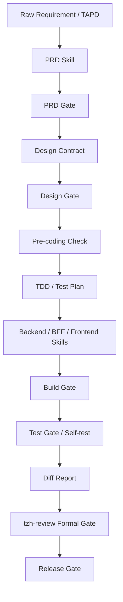

# Phase 2 Target Architecture

Updated: 2026-07-10

## Asset Responsibilities

| Asset | Responsibility |
| --- | --- |
| CLAUDE.md | Core hard rules and navigation |
| Rule | Stable constraints such as Java Mapper rule |
| Spec | Artifact contracts and structured delivery outputs |
| Skill | Reusable execution capability |
| Command | Thin user entry |
| Workflow | Multi-stage orchestration |
| Gate | Deterministic pass/block semantics |
| Template | Standard output skeleton |
| Script | Deterministic validation |
| Evaluation | Effectiveness test cases |

## Single Decision Source

`tzh-review` is the only formal quality decision source for Tingzhihui release review. `formal-review` can summarize or format, but cannot change risk grade, Unknowns, or the final decision.
